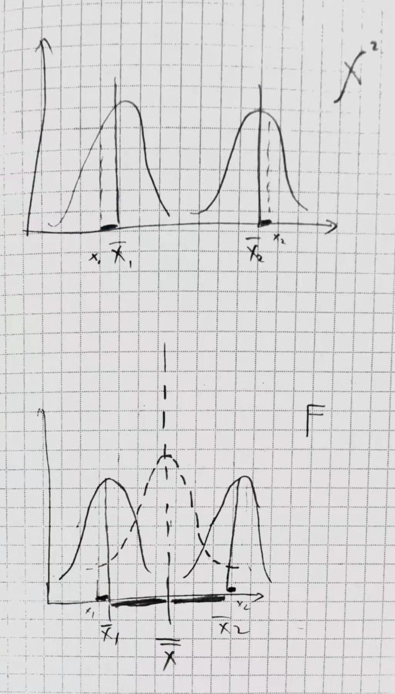

# 统计学 Q笔记

- [统计学 Q笔记](#统计学-q笔记)
    - [概率](#概率)
        - [离散分布](#离散分布)
        - [连续分布](#连续分布)
    - [估计与假设](#估计与假设)
        - [置信区间](#置信区间)
        - [零假设](#零假设)
    - [变量间的关系](#变量间的关系)

## 概率
### 离散分布
```
【伯努利】 ---n次---> 【二项分布】 ---p较小---> 【泊松分布】
                               ---n较大---> 【正态分布】
                               ---第r次才成功---> 【几何分布】
```
- 伯努利是扔一次硬币
- 二项分布是多次伯努利，即扔多次硬币
    - 知道扔一次的概率，求扔n次时，有x次成功的概率是多少
- 泊松分布是 p 很小的二项，即扔好多好多次硬币，且扔出正面概率极小
    - 知道扔很多次时平均成功次，求扔同样次数时，出现x次成功的概率是多少
- 正态分布是 n 很大的二项，即扔好多好多次硬币，且硬币是完全相同的

### 连续分布
- 标准差
    - 正态分布 z
    - t 分布
- 方差
    - χ^2 分布
        - 分类-频次，方差和
        - 当分类 n 足够大时，即有足够多的类方差，方差和分布趋向于正态
    - F 分布
        - 分类-数值，组间方差和 / 组内方差和
        - 当组间不存在方差时，即为 χ^2 的倒数
    


## 估计与假设
### 置信区间
### 零假设

## 变量间的关系
|  y \ x | class: a,b,c | number: 1,2,3
|---------|----------|---------
| class: a,b,c | χ^2 | regression
| number: 1,2,3 | AVONA (f-score) | regression
| | if 1-2 classes, then t-score | 
