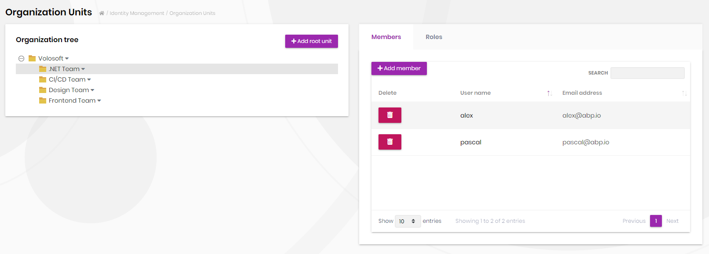

# Abp Organization

## Open source VS Commercial
- The open source version got the basic object for controlling the organizaiton units. On the other hand, the commercial version handles the whole procession of organization based on app service and ui service.
- How we do it ?
    - To mock an an app service referred from the commercial one.
    - [API Doc](https://docs.abp.io/api-docs/commercial/2.9/api/Volo.Abp.Identity.OrganizationUnitAppService.html) - Commercial
    - [Identity module](https://docs.abp.io/en/commercial/5.0/modules/identity) - Commercial

## What about the UI
- We like to make a tree view of orgnization.
- The default view of Identity Perssions were made on ng-zorro.
    - So, let's make a orgnization tree like it.

## ref
- [Organization Unit Sample Projects](https://github.com/abpframework/abp-samples/blob/master/OrganizationUnitSample/README.md)
- [Does ABP provides integration to any mock framework like Moq?](https://support.abp.io/QA/Questions/1208/Does-ABP-provides-integration-to-any-mock-framework-like-Moq)