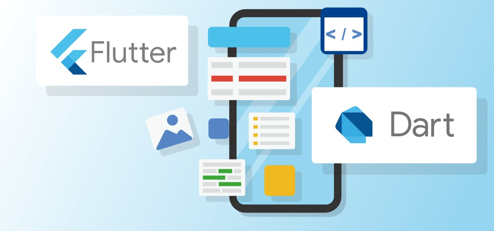

# First Flutter

- [First Flutter](#first-flutter)
    - [Run ios on mac](#run-ios-on-mac)
    - [Run android on pc](#run-android-on-pc)
    - [with serial port](#with-serial-port)
    - [with c](#with-c)
    - [with windows](#with-windows)

## Run ios on mac
- error on "Undefined symbols for architecture x86_64"
    - please update Xcode to 13.1+

## Run android on pc
- [ERROR Android emulator gets killed](https://stackoverflow.com/questions/36841461/error-android-emulator-gets-killed)
    - Check the free space of the emulator installation drive is more than 5 GB
- [flutter doctor --android-licenses java.lang.module.FindException: Module java.xml.bind not found](https://stackoverflow.com/questions/67403486/flutter-doctor-android-licenses-java-lang-module-findexception-module-java-xm)
    - unset JAVA_OPTS

## with serial port
- [flutter_libserialport](https://github.com/jpnurmi/flutter_libserialport)
    - [No toolchains found in the NDK toolchains folder for ABI with prefix: arm-linux-androideabi](https://stackoverflow.com/questions/66922162/no-toolchains-found-in-the-ndk-toolchains-folder-for-abi-with-prefix-arm-linux) - stackoverflow
    - [No toolchains found in the NDK toolchains folder for ABI with prefix: arm-linux-androideabi](https://github.com/flutter/flutter/issues/76393) - github

## with c#
- [Embeddinator-4000 for Android, iOS: Available on NuGet](https://www.mono-project.com/news/2017/08/02/embeddinator-4000-for-android/) - 2017
- [C# to Dart Transpiler](https://www.microsoft.com/en-us/p/c-to-dart-transpiler/9p5bnfrsmq00)
- [Calling F#/.NET code from Flutter with Mono](https://nick-fisher.com/articles/calling-fsharp-dotnet-code-from-flutter/)

## with windows
- [win32 - package](https://pub.dev/documentation/win32/latest/)
- [win32 - github]()