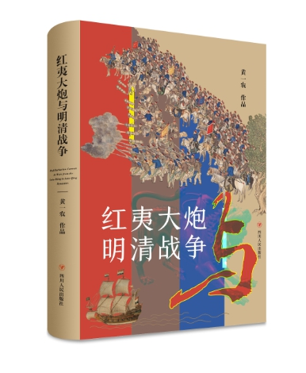

# 黃一農

## 论文链接
- [早期“脈望齋”提供的论文](https://web.archive.org/web/20150103071233/http://hss.nthu.edu.tw/~ylh/chinese.htm)
- [黃一農＿紅學研究成果目錄 (2021.11.01更新)](https://vocus.cc/article/6100d272fd89780001c27586) - VOCUS 方格子

## 其他
- 学生论文
    - 16-17世紀東亞海域火器交流史研究 - 常修銘
        - [台湾博硕士论文知识加值系统](https://hdl.handle.net/11296/63uyad)
        - [国立清华大学博硕士论文全文系统](http://etd.lib.nctu.edu.tw/cgi-bin/gs32/hugsweb.cgi?o=dnthucdr&s=GH029643804.id)
        - [国立清华大学图书馆](https://nthu.primo.exlibrisgroup.com/permalink/886UST_NTHU/vaplfb/alma990031223740206774)