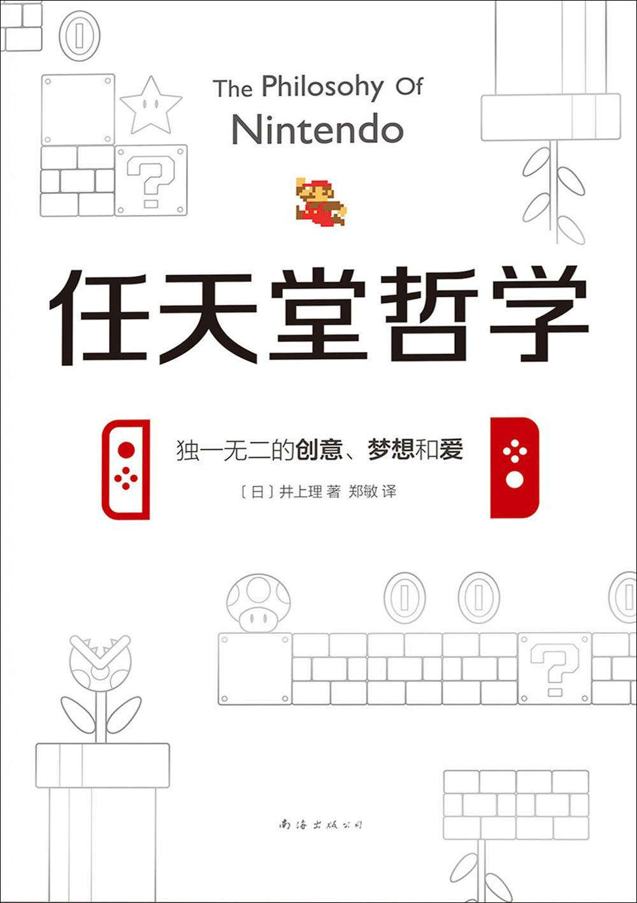

# The Philosophy of Nintendo

- [The Philosophy of Nintendo](#the-philosophy-of-nintendo)
    - [起 - 谁创造了“动森”](#起---谁创造了动森)
    - [承 - 寻找原文](#承---寻找原文)
    - [转 - 这书靠谱吗](#转---这书靠谱吗)
    - [合 - 猫叔做了什么](#合---猫叔做了什么)
    - [附 - 关于书名](#附---关于书名)
    - [其他参考](#其他参考)

## 起 - 谁创造了“动森”
多年前购买的《任天堂哲学》，居然有提到宫本茂创造了“动森”，对此有些疑惑。拖延许久后，决定下手研究下。

## 承 - 寻找原文
- 此书存在日文版本,开始在 google book 上搜索关键字，未能匹配到相关原文。
    - [任天堂“驚き”を生む方程式](https://books.google.co.jp/books?id=B_ibDwAAQBAJ)
- 那么购买原书，找到原文如下，“作った”，确实作者这么写了。但似乎还是个孤证。
    - > そう語る宮本は、何気ないコミュニケーションを遊びに変える、どうぶつの森を作った。
- 在维基百科中可以发现
    - 宫本茂为“动森”初代的 producer
        - [どうぶつの森（2001年4月14日、NINTENDO64）プロデューサー](https://ja.wikipedia.org/wiki/%E5%AE%AE%E6%9C%AC%E8%8C%82)
    - 但转至“动森”条目下便不再有猫叔的名字出现
        - [プロデューサー 手塚卓志](https://ja.wikipedia.org/wiki/%E3%81%A9%E3%81%86%E3%81%B6%E3%81%A4%E3%81%AE%E6%A3%AE)
    - 维基比起某度百科那是甩开了十万八千里，但也不可盲目相信

## 转 - 这书靠谱吗
- 既然有了中日文，则可进行对比。不比不知道，一比吓一跳，这 TM 什么翻译。随便举两列
    - 在‘宫本的秘密武器——“背后的视线”’这一节中
    - 在说完"如果妻子能制作出独特的东西时，他就能退休了“，后面明明有一句写着观众席一片笑声，就这么被吃掉了。
        - > 宮本がそう言うと、会場は笑いの渦に包まれた。
    - 明明写着 DS 重置版，这么重要的修饰词又被吃掉了
        - > ＤＳ版にリメイクされた《おいでよ どうぶつの森》では ......
        - > 在 NDS 版的动物之森中 ......
    - 明明写的是国内（也就是霓虹国），超过 500 万，这个“国内”又被吃掉了。
        - > 国内では、２００９年２月時点で５００万本を超える大ヒットを記録している。
        - > 截至 2009 年 2 月，动物之森的销量超过了 500 万套。
- 等等，怎么有个 DS 重置版
    - 日文原著也同样欠揍
    - 作者明显没搞明白，重制的是 NGC 版
- 既然这一作一译都不那么靠谱，那这个宫本创作动森的孤证，可不可信也就由读者大人么自己判断了

## 合 - 猫叔做了什么
- 在 2008 年的一期“社长问答”中也没有提到过猫叔的创作
    - [ゲームセミナー2008 ～『どうぶつの森』ができるまで～](https://www.nintendo.co.jp/etc/seminar2008/doubutsu/index.html)
- 在 nookipedia 中，有开发人员列表
    - [List of Animal Crossing staff](https://nookipedia.com/wiki/Animal_Crossing/Staff)
- 如要进一步确定，可以 N64 一下“动森”开发人员列表。
- 在 kotobank 中引用的「知恵蔵」"[宮本茂](https://kotobank.jp/word/%E5%AE%AE%E6%9C%AC%E8%8C%82-1718538)"，看来是最舒服的
    - 创造了
        - > 世界で2億5000万本以上を販売したゲーム「スーパーマリオ」シリーズや「ゼルダの伝説」シリーズ、「ドンキーコング」シリーズといった大ヒットゲームの生みの親として知られている。
    - 担任了
        - > 更に、86年の「ゼルダの伝説」や「スーパーマリオブラザーズ2」、88年の「スーパーマリオブラザーズ3」、89年の「MOTHER」といった、ファミコンのゲームソフトでディレクターやプロデューサーを務め、数々のヒット作を世に送り出した。
    - 主导了
        - > その後も、ゲームボーイ(89年)やスーパーファミコン(90年)、ニンテンドーDS(2004年)、Wii(06年)といったゲーム機の進化に合わせて、「ポケモンスタジアム」や「ピクミン」、「どうぶつの森」、「星のカービィ」といった人気作の開発を主導してきた。

## 附 - 关于书名
关于书的译名，最早为依据日文名称《任天堂快乐创意方程式》，再版时使用了日文版附带的英文标题 "The Philosophy of Nintendo" 译为《任天堂哲学》。另，本书有台版《任天堂創造"驚奇"的方程式》，不知翻译如何。

## 其他参考
- 社长问答
    - [社長が訊く](https://www.nintendo.co.jp/corporate/links/index.html)
    - [Iwata Asks](https://iwataasks.nintendo.com/)
- Asianprofile
    - [宮本茂](https://www.asianprofile.wiki/wiki/Shigeru_Miyamoto)
