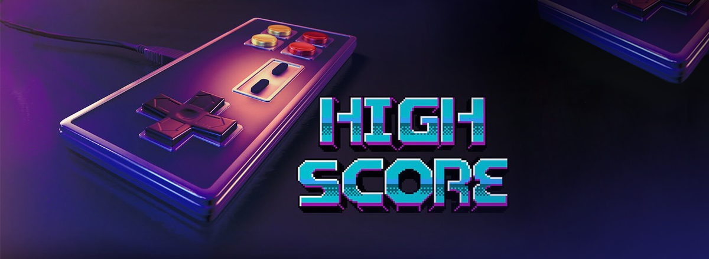

# Game History

- [Game History](#game-history)
    - [The Whole Industry](#the-whole-industry)
    - [Companies & People](#companies--people)
    - [The game develop](#the-game-develop)
    - [The movie](#the-movie)
    - [up](#up)
    - [others](#others)

## The Whole Industry
- [《剑指高分》 High Score](https://movie.douban.com/subject/35162178/) - Netflix
    - [wiki](https://zh.wikipedia.org/zh-hans/%E5%89%91%E6%8C%87%E9%AB%98%E5%88%86)
    - 1 大起大落 - Boom & Bust
        > 介绍街机游戏及家用游戏机于1970年代晚期到1980年代早期，截至1983年美国游戏业大萧条的早期发展。受访者包括《太空侵略者》主创西角友宏、首届《太空侵略者》全美锦标赛冠军丽贝卡·海涅曼、通用计算机公司街机游戏加速版发明者道格·麦克雷（Doug Macare）、史蒂夫·戈尔森（Steve Golson）和迈克·霍洛维兹（Mike Horowitz）、《吃豆人》主创岩谷彻、雅达利联合创办人诺兰·布什内尔、Fairchild Channel F 游戏卡带发明者杰瑞·劳森后裔凯伦与安德森，以及《E.T.外星人》开发者霍华德·斯科特·华沙。
    - 2 卷土重来 - Comeback Kid
        > 介绍1983年大萧条后任天堂凭借街机游戏《大金刚》和红白机打入美国市场，利用1990年任天堂世界锦标赛进行宣传，推出任天堂游戏顾问（Nintendo Game Play Counselors）帮助遇到困难的玩家以及《任天堂力量》的创刊。受访者包括多部任天堂游戏的作曲田中宏和、协助推广红白机及《任天堂力量》的任天堂美国营销总监盖尔·蒂尔登（Gail Tilden）、任天堂世界锦标赛冠军杰夫·汉森（Jeff Hansen）、任天堂游戏顾问肖恩·布鲁姆（Shaun Bloom）、环球城市影业诉任天堂案中任天堂代表律师约翰·卡比。本集致敬了2019年去世的卡比。
    - 3 角色扮演玩家 - Role Player
        > 介绍了冒险游戏和角色扮演游戏从最初的《巨洞冒险》等文字冒险游戏发展成《谜之屋》及《创世纪》系列的图像冒险游戏，再变成《最终幻想》系列等角色扮演游戏的历程。受访者包括《谜之屋》主创罗贝塔和肯·威廉姆斯、《创世纪》主创理查·盖瑞特、《最终幻想》美工天野喜孝和LGBT题材角色扮演游戏开发者莱恩·贝斯特（Ryan Best）。
    - 4 这是一场战争 - This Is War
        > 介绍了家用机战争。世嘉利用世嘉创世纪配合《刺猬索尼克》和《劲爆美式足球》，从销量层面在美国市场战胜人任天堂。受访者包括世嘉美国总裁汤姆·卡林斯克、《索尼克》玩法设计安原广和、索尼克美工大岛直人、1994年世嘉世界锦标赛冠军克里斯·唐（Chris Tang）、艺电创办人特里普·霍金斯、88版《劲爆美式足球》制作人乔·伊巴拉、将黑人足球引入《劲爆美式足球》的《Madden NFL》系列开发者戈登·贝拉米。
    - 5 开战！- Fight!
        > 介绍了《街头霸王II》和《真人快打》等格斗游戏，两者塑造了现代电子竞技比赛的雏形。后来《真人快打》和《午夜陷阱》引起大量争议，引起1993年美国国会举行听证会，促成娱乐软件分级委员会成立。受访者包括《街头霸王II》设计者西谷亮和安田朗、《真人快打》系列联合创始人约翰·托拜亚斯、1993年《街头霸王II 极速版》冠军、中野贵博电子竞技队主理人中野贵大（Takahiro Nakano）和《午夜陷阱》主创吉姆·莱利（Jim Riley）。
    - 6 晋级 Levelup
        > 介绍 1993 年任天堂家用机游戏《星际火狐》及计算机正式从二维计算机图形向三维计算机图形过渡，以及 Id Software 游戏《毁灭战士》正式提出网络游戏概念。受访者包括《毁灭战士》主创约翰·罗梅洛、《星际火狐》主创迪伦·库斯伯特 及吉尔斯·戈达德，以及诺兰·布什内尔的最终回顾，包括《乓》和《太空战争》的开发。

- the assac book

## Companies & People
- Nintendo book
- Iwata book
- Iwata asks
- nintendo vs sega
- xbox

## The game develop
- id
- gdc
    - zelda
    - iwata
    - miyamoto
    - hideo
    - cup head
- WILL WRIGHT - Teaches Game Design and Theory

## The movie
- rock star

## up
- gamker
- leya
- ninzi

## others
- nintendo king
- nintendo philosophy
- high school iwata
- ff7 talk
- RE2 talk
