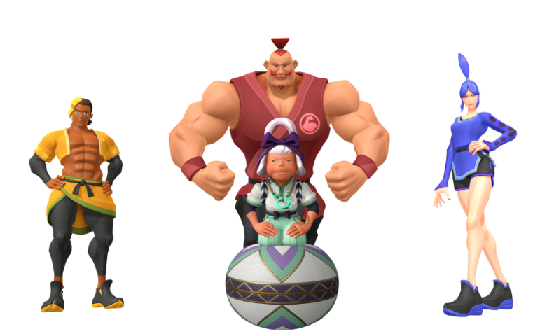

# 灵环与四大师

## 起
- 强大烦要玩《健身环》

## 承
- 四大师出现
    - 足莉娜
    - 强腕
    - 腹肌利
    - 欧婆婆
- 强大烦问，为什么欧婆婆名字里没有瑜伽？
- 那我们就“狗狗”一下吧

## 转
- 查日文原名
    - オババ様（CV:垣尾麻美）
        - マスター４のリーダーで、各筋肉のバランスが取れたヨガ担当の老婆。リングからは「妖怪」だの「オバケ」だの散々な呼ばれ方をしている。子供達が楽しく筋トレを行えるよう「ゲームランド」を建設した。
            - [リングフィットアドベンチャー](https://dic.pixiv.net/a/%E3%83%AA%E3%83%B3%E3%82%B0%E3%83%95%E3%82%A3%E3%83%83%E3%83%88%E3%82%A2%E3%83%89%E3%83%99%E3%83%B3%E3%83%81%E3%83%A3%E3%83%BC)
        - マスター4のリーダー。全身をバランス良く鍛えた老婆。 ヨガスキルが弱点のモンスターを従えていることが多いが、嫌らしいことにオババ自身は弱点なしの無属性扱い。 登場する度にリングから「出た」だの「オバケ」だのと散々な扱いを受けるのがお約束。 HPを削るごとに腕、腹、足のラッシュを叩き込み、攻撃力過剰でも全てのラッシュを受けきらない限り倒せない、総まとめ的な強敵。
            - [筋肉は一生の相棒](https://w.atwiki.jp/aniwotawiki/pages/47276.html)
    - 是综合选手啦，那就不要和专用技能特别挂钩咯，同时日语发音又和“鬼”发音类似，怎么不翻成“鬼婆婆”呢（doge)
- 看看英文吧
    - [The Four Masters](https://ringfitadventure.fandom.com/wiki/The_Four_Masters)
        - Allegra
        - Armando
        - Abdonis
        - Guru Andma
    - Trivia
        - In English, every one of the Four Masters have their names beginning with A.
        - Alongside that, all of the Four Master's names are puns.
            - Allegra, Armando, and Abdonis's names all have their designated fit skills inside: Leg, Arm, Ab.
            - Guru Andma is a homophonic pun on 'Grandma'—a homage to her appearance and that yoga can help fight

## 合
- 那中文能不能叫“幽婆婆”呢
    - yoga 和”幽“发音类似
    - 灵环说“鬼”啊，说成”幽灵“也能混混吧