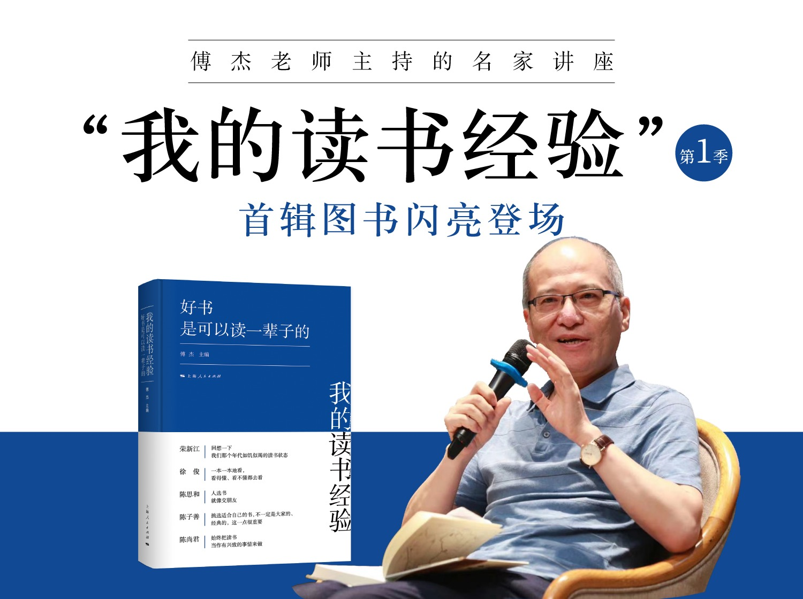

# 我的读书经验

> 《好书是可以读一辈子的》脱胎于傅杰教授主持的“我的读书经验”系列名家讲座，邀请的每一位主讲人都是“书界大佬”，现场讲述自己买书、读书甚至做书的故事，分享宝贵的阅读心得，向热爱读书的听众推荐值得翻阅的书目。此系列讲座一经推出便广受听众好评，也得到澎湃新闻等国内知名媒体的关注。
> 
> 以该系列讲座为主体、适当补充相关背景材料和珍贵图片的系列图书《我的读书经验》，将由上海人民出版社陆续推出，《好书是可以读一辈子的》是其中的第一本。
> 
> 这一本邀请了荣新江、徐俊、陈思和、陈子善和陈尚君五位在学界极有建树的学者，讲述自己读书的经历和治学的道路。五位主讲人爱书、读书几十年，所阅图书无数，深悉何为好书、如何读好书，其读书分享亦蕴含治学、树人、成才之理，能为身处信息碎片化时代的读者，尤其是年轻读者，提供有益的读书、学习、研究指引。

## 四种版本
- 现场直播视频
    - 相对最原始
- 录制视频
    - 有删改
- 公众号文章
    - 精选重点
- 图书出版
    - 略有删改

## 以陈子善老师访谈为例
- 直播版
    - 未看过
- 录制视频
    - 所能见到的内容最完整
- 公众号文章
    - 基本记录了前半部分的主体演讲内容，后续提问内容无记录
- 图书
    - 基本还原了录制视频，适当修饰

