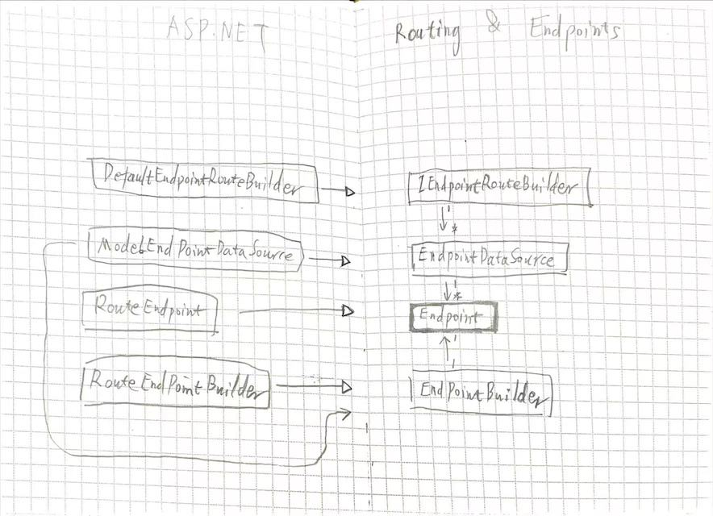

# Asp.net Routing & Endpoints

- 基于 Asp.net core 5
    ``` cs
    app.UseRouting();
    app.UseEndpoints();
    ```

## 关系图



## 流程

- 注册阶段
    - UseRouting
        - 注册 EndpointRoutingMiddleware
    - UseEndpoints
        - 注册 Endpoints
        - 注册 EndpointMiddleware
- 运行阶段
    - EndpointRoutingMiddleware
        - 匹配 Endpoints
    - EndpointMiddleware
        - 执行 Endpoint 的 RequstDelegate

``` cs
// set
UseRouting
    -> regist routeBuilder as new DefaultEndpointRouteBuilder
    -> regist EndPointRoutingMiddleware
UseEndpoints
    -> append dataSource to routeBuilder
    -> regist EndpointMiddleware

// init
init EndPointRoutingMiddleware
    -> compose dataSources of routeBuilder to one dataSource

// run
run EndPointRoutingMiddleware Task
    -> create matcher from dataSource 
    -> match endpoint by matcher
run EndPointMiddleware Task
    -> run requestDelegate from endpoint

```


## 源码截取

``` cs
public static class EndpointRoutingApplicationBuilderExtensions 
{
    public static IApplicationBuilder UseRouting(this IApplicationBuilder builder)
    {
        var endpointRouteBuilder = new DefaultEndpointRouteBuilder(builder);
        return builder.UseMiddleware<EndpointRoutingMiddleware>(endpointRouteBuilder);
    }

    public static IApplicationBuilder UseEndpoints(this IApplicationBuilder builder, Action<IEndpointRouteBuilder> configure)
    {
        configure(endpointRouteBuilder);
        foreach (var dataSource in endpointRouteBuilder.DataSources) {
            routeOptions.Value.EndpointDataSources.Add(dataSource);
        }
        return builder.UseMiddleware<EndpointMiddleware>();
    }
```

``` cs
internal sealed class EndpointRoutingMiddleware
{
    _endpointDataSource = new CompositeEndpointDataSource(endpointRouteBuilder.DataSources);

    public Task Invoke(HttpContext httpContext) {
        var matcher = _matcherFactory.CreateMatcher(_endpointDataSource);
        matcher.MatchAsync(httpContext);
        return SetRoutingAndContinue(httpContext);
    }
}
```

``` cs
internal sealed class EndpointMiddleware
{
    public Task Invoke(HttpContext httpContext)
    {
        var endpoint = httpContext.GetEndpoint();
        var requestTask = endpoint.RequestDelegate(httpContext);
    }
}
```

``` cs
public static class EndpointRouteBuilderExtensions
{
    public static IEndpointConventionBuilder Map(
        this IEndpointRouteBuilder endpoints,
        RoutePattern pattern,
        RequestDelegate requestDelegate)
    {
        var builder = new RouteEndpointBuilder(
            requestDelegate,
            pattern,
            defaultOrder) {
            DisplayName = pattern.RawText ?? pattern.DebuggerToString(),
        };
        var dataSource = endpoints.DataSources.OfType<ModelEndpointDataSource>().FirstOrDefault();
        if (dataSource == null) {
            dataSource = new ModelEndpointDataSource();
            endpoints.DataSources.Add(dataSource);
        }
        return dataSource.AddEndpointBuilder(builder);
    }
}
