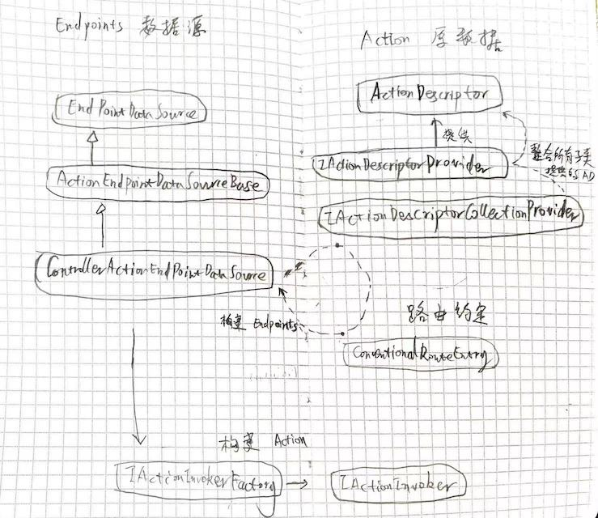
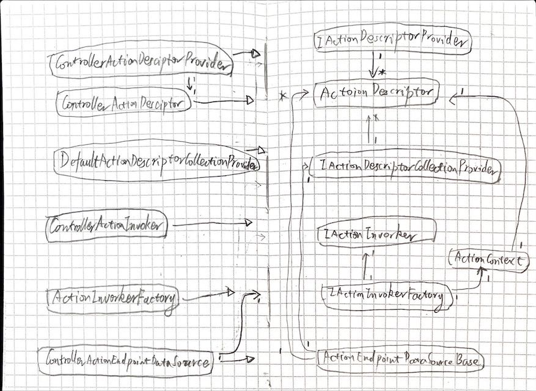

# Asp.net 中的 Actions

- 基于《[通过极简模拟框架让你了解ASP.NET Core MVC框架的设计与实现[上篇]：路由整合](https://www.cnblogs.com/artech/p/inside-asp-net-core-mvc-01.html)》

## 关系图

### from ActionDesctript to ActionInvoker


### from ActionDesctript to ActionInvoker 2


- 相对于原框架，实质上只是使用了自定义的 ControllerActionEndPointDataSource 代替了原类。
- 运行时，将其注册到 EndpointDataSources，构建 Endpoints 即可

## 流程
- 注册
    - 注册 ControllerActionDescriptorProvider
    - 注册 ControllerActionEndpointDataSource
- 初始化
    - ControllerActionEndpointDataSource 
        - 设置 ActionInvoker 为 RequestDelegate
        - 注册 Endpoints
            - 通过 ControllerActionDescriptor 和 ConventionalRouteEntry
- 运行
    - 执行对应 Endpoint 的 RequestDelegate

## 代码
- 注册
    ``` cs
    public static class ServiceCollectionExtensions
    {
        public static IServiceCollection AddMvcControllers(this IServiceCollection services)
        {
            return services
                .AddSingleton<IActionDescriptorCollectionProvider, DefaultActionDescriptorCollectionProvider>()
                .AddSingleton<IActionInvokerFactory, ActionInvokerFactory>()
                .AddSingleton<IActionDescriptorProvider, ControllerActionDescriptorProvider>()
                .AddSingleton<ControllerActionEndpointDataSource, ControllerActionEndpointDataSource>();
        }
    }
    ```
- 初始化
    ``` cs
    public class ControllerActionEndpointDataSource : ActionEndpointDataSourceBase
    {
        protected override List<Endpoint> CreateEndpoints(......)
        {
            foreach (var action in actions) {
                foreach (var route in _conventionalRoutes) {

                    var pattern = _routePatternTransformer.SubstituteRequiredValues(route.Pattern, action.RouteValues);
                    if (pattern != null) {
                        RouteEndpointBuilder builder = new RouteEndpointBuilder(_requestDelegate, pattern, route.Order);
                        builder.Metadata.Add(action);
                        endpoints.Add(builder.Build());
                    }

                } else { //Attribute Routing
                    ......
                }
            }
            return endpoints;
        }
    }
    ```
- 运行
    ``` cs
    public class ControllerActionEndpointDataSource : ActionEndpointDataSourceBase
    {
        private Task ProcessRequestAsync(HttpContext httContext)
        {
            var endpoint = httContext.GetEndpoint();
            var actionDescriptor = endpoint.Metadata.GetMetadata<ActionDescriptor>();
            var actionContext = new ActionContext
            {
                ActionDescriptor = actionDescriptor,
                HttpContext = httContext
            };

            var invokerFactory = httContext.RequestServices.GetRequiredService<IActionInvokerFactory>();
            var invoker = invokerFactory.CreateInvoker(actionContext);
            return invoker.InvokeAsync();
        }
    }
    ```

