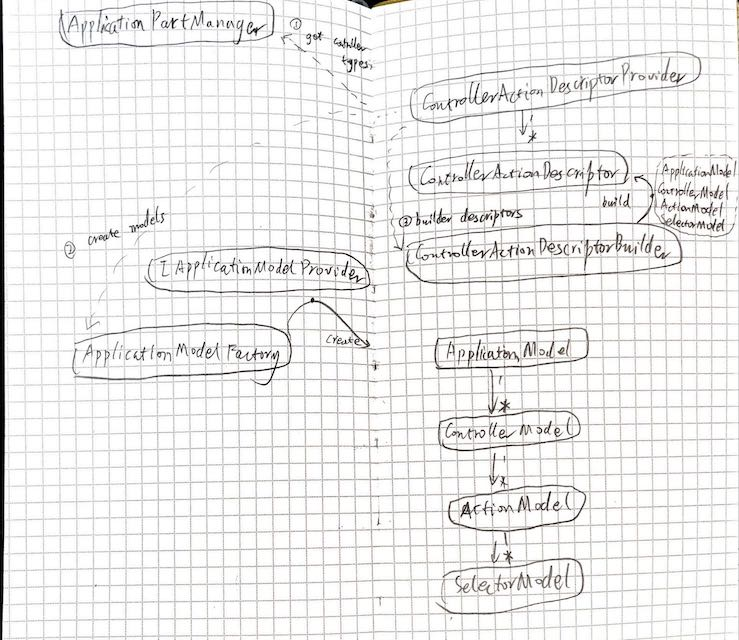

# Asp.net 中的 Controllers




## 流程

``` cs
- 依赖注入
    -> AddMvcCore 
        -> ControllerActionDescriptorProvider
- 注册
    -> UseEndpoints
        -> UseMvcControllers
            -> add ControllerActionDataSource to dataSources
- 运行
    -> run EndPointRoutingMiddleware Task
        -> ControllerActionDataSource build endpoints
            -> use controllerActionDescriptor to build
                -> get controller types from ApplicationParManager
                -> create models from ApplicationModelFactory
                -> build descriptors from ControllerActionDescriptorBuilder
        -> match endpoint
    -> run EndPointMiddleware Task
        -> run requestDelegate from endpoint
```

## 从 model 到 endpoint 的构建
``` cs
ApplicationModel-ControllerModel-ActionModel
    -> ControllerActionDescriptor
        -> Endpoint
```