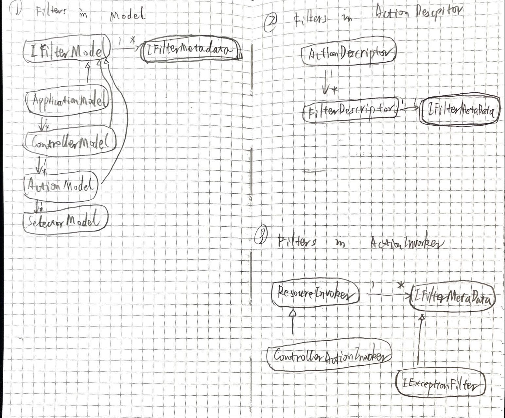

# Asp.net 中的 Filter



## 流程
- 注入
    - 两种注入方式，参见《[ASP.NET Core Filter与IOC的羁绊](https://www.cnblogs.com/wucy/p/15398927.html)》
        - TypeFilterAttribute
        - ServiceFilterAttribute
- 初始化
    - Model.Filters -> ActionDescriptor.Filters -> Endpoint.ActionIvoker.Filters
- 运行
    - 硬编码运行各类 Filter

## 代码

- 注入
    ``` cs
    services.TryAddEnumerable(ServiceDescriptor.Singleton<IFilterProvider, DefaultFilterProvider>());
    ```
- 初始化
    ``` cs
    public class DefaultApplicationModelProvider
    {
        public void OnProvidersExecuting(ApplicationModelProviderContext context)
        {
            foreach (var filter in _mvcOptions.Filters) {
                context.Result.Filters.Add(filter);
            }
        }
    }
    ```

## ref
- [理解ASP.NET Core - 过滤器(Filters)](https://www.cnblogs.com/xiaoxiaotank/p/15622083.html)
- [.NetCore之过滤器](http://www.longtaosu.com/article/15)