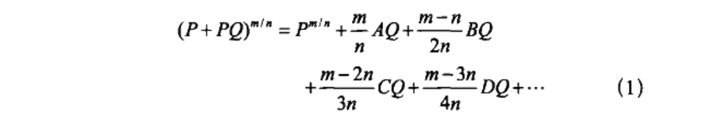

# 《微积分的历程》笔记

- [《微积分的历程》笔记](#微积分的历程笔记)
    - [第1章　牛顿](#第1章牛顿)
        - [广义二项展开式](#广义二项展开式)
        - [逆级数](#逆级数)
        - [《分析学》中求面积的法则](#分析学中求面积的法则)
        - [牛顿的正弦级数推导](#牛顿的正弦级数推导)

## 第1章　牛顿

### 广义二项展开式

- 从有限项到无限项
- 

### 逆级数

- 从 z = x - x^2 + x^3 - x^4 + ... 到 x = z + z^2 + z^3 ...

### 《分析学》中求面积的法则
- 
- 
- 

### 牛顿的正弦级数推导
