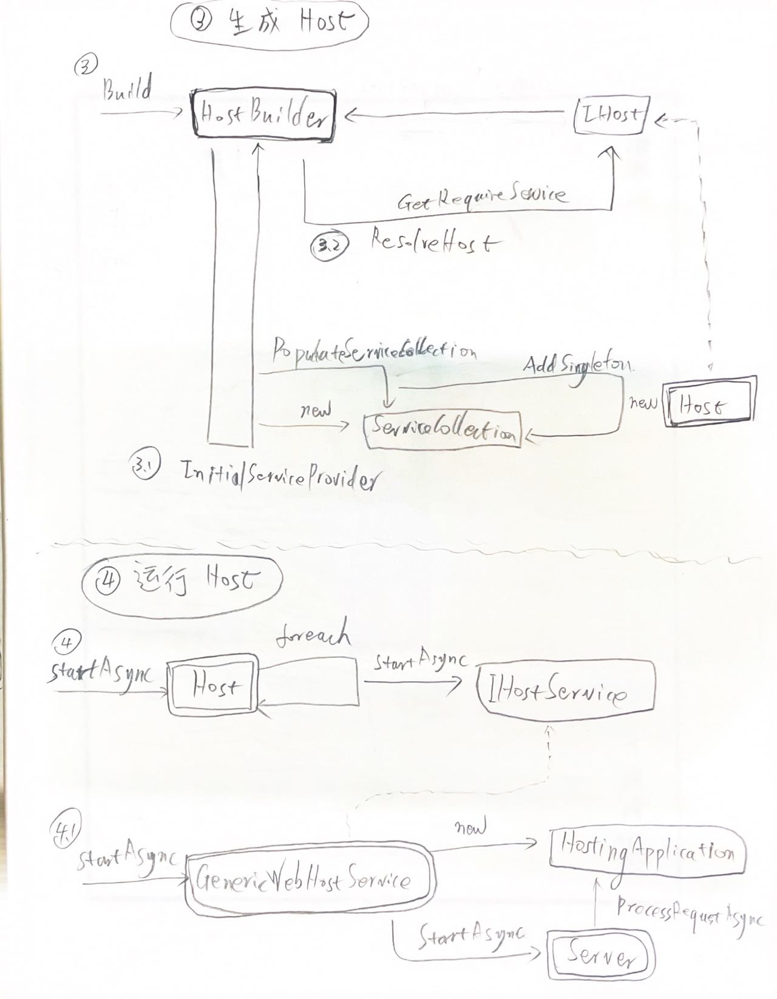

# Asp.Net 的 WebHost

- [Asp.Net 的 WebHost](#aspnet-的-webhost)
    - [从 host 到 services](#从-host-到-services)
    - [asp.net 3.x/5 的 Host](#aspnet-3x5-的-host)
    - [asp.net 6 的 WebApplication](#aspnet-6-的-webapplication)

## 从 host 到 services
- 构建 Web Host
    - 
- 从 Connection Delegate 到 HttpConnection MiddleWare
    - 
- 从 Connection Context 到 Http Context
    - 
- AppServices & RequestServices
    - 

## asp.net 3.x/5 的 Host
- Host & Builder
    - 
- Host Run
    - 
- GenericWebHostBuilder
    - 
- Create & Use Middleware
    - 

## asp.net 6 的 WebApplication
- WebApplication
    - 
- TcpApplciation
    - 
