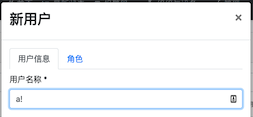
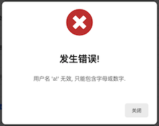
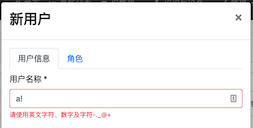

# Abp Angular UI 设置 Validator


- [Abp Angular UI 设置 Validator](#abp-angular-ui-设置-validator)
    - [目标](#目标)
    - [原理](#原理)
    - [操作](#操作)
    - [ref](#ref)


## 目标
- 原始：Angular UI 端 user name 的输入验证不包含字符类型检验，需提交后经服务端验证
    -  -> 
- 目标：添加 Angular UI 端验证
    - 

## 原理
- `identity.module` 框架的 `default-users-form-props.ts` 中 `userName` 只有“非空”和“长度限制”
``` ts
export const DEFAULT_USERS_CREATE_FORM_PROPS = FormProp.createMany<IdentityUserDto>([
  {
    type: ePropType.String,
    name: 'userName',
    displayName: 'AbpIdentity::UserName',
    id: 'user-name',
    validators: () => [Validators.required, Validators.maxLength(256)],
  },
  ......
]);
```


## 操作
- 按推荐
    - First Option: Override `UsersComponent`
    - Second Option: Override `UserName` field in the form
- 选择第二种，即设置新验证
    - 新建 `form-prop-contributors.ts`
    ``` ts
    // form-prop-contributors.ts

    import {
        eIdentityComponents,
        IdentityCreateFormPropContributors,
        IdentityUserDto,
    } from '@abp/ng.identity';
    import { ePropType, FormProp, FormPropList } from '@abp/ng.theme.shared/extensions';
    import { AbstractControl, ValidationErrors, ValidatorFn, Validators } from '@angular/forms';

    function allowedNameValidator(nameRe: RegExp): ValidatorFn {
        return (control: AbstractControl): ValidationErrors | null => {
            const isPassed = nameRe.test(control.value);
            return isPassed ? null : { allowedUsername: {} };
        };
    }

    const usernameProp = new FormProp<IdentityUserDto>({
        type: ePropType.String,
        name: 'userName',
        displayName: 'AbpIdentity::UserName',
        id: 'user-name',
        validators: () => [
            Validators.required,
            Validators.maxLength(256),
            allowedNameValidator(new RegExp('^[a-zA-Z0-9-._@+]*$')),
        ],
    });

    export function usernamePropContributor(propList: FormPropList<IdentityUserDto>) {
        const index = propList.indexOf('userName', (action, name) => action.name === name);
        propList.dropByIndex(index);
        propList.addByIndex(usernameProp, index);
    }

    export const identityCreateFormPropContributors: IdentityCreateFormPropContributors = {
        [eIdentityComponents.Users]: [
            usernamePropContributor,
        ],
    };

    export const identityEditFormPropContributors = identityCreateFormPropContributors;
    ```
    - 将其加载到 `Identtiy.Module` 中
    ``` ts
    // app-routing.module.ts

    const routes: Routes = [
        ......
        {
            path: 'identity',
            loadChildren: () => import('@abp/ng.identity').then(m =>
            m.IdentityModule.forLazy({
                createFormPropContributors: identityCreateFormPropContributors,
                editFormPropContributors: identityEditFormPropContributors,
            })
            ),
        },
    ......
    ```
    - 其他参见文末 ref
        - angular 中 validator 的 RegExp
        - 错误信息的具体输出


## ref
- [Need customization in Password validation - Abp Angular](https://support.abp.io/QA/Questions/544/Angular-Need-customization-in-Password-validation)
- [Dynamic Form (or Form Prop) Extensions for Angular UI - Abp Angular](https://docs.abp.io/en/abp/4.3/UI/Angular/Dynamic-Form-Extensions)
- [Validators - Angular](https://angular.io/api/forms/Validators)
    - [validators.ts](https://github.com/angular/angular/blob/c14c701775c900ce9ac8781c08fc76da067910c5/packages/forms/src/validators.ts)
- [Form Validation - Abp Angular](https://docs.abp.io/en/abp/4.3/UI/Angular/Form-Validation)