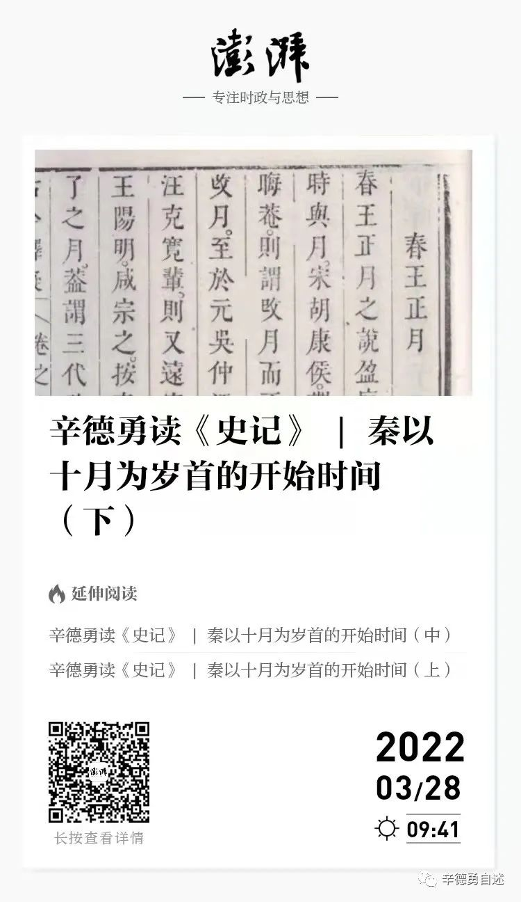

# 《秦以十月爲歲首的開始時間》笔记

- 夏商周時期所謂“三正”與“中國年”十二月對應關係表

| | 寅 | 卯 | 辰 | 巳 | 午 | 未 | 申 | 酉 | 戌 | 亥 | 子 | 丑 |
|---|---|---|---|---|---|---|---|---|---|---|---|---|
| 夏历 | 正 | 二 | 三 | 四 | 五 | 六 | 七 | 八 | 九 | 十 | 十一 | 十二 |
| 殷历 | 二 | 三 | 四 | 五 | 六 | 七 | 八 | 九 | 十 | 十一 | 十二 | 正 |
| 周历 | 三 | 四 | 五 | 六 | 七 | 八 | 九 | 十 | 十一 | 十二 | 正 | 二 |

- 《呂氏春秋·十二紀》另外還在季夏之月裏提到有土德之事，合之可以更好地瞭解五德與五行的對應關係：

|  | 四立 | 五行 |
| ------- | ------- | ------- |
| 孟春之月 | 某日立春 | 盛德在木 |
| 孟夏之月 | 某日立夏 | 盛德在火 |
| 季夏之月 |         | 中央土  |
| 孟秋之月 | 某日立秋 | 盛德在金 |
| 孟冬之月 | 某日立冬 | 盛德在水 |

> 如前所述，《呂氏春秋》一書的根本思想，是法天地而“爲民父母”，惟《呂氏春秋》又云“民無道知天，民以四時寒暑日月星辰之行知天”（《呂氏春秋》卷二四《不苟論·當賞》），即謂四時之行是識得天機的孔徑，可見它在呂不韋的治國理念中佔有何等重要的地位。
> 
> 遵循這樣的治國理念，呂不韋對以十月爲歲首的秦曆自然不會滿意，因而也就很自然地改以正月爲歲首，以順應天道。——這就是我對這次曆法更改背後原因的理解。

> 其實趙正更改呂不韋故轍最爲昭彰、也最有象徵性的舉措，便是如同本文開頭引述的那段《史記·秦始皇本紀》所述，大秦帝國甫一建立，趙正這位始皇帝就把歲首從正月改到了十月。
> 
> 趙正這樣做的原因，
> - 一是他“推終始五德之傳，以爲周得火德，秦代周德，從所不勝，方今水德之始”，這是基於當時流行的五行學說，以爲秦既然已取代周成爲天下共主，它的德運也要與周人不同——周屬火，水勝火，故秦當屬水德。......
> - 二是趙正“以爲水德之治，剛毅戾深，事皆決於法，刻削毋仁恩和義，然後合五德之數”。

- 歲首演变

| | 歲首 |
|------- | ------- |
| 秦昭襄王 | 十月 |
| 吕不韦 | 正月 |
| 秦王正 | 十月 |
| 汉武帝 | 正月 |