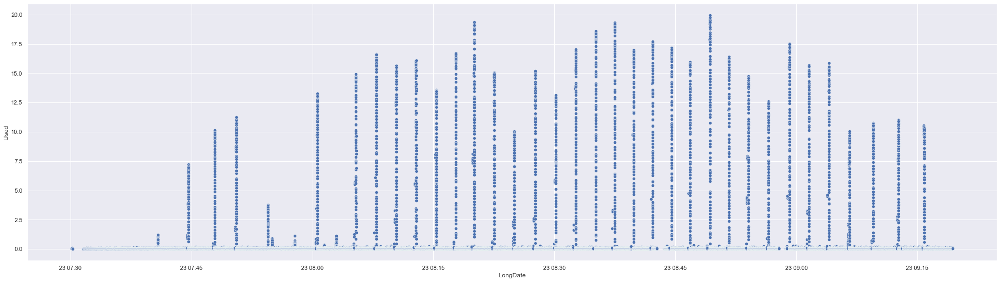
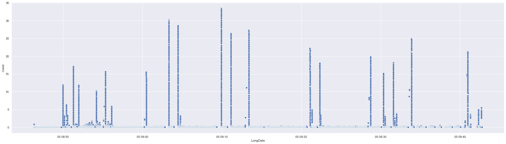
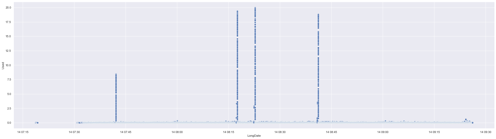
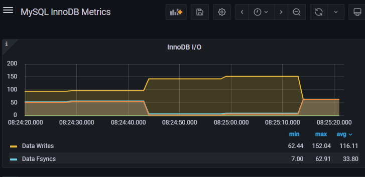
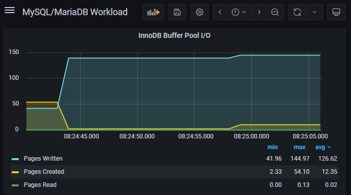
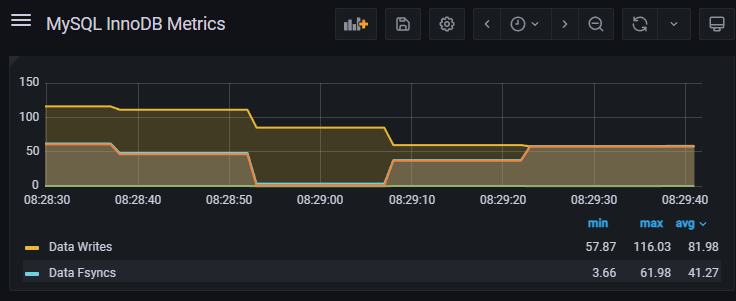
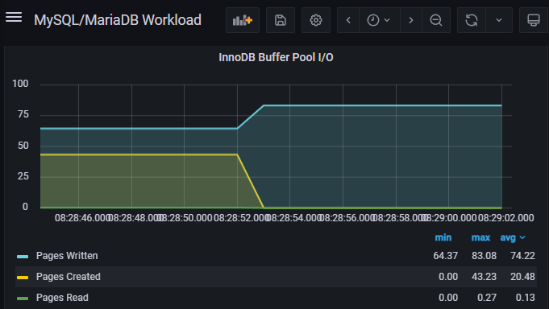

# Concen with MariaDb

- [Concen with MariaDb](#concen-with-mariadb)
  - [origin](#origin)
  - [app server - log async](#app-server---log-async)
  - [mariadb server - innodb\_log\_file\_size up](#mariadb-server---innodb_log_file_size-up)
  - [mariadb server - thread\_pool\_size, thread\_pool\_min\_threads up](#mariadb-server---thread_pool_size-thread_pool_min_threads-up)
  - [others](#others)
  - [ref](#ref)

## origin

- 原始设置，尚未优化
- 大量数据超过 1s，部分超过 20s

## app server - log async

- 将软件日志的写入，改为 async
- 规律性长时间响应

## mariadb server - innodb_log_file_size up

- 将数据库的 innodb_log_file_size 增大，保证不会发生 sync write
- 长时间响应间隔增大

## mariadb server - thread_pool_size, thread_pool_min_threads up

- 将数据库的的 thread_pool_size(unix), thread_pool_min_threads(windows) 增大
- 仅出现 4 次长时间响应，原因如下
    - new connections
    - new thread pools
    - write c disk
    - new thread pools

## others
- app 服务器自身造成的长时间响应
  - 由于 app 服务器其他程序的影响，造成的长时间响应
  - 等待结束后，连接数自然会上升
  - 由于 app 服务器的不响应，数据库发起刷脏
- `innodb_adaptive_flushing_lwm`
  - 一种推测
    - `innodb_adaptive_flushing_lwm` 在到达水平线时，会触发 flush，先以一定速度 async （见[“理解 InnoDB 自适应刷脏”](https://leviathan.vip/2020/05/19/mysql-understand-adaptive-flushing/)），一定时间后如无法降至水平线下，再以 sync 的方式 flush，此时速度为 `innodb_io_capacity`
    - 下图为 200_io
      - 
      - 
    - 下图为 100_io：
      - 
      - 
    - 黄图和蓝图对比可知，此刻的 flush 都是为了增加 page written
    - 那么直接增大 `innodb_log_file_size` 和 `innodb_adaptive_flushing_lwm`，撑过高峰
  - [innodb_adaptive_flushing_method](https://mariadb.com/kb/en/innodb-system-variables/#innodb_adaptive_flushing_method)
    > **innodb_adaptive_flushing_method**
    >
    > _Removed: MariaDB 10.0 - replaced with InnoDB flushing method from MySQL 5.6_  
    > _已删除: MariaDB 10.0 - 由 MySQL 5.6 中的 InnoDB 刷新方法替换_
    >
    > Description: Determines the method of flushing dirty blocks from the InnoDB buffer pool. If set to native or 0, the original InnoDB method is used. The maximum checkpoint age is determined by the total length of all transaction log files. When the checkpoint age reaches the maximum checkpoint age, blocks are flushed. This can cause lag if there are many updates per second and many blocks with an almost identical age need to be flushed. If set to estimate or 1, the default, the oldest modified age will be compared with the maximum age capacity. If it's more than 1/4 of this age, blocks are flushed every second. The number of blocks flushed is determined by the number of modified blocks, the LSN progress speed and the average age of all modified blocks. It's therefore independent of the innodb_io_capacity for the 1-second loop, but not entirely so for the 10-second loop. If set to keep_average or 2, designed specifically for SSD cards, a shorter loop cycle is used in an attempt to keep the I/O rate constant. Removed in MariaDB 10.0/XtraDB 5.6 and replaced with InnoDB flushing method from MySQL 5.6.
    > 
    > 描述：确定从 InnoDB 缓冲池中刷新脏块的方法。如果设置为 native 或 0 ，则使用原始 InnoDB 方法。最大检查点期限由所有事务日志文件的总长度确定。当检查点年龄达到最大检查点年龄时，块将被刷新。如果每秒有很多更新并且需要刷新许多具有几乎相同年龄的块，这可能会导致延迟。如果设置为 estimate 或 1 ，默认情况下，最旧的修改年龄将与最大年龄容量进行比较。如果超过该年龄的 1/4，则每秒都会刷新块。刷新的块数量由修改块数量、LSN 进度速度和所有修改块的平均年龄决定。因此，对于 1 秒循环，它与 innodb_io_capacity 无关，但对于 10 秒循环而言，并不完全如此。如果设置为专为 SSD 卡设计的 keep_average 或 2 ，则会使用较短的循环周期来尝试保持 I/O 速率恒定。在 MariaDB 10.0/XtraDB 5.6 中删除，并从 MySQL 5.6 开始替换为 InnoDB 刷新方法。
  - [Tuning MySQL/InnoDB Flushing for a Write-Intensive Workload](https://www.percona.com/blog/tuning-mysql-innodb-flushing-for-a-write-intensive-workload/)
    > **innodb_adaptive_flushing_lwm**
    >
    > innodb_adaptive_flushing_lwm defines the low watermark to activate the adaptive flushing. The low watermark value is expressed as a percentage of the checkpoint age over the maximal checkpoint age. When the ratio is under the value defined by the variable, the adaptive flushing is disabled. The default value is 10 and the max allowed value is 70.
    > 
    > innodb_adaptive_flushing_lwm 定义低水位线以激活自适应刷新。低水位值表示为检查点年龄与最大检查点年龄的百分比。当该比率低于变量定义的值时，自适应刷新将被禁用。默认值为 10，最大允许值为 70。
    > 
    > The main benefits of a higher watermark are similar to the ones of using a larger value for innodb_log_file_size but it puts the database closer to the edge of max checkpoint age. With a high low watermark value, the write performance will be better on average but there could be short stalls. For a production server, increasing innodb_log_file_size is preferred over increasing innodb_adaptive_flushing_lwm. However, temporarily, it can be useful to raise the value dynamically to speed up a logical dump restore or to allow a slave to catch up with its master.
    > 
    > 较高水位的主要好处与使用较大 innodb_log_file_size 值的好处类似，但它使数据库更接近最大检查点年龄的边缘。使用高低水位线值时，平均写入性能会更好，但可能会出现短暂的停顿。对于生产服务器，增加 innodb_log_file_size 优于增加 innodb_adaptive_flushing_lwm。然而，暂时地，动态提高该值以加速逻辑转储恢复或允许从机赶上主机可能会很有用。

## ref
- [Thread Pool in MariaDB](https://mariadb.com/kb/en/thread-pool-in-mariadb/)
- [InnoDB Flushing: Theory and solutions](https://www.percona.com/blog/2011/04/04/innodb-flushing-theory-and-solutions/)
- [A graph a day, keeps the doctor away ! – MySQL Checkpoint Age](https://lefred.be/content/a-graph-a-day-keeps-the-doctor-away-mysql-checkpoint-age/)
- [Poorman’s MySQL monitoring/trending](https://lefred.be/content/poormans-mysql-monitoring-trending/)
- [MySQL Server Exporter](https://grafana.com/oss/prometheus/exporters/mysql-exporter/?tab=installation)
- [在Windows 如何安裝 mysql_exporter](https://opensource.dwins.com/?p=458)
- [InnoDB Flushing in Action for Percona Server for MySQL](https://www.percona.com/blog/innodb-flushing-in-action-for-percona-server-for-mysql/)
- [Give Love to Your SSDs – Reduce innodb_io_capacity_max!](https://www.percona.com/blog/give-love-to-your-ssds-reduce-innodb_io_capacity_max/)
