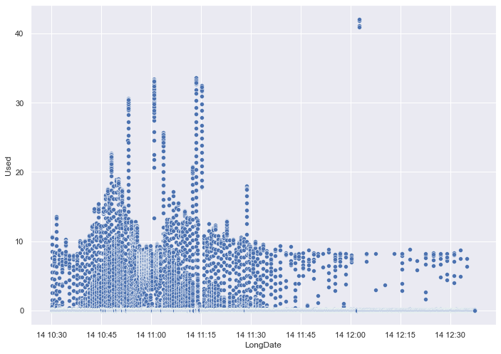

# Concen with MariaDb

- [Concen with MariaDb](#concen-with-mariadb)
  - [origin](#origin)
  - [app server - log async](#app-server---log-async)
  - [mariadb server - innodb\_log\_file\_size up](#mariadb-server---innodb_log_file_size-up)
  - [mariadb server - thread\_pool\_size, thread\_pool\_min\_threads up](#mariadb-server---thread_pool_size-thread_pool_min_threads-up)
  - [others](#others)
  - [ref](#ref)

## origin

- 原始设置，尚未优化
- 大量数据超过 1s，部分超过 20s

## app server - log async

- 将软件日志的写入，改为 async
- 规律性长时间响应

## mariadb server - innodb_log_file_size up

- 将数据库的 innodb_log_file_size 增大，保证不会发生 sync write
- 长时间响应间隔增大

## mariadb server - thread_pool_size, thread_pool_min_threads up

- 将数据库的的 thread_pool_size(unix), thread_pool_min_threads(windows) 增大
- 仅出现 4 次长时间响应，原因如下
    - new connections
    - new thread pools
    - write c disk
    - new thread pools

## others
- `innodb_adaptive_flushing_lwm`
  - 一种推测
    - `innodb_adaptive_flushing_lwm` 在到达水平线时，会触发 flush，先以一定速度 async （尚未了解如何计算该速度），一定时间后如无法降至水平线下，再以 sync 的方式 flush，此时速度为 `innodb_io_capacity`
    - 图一为 200_io， 图二为 100_io：
    - 
    - 
    - 那么直接增大 `innodb_log_file_size` 和 `innodb_adaptive_flushing_lwm`，撑过高峰
  - [Tuning MySQL/InnoDB Flushing for a Write-Intensive Workload](https://www.percona.com/blog/tuning-mysql-innodb-flushing-for-a-write-intensive-workload/)
    > innodb_adaptive_flushing_lwm
    > innodb_adaptive_flushing_lwm defines the low watermark to activate the adaptive flushing. The low watermark value is expressed as a percentage of the checkpoint age over the maximal checkpoint age. When the ratio is under the value defined by the variable, the adaptive flushing is disabled. The default value is 10 and the max allowed value is 70.
    > 
    > innodb_adaptive_flushing_lwm 定义低水位线以激活自适应刷新。低水印值表示为检查点年龄与最大检查点年龄的百分比。当该比率低于变量定义的值时，自适应刷新将被禁用。默认值为 10，最大允许值为 70。
    > 
    > The main benefits of a higher watermark are similar to the ones of using a larger value for innodb_log_file_size but it puts the database closer to the edge of max checkpoint age. With a high low watermark value, the write performance will be better on average but there could be short stalls. For a production server, increasing innodb_log_file_size is preferred over increasing innodb_adaptive_flushing_lwm. However, temporarily, it can be useful to raise the value dynamically to speed up a logical dump restore or to allow a slave to catch up with its master.
    > 
    > 较高水印的主要好处与使用较大 innodb_log_file_size 值的好处类似，但它使数据库更接近最大检查点年龄的边缘。使用高低水位线值时，平均写入性能会更好，但可能会出现短暂的停顿。对于生产服务器，增加 innodb_log_file_size 优于增加 innodb_adaptive_flushing_lwm。然而，暂时地，动态提高该值以加速逻辑转储恢复或允许从属设备赶上其主控设备可能会很有用。

## ref
- [Thread Pool in MariaDB](https://mariadb.com/kb/en/thread-pool-in-mariadb/)
- [InnoDB Flushing: Theory and solutions](https://www.percona.com/blog/2011/04/04/innodb-flushing-theory-and-solutions/)
- [A graph a day, keeps the doctor away ! – MySQL Checkpoint Age](https://lefred.be/content/a-graph-a-day-keeps-the-doctor-away-mysql-checkpoint-age/)
- [Poorman’s MySQL monitoring/trending](https://lefred.be/content/poormans-mysql-monitoring-trending/)
- [MySQL Server Exporter](https://grafana.com/oss/prometheus/exporters/mysql-exporter/?tab=installation)
- [在Windows 如何安裝 mysql_exporter](https://opensource.dwins.com/?p=458)
- [InnoDB Flushing in Action for Percona Server for MySQL](https://www.percona.com/blog/innodb-flushing-in-action-for-percona-server-for-mysql/)
- [Give Love to Your SSDs – Reduce innodb_io_capacity_max!](https://www.percona.com/blog/give-love-to-your-ssds-reduce-innodb_io_capacity_max/)
