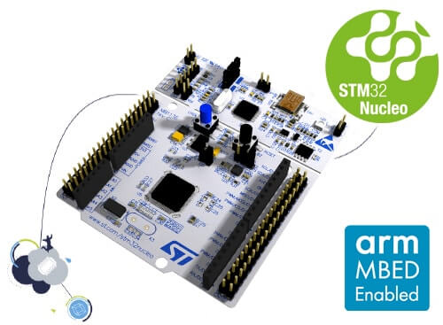

# Mbed Test



- main无法编译
    - 解决方案：添加注释
    - [Greentea for testing applications](https://os.mbed.com/docs/mbed-os/v6.15/debug-test/greentea-for-testing-applications.html)
        > The macro MBED_TEST_MODE is defined when building tests with Mbed CLI versions 1.9.0 and later. You can wrap your application's main() function in a preprocessor check to prevent multiple main() functions from being defined:
        ``` c
        #if !MBED_TEST_MODE
        int main() {
            // Application code
        }
        #endif
        ```
- 测试仍无法通过 
    - 解决方案：升级固件
    - [ST-Link interface doesn't work with greentea on mac os](https://github.com/ARMmbed/mbed-os/issues/4301#issuecomment-301621673)
    - [Nucleo ST-LINK/V2 driver installation and firmware upgrade](https://os.mbed.com/platforms/ST-Nucleo-L152RE/#getting-started)
- 测试偶尔通过 
    - 错误如下 `device disconnected or multiple access on port`
    - 解决方案：关闭 `Mbed Studio` 上的串口