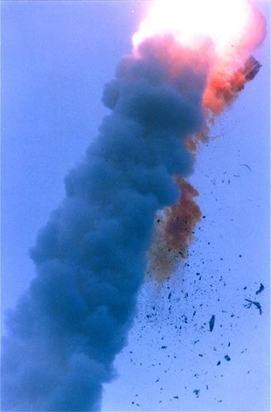

# 我把公司的火箭炸了

是的，公司的火箭被我炸了。

## 联盟1号

大家都听过《悲壮的两小时》吧？

> 1967年8月23日，前苏联著名宇航员弗拉迪米尔.科马洛夫在驾驶“联盟1号”宇宙飞船归航的过程中，当宇宙飞船返回大气层后，需要打开降落伞以减慢飞船速度时，科马洛夫突然发现降落伞出现故障无法打开了。科马洛夫将和“联盟1号”一起在着陆基地附近坠毁。苏联当局在此过程中对于这一情况做了实况直播，并请科马洛夫的家人在科马洛夫生命中的最后两个小时与他告别。
> 
> 科马洛夫告诉女儿“‘联盟1号’今天发生的一切，就因为地面检查时，忽略了一个小数点”。

反正这和爱迪生画鸡蛋、达芬奇救妈妈之类的故事也差不多，有兴趣可以看看下面的文章

- [2004中国十大科技骗局--《悲壮的两小时》](https://tech.china.com/zh_cn/data/11022462/20050106/12050953.html)
- [千面科学｜联盟号宇宙飞船坠毁后：“时间也可能给不出答案”](https://m.thepaper.cn/newsDetail_forward_21447489)
- [朗诵《悲壮的两小时》点击量超八百万 作者竟然是青州市文化馆原馆长](https://sdxw.iqilu.com/share/YS0yMS01MTY0MTE4.html)

## 阿丽亚娜（Ariane）5 型

1996年6月4日，欧洲航天局计划首次发射新的阿丽亚娜（Ariane）5 型火箭，的确由于类似的原因发生了意外。

> 这场灾难性且耗资巨大的飞行事故，其根源就是一行代码尝试将 64 位浮点数转换成有符号整数，整数溢出结果被直接传递给主计算机，最终被主计算机解释为真实数据。

- [一行代码引发的“血案”：价值 5 亿欧元的火箭，发射 40 秒后凌空爆炸](https://www.infoq.cn/article/1e8hae0tviol4ordalma)
    - 注：此文最后一段翻译居然完全偏离原意
- [How a single line of code brought down a half-billion euro rocket launch](https://jam.dev/blog/famous-bugs-rocket-launch)

> ### 3.2 CAUSE OF THE FAILURE
> The failure of the Ariane 501 was caused by the complete loss of guidance and attitude information 37 seconds after start of the main engine ignition sequence (30 seconds after lift- off). This loss of information was due to specification and design errors in the software of the inertial reference system.
> 
> The extensive reviews and tests carried out during the Ariane 5 Development Programme did not include adequate analysis and testing of the inertial reference system or of the complete flight control system, which could have detected the potential failure.

- [N° 33–1996: Ariane 501 - Presentation of Inquiry Board report](https://www.esa.int/Newsroom/Press_Releases/Ariane_501_-_Presentation_of_Inquiry_Board_report)

## 我做了什么

今天公司的某个服务挂了，是的某个地方溢出了，int64 被转成了 int32。如果公司造火箭，那已经被我炸了。但……请记住，重点不是 int64 转不转 int32，而是 __Ariane 501 - Presentation of Inquiry Board report__ 中 __3.2 CAUSE OF THE FAILURE__ 的说明：

> Programme did not include adequate analysis and testing of ......
