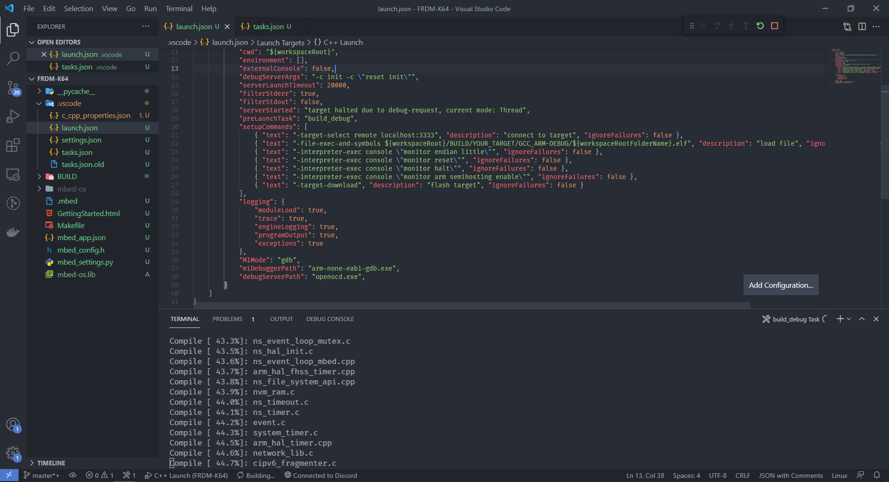

# vs code mbed debug



- 针对 NULEO-L152RE 开发板，使用自带 st-link v2 进行调试
- 照着教程做
  - [mbed - Debugging - Visual Studio Code](https://os.mbed.com/docs/mbed-os/v6.16/debug-test/visual-studio-code.html)
- 经常失败出现 `connection close`
  - 这是由于 debug server 启动后异常退出导致的，需要重新关闭所有 3333 端口相关的进程
- 可以使用 `pyocd` 或 `openocd`
  - 最后选择 `pyocd`，因可直接下载相应 `board` 的 pack
    ``` shell
    > pyocd pack install stm32l152re
    > pyocd pack find stm32l152re
    
    Part            Vendor               Pack                 Version   Installed
    ---------------------------------------------------------------------------------
    STM32L152RETx   STMicroelectronics   Keil.STM32L1xx_DFP   1.4.1     True

    > pyocd gdbserver
    ```
  - `opencd `需指定 `board` 的 config 文件
    ``` shell
    > openocd -f interface/stlink.cfg -f target/stm32l1.cfg
    ```
- 两个 `server` 都要在 `launch.json` 设置 `reset`
  - `pyocd` 设置 `"debugServerArgs": "-Oconnect_mode=under-reset",`
  - `openocd` 设置 `"debugServerArgs": "-c init -c \"reset init\"",`

