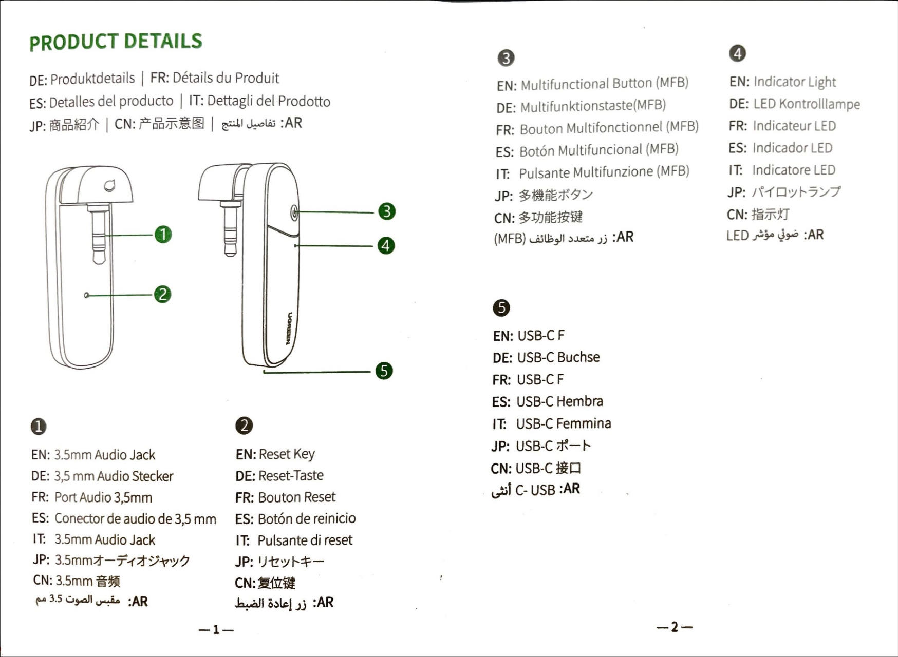

# Bluetooth Transmitter Adapter For Switch

## Product Details
- 将蓝牙接收设备放到本产品附近（10 米内）。
- 确认蓝牙接收设备和本产品都处于开机配对状态（红蓝灯交替闪烁）。
- 本产品与蓝牙接收设备自动配对连接，白灯每 10 秒闪烁1次表示已连接成功。
- 开机后任意模式下，双击多功能按键可以进入配对状态。

## How It Works
- 连接示意图

## Power ON/OFF
- 首次使用：将本产品 3.5mm 音频接口连接至 Switch，长按多功能按键 3 秒开机，白灯长亮 1 秒后，红蓝灯交替闪烁，表示产品正常开机并处于待配对状态。
- 开机：后续开机使用，长按多功能按键3秒或插入 Type-C 接入 5V 供电可开机，白灯长亮 1 秒后，每 5 秒闪烁1次，产品进入回连状态。
- 关机：任意开机状态下，长按多功能按键3秒，白灯长亮1秒后熄灭，产品进入关机状态。

## Bluetooth Pairing
- 将蓝牙接收设备放到本产品附近（10 米内）。
- 确认蓝牙接收设备和本产品都处于开机配对状态（红蓝灯交替闪烁）。
- 本产品与蓝牙接收设备自动配对连接，白灯每 10 秒闪烁 1 次表示已连接成功。
- 开机后任意模式下，双击多功能按键可以进入配对状态。

## Multipoint Bluetooth
- 本产品支持同时连接两台蓝牙接收设备并同时输出声音。
- 先与 A 设备配对完成后，关闭 A 设备。
- 双击多功能按键进入配对状态，与 B 设备配对连接。
- 与 B 设备配对连接成功后，打开 A 设备，本产品会自动回连 A 设备。
- 连接音源播放，两台设备都有声音播放时，表示一拖二连接成功。
- 如果其中一台或者两台没有声音输出时，可以单击本产品多功能按键进入回连或者重新开机回连两台设备，如果还是没声音，请更换下 A/B 两台设备连接顺序。

## Auto Reconnection
- 本产品重启后，会自动回连最后两次连接过的蓝牙设备连接。
- 如果没有连接成功，可单击多功能键手动回连。

## Connectivity Interruptions
- 配对状态下，5 分钟内没有配对成功则自动关机。
- 本产品的有效配对范围为 10 米。

## Factory Setting
- 任意关机状态下，长按开机键 10 秒后，白灯长亮 2.5 秒左右，产品恢复出厂设置，同时进入配对状态。