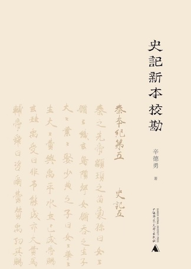
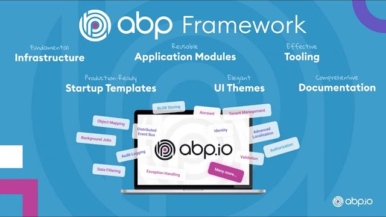
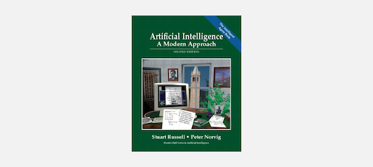

# Collections

- [Collections](#collections)
  - [Xin Deyong](#xin-deyong)
  - [Huang Yinong](#huang-yinong)
  - [ASP.NET core](#aspnet-core)
  - [eShop](#eshop)
  - [Abp](#abp)
  - [React Learning - Tyler McGinnis](#react-learning---tyler-mcginnis)
  - [Serial Port on Node.js](#serial-port-on-nodejs)
  - [JS Learning](#js-learning)
  - [Deep Learning](#deep-learning)
  - [Reinforcement Learning](#reinforcement-learning)
  - [Dissecting_Reinforcement_Learning_Notes](#dissecting_reinforcement_learning_notes)
  - [Self-Driving Car](#self-driving-car)

## Xin Deyong

- [Sanjiang and others](../2017/2017-09-29-Sanjiang_and_others/words_from_xindeyong.md)
- [Bai Qi Conqued Yin](../2018/2018-07-20-Bai_Qi_Conqued_Yin/conqued_yin.md)

## Huang Yinong

- [《二重奏：红学与清史的对话》黄一农](../2019/2019-06-19_Duet_Qing_Honglou/duet.md)
- [黃一農 成果目錄](../2021/2021-12-25_HuangYinong_Papers/hongyinong_papers.md)

## ASP.NET core

- Framework
  - [Mini ASP.NET Core](../2019/2019-01-30_Mini_AspNet_Core/mini_aspnet_core.md)
- WebHost
  - [Web Host](../2022-07-08_Aspnet_WebHost/webhost.md)
- Services
  - [Services](../2022-06-29_Dotnet_Services/dotnet_services.md)
- Routing & Endpoints
  - [Routing & Endpoints](../2022-02-24_Aspnet_Routing_Endpoints/routing_endpoints.md)
  - [To Endpoints](../2022-03-04_Aspnet_To_Endpoints/to_endpoints.md)
  - [Actions](../2022-02-28_Aspnet_Actions/actions.md)
- Controllers
  - [Controllers](../2022-03-02_Aspnet_Controllers/controllers.md)
  - [Filters](../2022-03-03_Aspnet_Filters/filters.md)

## eShop
- [eShopContainer Learning](../2019/2019-05-15_eShopContainer_Learning/eshop.md)

## Abp

- [list service](../2021/2021-06-10_Abp_ListService/abp_listservice.md)
- [unit of work](../2021/2021-07-02_Abp_UoW/uow.md)
- [deploy](../2021/2021-07-16_Abp_Deploy/abp_deploy.md)
- [angular validator](../2022/2022-07-20_Abp_Angular_Validators/validators.md)

## React Learning - Tyler McGinnis
- [React Fundamentals](../2018/2018-12-25_React_Fundamentals/react_fundamentals.md)
- [Redux](../2019/2019-02-12_Redux/redux.md)
- [React Router](../2019/2019-03-12_React_Router/react_router.md)

## Serial Port on Node.js
- [Serial Port on Mac](../2019/2019-01-04_Serial_Port_on_Mac/serial_port_on_mac.md)
- [Serial Port App Dev](../2019/2019-01-08_Serial_Port_App_Dev/serial_port_app_dev.md)

## JS Learning
- [React on Electron](../2019/2019-01-23_React_on_Electron/react_on_electron.md)
- [keyword 'new' in JS](../2019/2019-01-30_Keyword_new_in_JS/keyword_new_in_js.md)
- [Functional Instantiation pattern](../2019/2019-02-11_Functional_Instantiation/functional_instantiation.md)
- [Promise in JS](../2019/2019-02-11_Promise_in_JS/promise_in_js.md)

## Deep Learning
- [How Relu Works](../2017/2017-07-31-How_Relu_Works/how_relu_works.md)
- [About Back Propagation](../2017/2017-08-07-About_Back_Propagation/about_bp.md)
- Topological Sorting
- MiniFlow
- Hyperparameter Optimization
- L1 Regular
- Explore CNN
- Explore LSTM
- [YOLO like Object Detection](../2018/2018-12-13_Traffic_Light_Detection/traffic_light_detection.md)

## Reinforcement Learning
- [Deep RL Pong](../2017/2017-10-30-DeepRL_Pong/deep_rl_pong.md)
- [Policy Gradient](../2017/2017-11-25-Policy_Gradient/policy_gradient.md)
- Monte Carlo Methods
- Deep Q-Learning
- Policy-Based Methods
- Deep Deterministic Policy Gradient
- Quadcopter Udacity
- Curiosity Driven Learning

## Dissecting_Reinforcement_Learning_Notes

- [Dissecting RL P1 Note](../2017/2017-10-19-Dissecting_Reinforcement_Learning_P1_Note/DissectingReinforcementLearningP1Note.md)
- [Dissecting RL P2 Note](../2017/2017-10-25-Dissecting_Reinforcement_Learning_P2_Note/DissectingReinforcementLearningP2Note.md)
- [Dissecting RL P3 Note](../2017/2017-10-27-Dissecting_Reinforcement_Learning_P3_Note/DissectingReinforcementLearningP3Note.md)
- [Dissecting RL P7 Note](../2018/2018-12-26_Dissecting_RL_p7_note/dissecting_rl_p7_note.md)

## Self-Driving Car

- [Summary](../2018/2018-12-24_Self_Driving_nd_Summary/self_driving_summary.md)
- [SVM Vichle Detector](../2018/2018-04-07-SVM_Vichle_Detector/vehicle_detector.md)
- [Kalman Filter](../2018/2018-05-31-Kalman_Filter/kalman_filter.md)
- [Extended Kalman Filter](../2018/2018-06-08-Extended_Kalman_Filter/extented_kalman_filter.md)
- [Unscented Kalman Filter](../2018/2018-06-13-Unscented_Kalman_Filter/unscented_kalman_filter.md)
- [Markov Localization](../2018/2018-07-17-Markov_Localization/markov_localization.md)
- [Particle Filter](../2018/2018-08-01-Particle_Filter/particle_filter.md)
- [PID](../2018/2018-08-02-PID/pid.md)
- [Model Predictive Control](../2018/2018-08-09-Model_Predictive_Control/model_predictive_control.md)
- [MPC Quizzes Solution](../2018/2018-08-10-MPC_Quizzes_Solution/mpc_solution.md)
- [Search Path](../2018/2018-09-07-Search_Path/search_path.md)
- [Prediction by GNB](../2018/2018-09-21-Prediction_by_GNB/gnb.md)
- [Behavior Planning](../2018/2018-10-11_Behavior_Planning/behavior_planning.md)
- [Traffic Light Detection](../2018/2018-12-13_Traffic_Light_Detection/traffic_light_detection.md)
