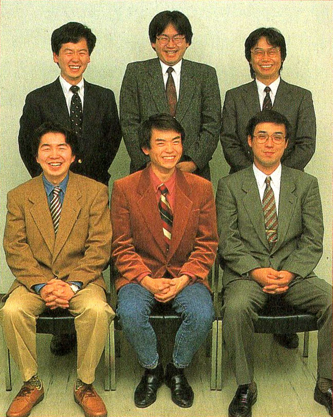

# 追赶乔布斯的岩田聪 —— 个人计算机早期发展史

## 00 楔子

_一个大人怎么能一直那么笑着呢_[^0]

日本東京都千代田区神田須田町 2-6-5 坐落着一栋名为 OS'85 的办公大楼，建成于 1985 年，通体白色瓷砖。大楼地上 10 层地下 1 层，每层 250 多平方。[^1]1989 年的某一天，一位来自东京都武藏村山市的 18 岁青年，来到了大楼的 5 层，今天是他的面试日。走入办公室，他见到面试官中有一位梳着中分头，带着眼镜，永远一脸笑容的男人。面试过程中，一脸稚气的男孩交给了面试官一份准备好的策划书。笑脸面试官接过来仔细端详。

这家面试公司是日后为任天堂开发出热门游戏《星之卡比》系列和《任天堂明星大乱斗》系列的 HAL 研究所，这位尚未成年的青年，便是这两个系列的生父，著名游戏创作人樱井政博。永远保持着微笑的面试官，是日后的任天堂传奇社长岩田聪。岩田聪的脸上总是挂着微笑，“一个大人怎么能一直那么笑着呢”，樱井政博回忆 18 岁时第一次见到岩田聪。

前中樱井政博、后中岩田聪[^smile]

被岩田的笑容，所感染的可不止樱井一个人。樱井之所以想要加入 HAL 是因为玩了一款叫 Gall Force 的游戏。那个年代，还是游戏发展初期，当你通关一款游戏后，基本上就显示一句“恭喜您，通关啦！”但是，Gall Force 不同，它模仿电影片尾，列出了所有参与制作的人员名单。樱井瞬间被吸引了，想要加入这个有意思的公司。

更有意思的是，在这个制作人员名单中，出现了四个不同的叫 IWATA 的开发者。英文版分别是 SATORU.IWATA, S.IWATA, WAHYO.IWATA, W.IWATA。其实这四个人，都是岩田聪。

第一个和第二个，是岩田聪的英文发音；第三个和第四个是代号，当时 HAL 研究所很多人都会给自己起个代号，W.IWATA 在日文版中又写作“ワヒョ.IWATA”，大概就是“岩田哇哈”（表情可以参考“拓麻歌子”百科全书中的图片）。不知道这个代号是岩田自己起的，还是大家被他的笑容所感染，就这么称呼他，然后用在了游戏中。

回到那天的面试，岩田看着手中的游戏策划书问到樱井，是使用当时市面上的一款文字处理软件来编写的？得到樱井的肯定回答后，岩田发现这位青年对于该软件的使用非常娴熟，便夸奖他起来，樱井反倒有些吃惊，这个我自己都没注意到，是这样吗？接着岩田追问，这样这样的功能你会用吗？刚被夸完的樱井突然发现对面这位笑将才是高手中的高手。樱井后来才知道，HAL 研究所当年除了游戏外，还开发了一堆电脑软硬件，其中就包括一款文字处理软件。而且不止于此，他们的野心更大……

[^0]: 本章主要参考樱井政博采访：[『スマブラ』とスポーツカーと
誠実の怪人。](https://www.1101.com/about_iwatasan/sakurai/)

[^1]: 关于 HAL 研究所 1989 年办公地的判断：1988 年发售的 Millipede 包装盒上印有该地址，MSX Magazine 1990 年 4 月号 Lab Letter No.3 介绍页中有 HAL 招聘截图仍是此地址，但樱井说最初他在国台寺上班。MSX Magazine 1984-02 p63 显示地址为，东京都台东区台东 2-19-10 木村BIRU 4F。

[^2]: 国分寺的公寓只有 6 叠，后来开发人员搬去了山梨，见 Keyboard magazine (キーボード マガジン) 2017年7月号 SUMMER。

[^smile]: 出自《星之卡比：梦之泉物语》1993年开发者访谈。
