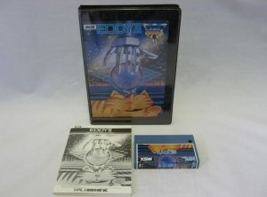
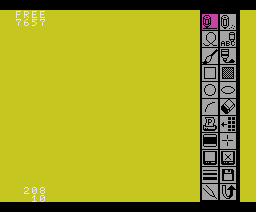
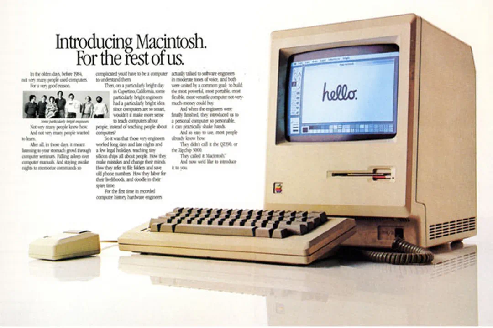

# 从 EDDY II 到 HALNOTE

## 早年生涯
岩田聪于1959年12月6日出生于北海道札幌市，父亲是前北海道室兰市市长。他在学生时代已对电子游戏产生极大兴趣，在高中时期曾利用惠普的HP-65电子计算机制作一些简单的数字游戏，并与同学一起游玩。岩田聪高中毕业后进入东京工业大学修读计算机科学。在校期间，加入刚成立不久的HAL研究所当兼职程序员。1982年大学毕业后，他正式成为HAL研究所的员工。

不久之后，他被提升为部门经理，入职时，岩田聪向公司总经理提出了一些要求，包括能够参与决策和管理工作。他不仅是一名工程师，还负责人事和财务管理。[^6]

## Eddy II

早期的游戏开发公司很多脱胎于计算机软件公司，经常是什么能赚钱就做什么，游戏、应用软件、计算机外设来者不拒。HAL 研究所也不例外，除了游戏外，还开发了一堆电脑软硬件，其中就包括一款绘图软件 Eddy II，这是当年 HAL 研究所开发的轨迹球 CAT[^3] 的附赠软件 EDDY 的升级版，EDDY 的介质还是磁带，EDDY II 已经改用卡带。

对应机种为 MSX，但性能确实差强人意，绘制新内容或删除某些内容后，经常整个画面都需要重新绘制，过程非常缓慢。

## 受到Macintosh的刺激……
EDDY II 由 HAL 研究所的金田猛志[^2]领导开发，岩田聪负责支持。

经历了数月的艰辛努力，1984 年完成 EDDY II 之后，他俩兴高采烈地想：“太好了，我可以出国逃亡了！”于是马上开溜，去洛杉矶参加了一场展览。20 世纪 80 年代的日本是它最辉煌的繁荣期，这个时期的日本让世界上的所有国家都羡慕不已，那时候的日本，号称富到可以买下整个美国。

这两个在美国闲逛的青年，心想着美国也不过如此嘛。直到他们走进了一家计算机商店，看到了苹果发布不久的 Macintosh，着实被惊讶到了。金田回忆起当时的情景说，我哇哇大叫，完全不在乎其他顾客的想法,

 “我觉得这是一台多么漂亮的计算机啊。在那之前，我并不喜欢个人电脑。你觉得黑屏白字的世界，总是让人觉得无味乏味，一点也不有趣吧？但是，当我看到Macintosh时，仅仅这一点就让我感到开心起来......第一次，我意识到，啊，原来个人电脑是一件有趣的东西。”

“我们在EDDY II中想要做的各种事情，在 Macintosh 的 MacPaint 这个图形软件中都得到了实现。完全实现了......”[^7]

两人遇到的 Macintosh 是由苹果公司刚推出的个人图形计算机。它是一台革命性的机器，可以通过鼠标完成工作，几乎不需要触碰键盘。它以图标的形式显示在屏幕上，即使没有运行任何软件，也会显示出磁盘和垃圾桶等图标，非常可爱。这给人一种乐趣的感觉。

岩田和金田对此感到震惊。这激发了他们，想要做出一款能和 Macintosh 系统比肩的综合软件，这便是 HALNOTE 诞生的起点。

## 拿着企划书在公司内部宣传

两个人从美国回国后，兴奋不已地开始制作企划书。无论如何，他们都希望能够在一台名为 MSX 的低性能电脑上实现那个美妙的世界。这就是 HALNOTE 的企划书，包含图形操作系统、绘图软件、文字处理软件、数据库软件等等，一个庞大的计划。

对于当时刚入职一年的金田先生来说，这是他第一次制作企划书。在岩田先生的帮助下，经过一番尝试和努力，企划书终于完成了。

接下来，他们拿着企划书开始了公司内部的宣传之旅。他们的热情和执着得到了回报，HALNOTE 项目得到了批准。然而，困难的道路才刚刚开始。毕竟，Macintosh 是 16 位机，而最新版的 MSX2 只有 8 位，要实现相同的功能并不像口头上那么简单。即使对于乐观的金田来说，他也曾经想过“最好不要说出来”。但是，出于让 MSX 用户体验那个美妙世界的一片心意，他们将经历一段的艰难时光。

HALNOTE 的未来将会是怎样的，岩田尚不知晓。但是，他们想要追赶的那台 Macintosh，却实实在在地改变计算机行业…… 

[^2]: MSX Magazine 1986-10 介绍了金田先生，没有全名，只说是 24 岁结婚两年的好青年（哈哈），但是 MSX Magazine 1984-01 介绍轨迹球时，有金田猛志的全名。
[^3]: 不知将轨迹球命名为 CAT 是否就是为了对应鼠标的 MOUSE。不过鼠标命名 MOUSE 除了形似老鼠外，也与 CAT 一词有关，CAT 可能表示为定位系统。
[^6]: べ/ビジネズの若者たち <18>	岩崎寿次	HALハル研究所の 岩田 聡さん 23 営業もやれば管理もやる
[^7]: MSX Magazine 1986-10 