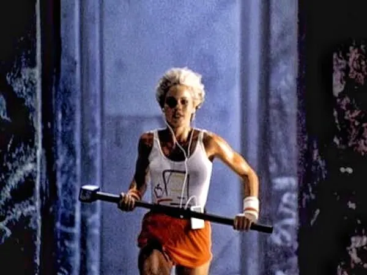
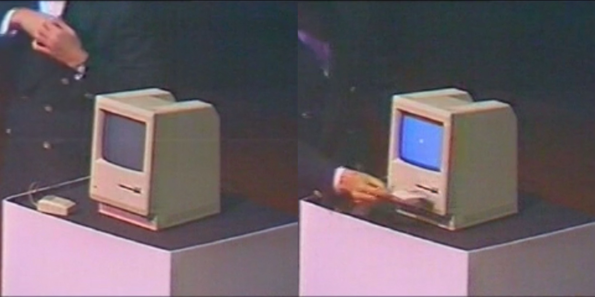
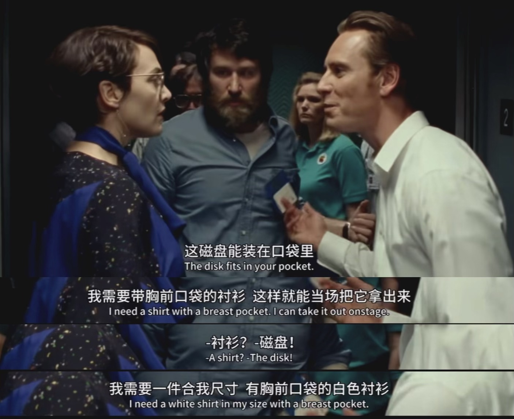
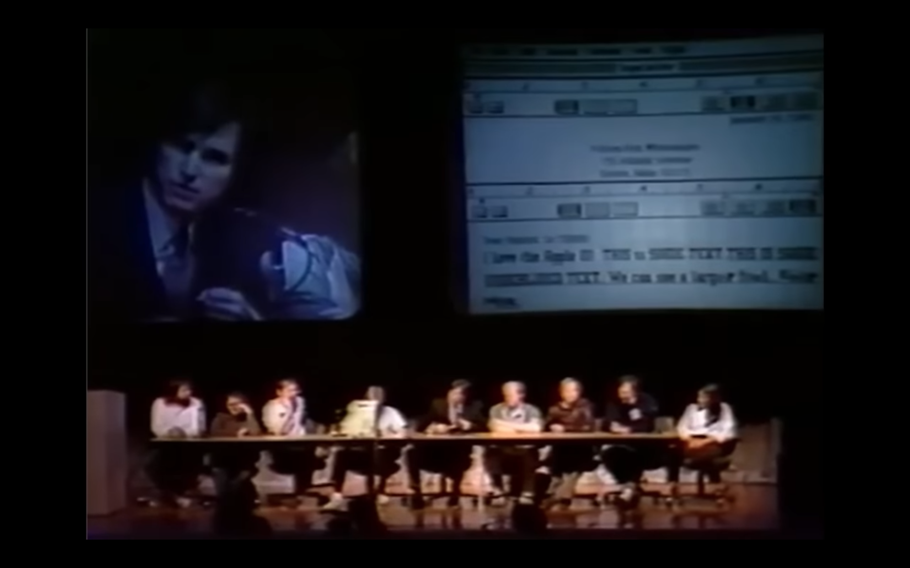
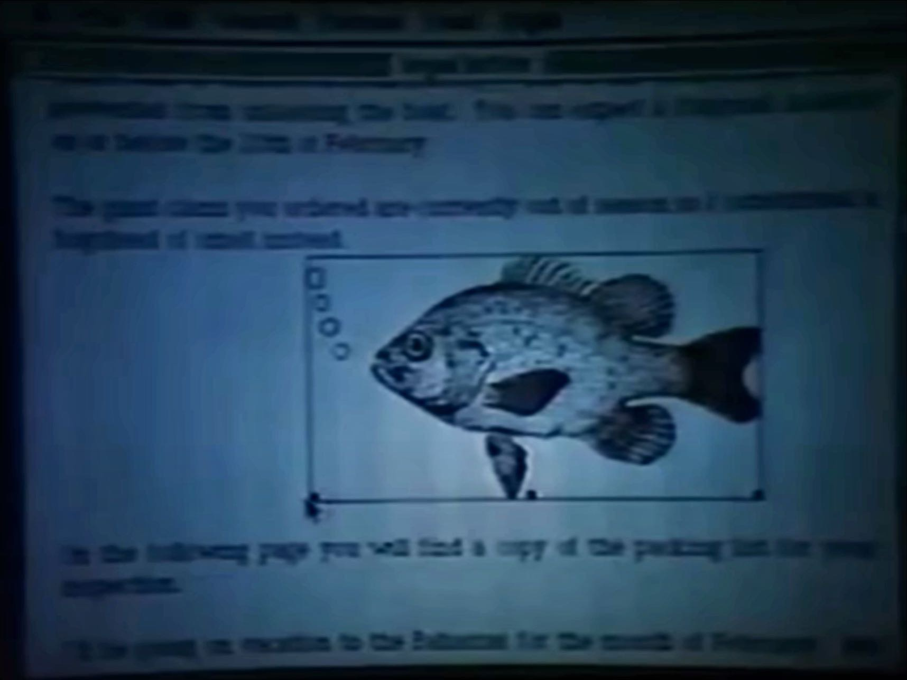

# 1984

## 1984 广告
何以 1984 不似《一九八四》

## 股东会[^release]

1984 年 1 月 24 日，苹果召开了年度股东大会，但这并不是典型的股东大会。这一天，苹果决定展示其下一款产品，苹果联合创始人史蒂夫·乔布斯称其“牛逼的一塌糊涂”（Insanely Great）。

舞台上，乔布斯重新播放了两天前在十八届超级碗期间播出的“1984”广告。接着伸手进西装内侧，从衬衫口袋中掏出了一张 3.5 英寸软盘，举在半空中晃一晃，特意展示其有多小巧。

这招他日后屡试不爽，发布新款 Macbook 笔记本时，缓缓拿出一个黄皮文件袋，打开，慢慢抽出一款极薄的 Macbook Air。发布新款 ipod 时，先要问一句，我就纳了闷了，这牛仔裤的小小口袋干嘛用的啊？然后再慢慢掏出 iPod mini。

电影乔布斯[^movie]中，甚至特地为他的 3.5 英寸盘展示环节编撰了一个场景：开场前，乔布斯一定要换上一件有口袋的衬衫，将软盘放在胸前的口袋，以强烈的对比突出其小巧。

回到现场，乔布斯插入软驱，Macintosh 开启自动演示。“今天 Macintosh，有史以来将第一次自己介绍自己。”随着乔布斯的介绍，Macintosh 开始使用语音自我介绍。

## 计算机大会

六天后，1984 年 1 月 30 日，史蒂夫·乔布斯和 Mac 团队又在波士顿计算机协会大会上向公众展示 Macintosh。[^first-mac]史蒂夫·乔布斯介绍了 Macintosh，随后由开发小组的 Steve Capps, Andy Hertzfeld, Randy Wigginton, Bill Atkinson, Bruce Horn, Burrell Smith, Owen Densmore, Rony Sebok 介绍了 Macintosh。

展示环节几乎和六天前的流程一模一样。除了一句，“今天 Macintosh，有史以来将第二次自己介绍自己。”介绍完 Macitosh，播放完影片后，来到了实机演示环节，乔布斯和其他 8 位开发者一起坐在舞台中央，中间放着一台 Macintosh。

演示开始。开机，打开 MacPaint，用鼠标随便画（拖动、点击、放大），复制，打开 MacWrite，随意编辑（字体、字号、段落），粘贴图片，保存，结束。这些都是我们今天再熟悉不过的操作，但是在 1984 年，这些都是前所未有的。

1984 之前的个人电脑是何状况？“1984”广而告之的是什么？……

[^first-mac]: [Watch Steve Jobs reveal the very first Macintosh on this day in 1984](https://www.macworld.com/article/2215934/watch-steve-jobs-reveal-first-mac.html), from macworld.com, 1984.1.24
[^release]: [1984.1.30 Macintosh 产品介绍及演示 - Steve Jobs Introduces the Macintosh - Computer History Museum](https://www.youtube.com/watch?v=1tQ5XwvjPmA&t=73s&pp=ygUObWFjaW50b3NoIDE5ODQ%3D)
[^movie]: Steve Jobs, 2015, Director - Danny Boyle; Writers - Aaron Sorkin, Walter Isaacson; Stars - Michael Fassbender, Kate Winslet, Seth Rogen; 
