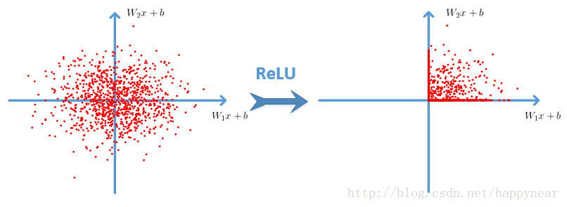
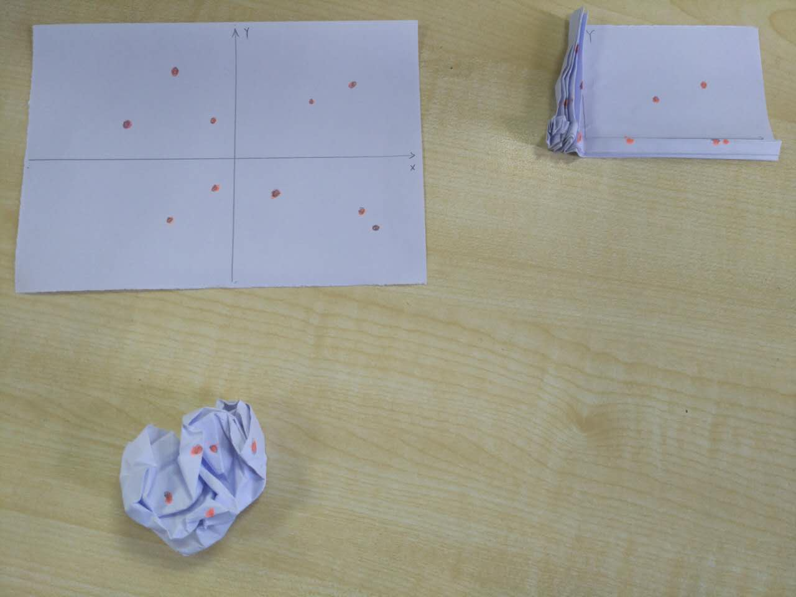
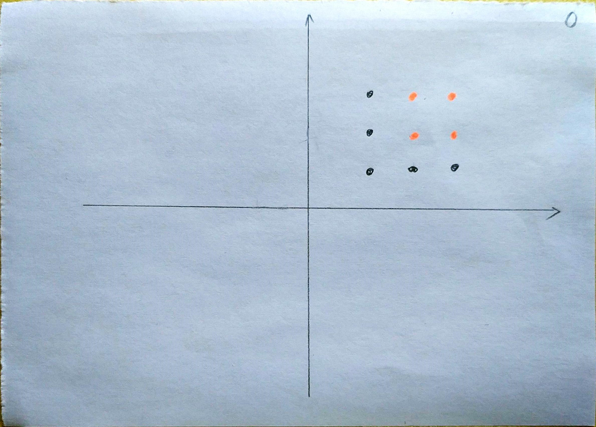
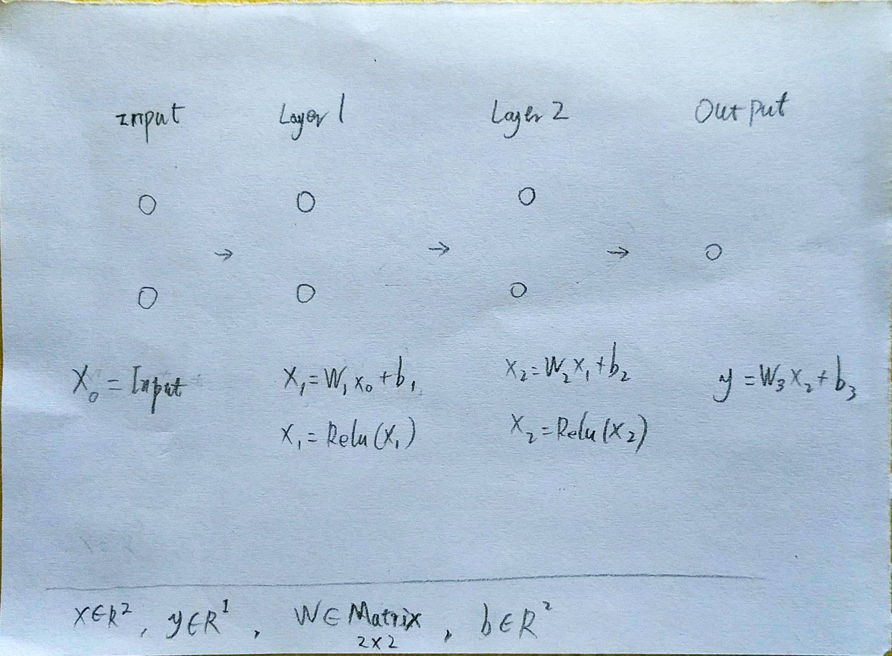
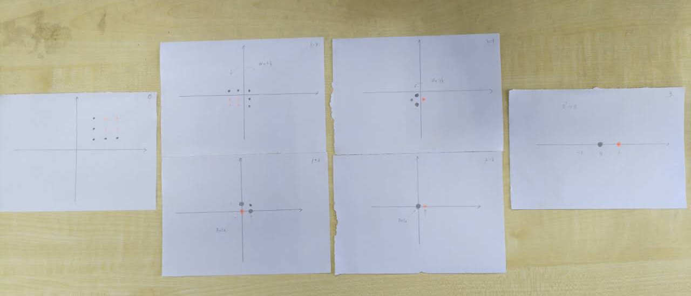
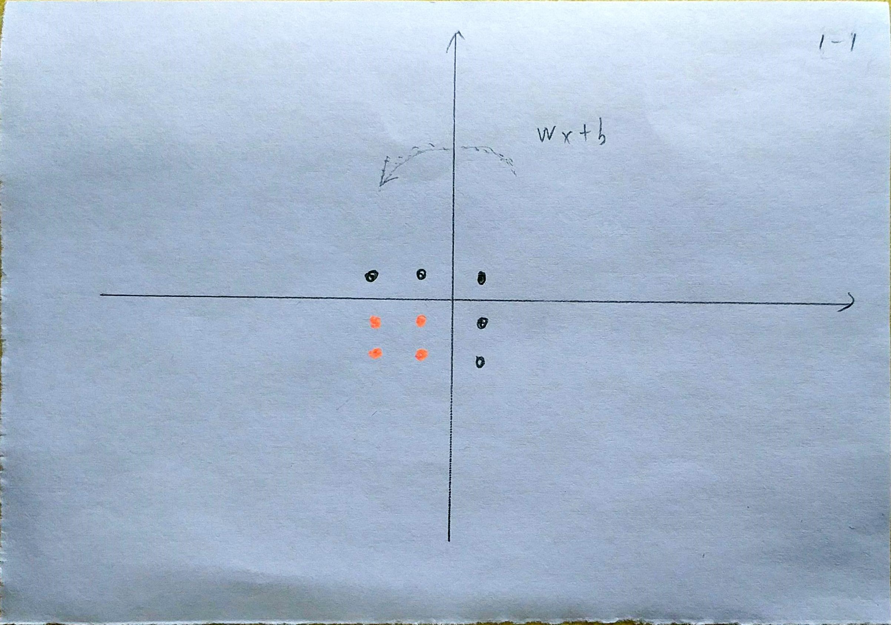
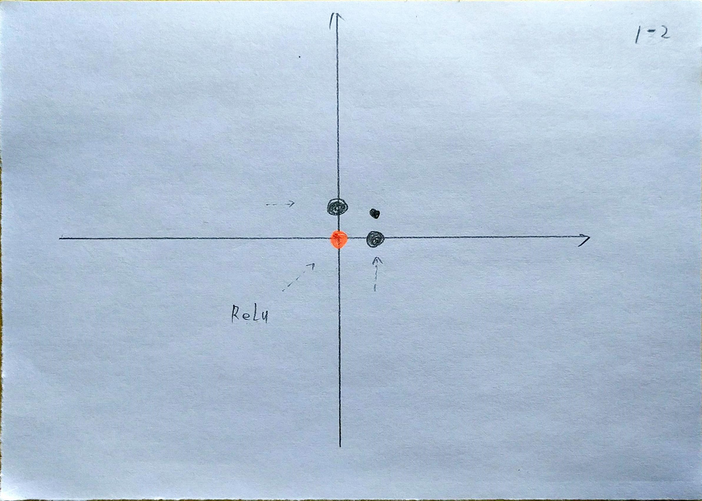
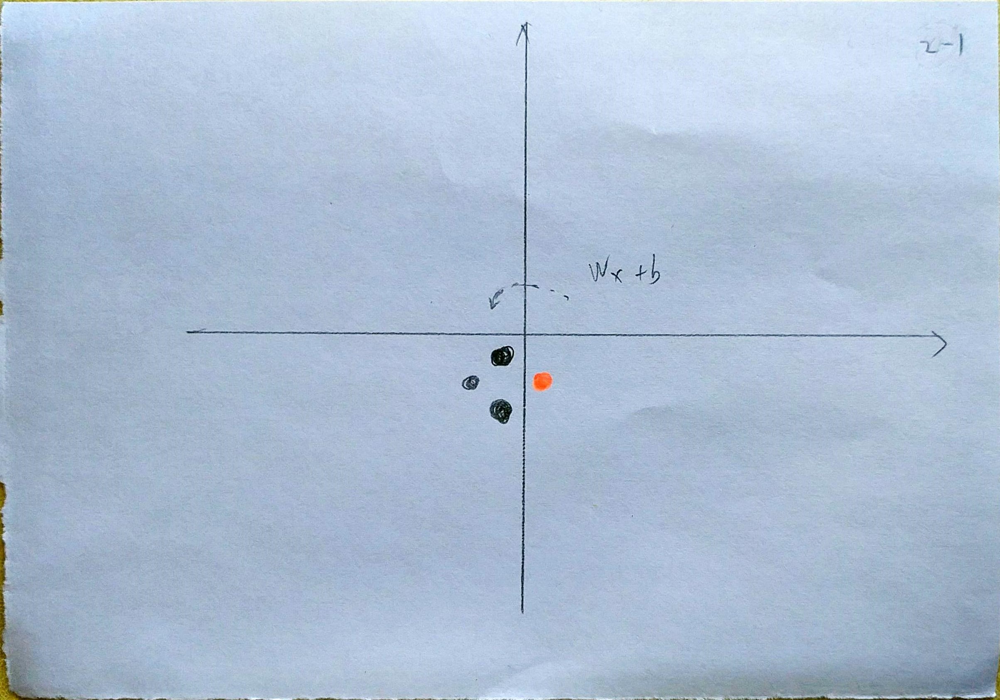
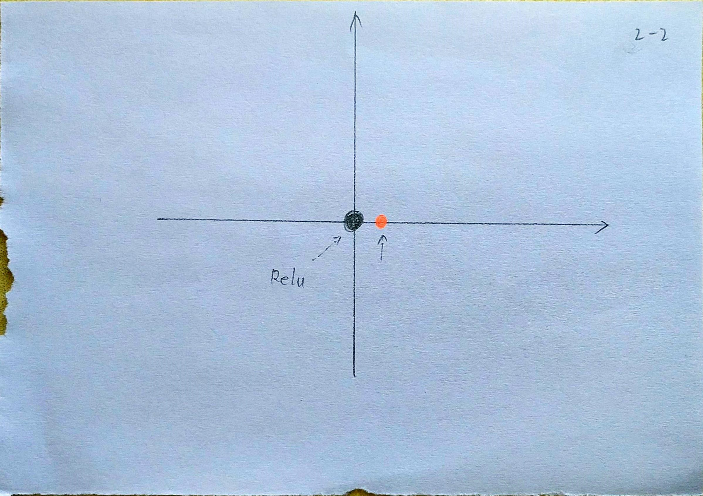
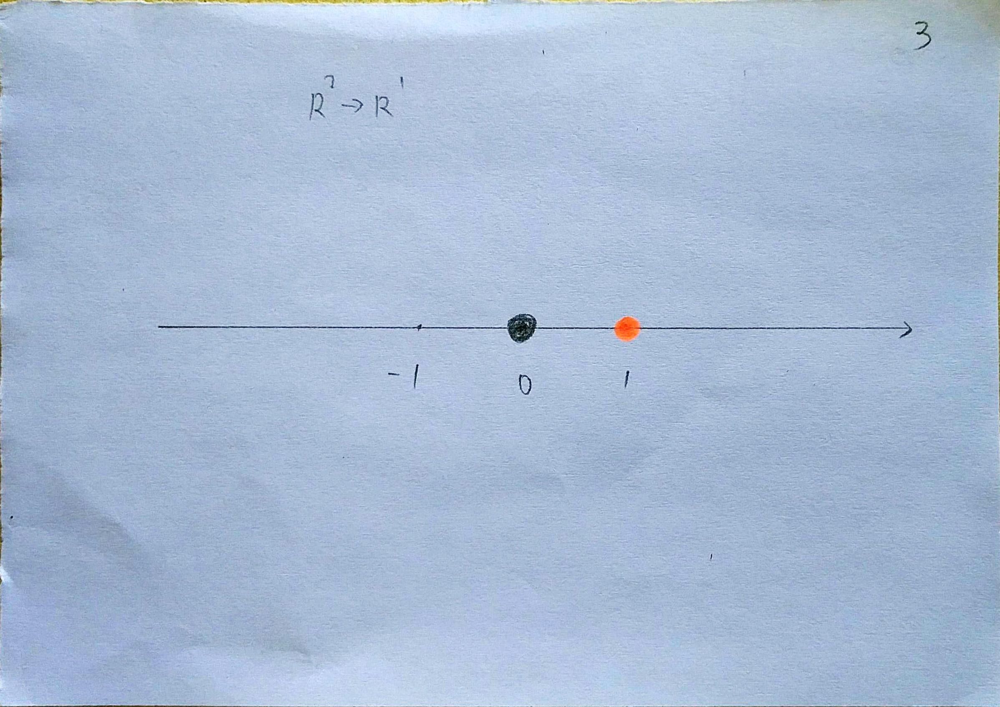

---

layout:            post  
title:             "ReLU是如何起作用的"  
date:              2017-07-30 18:25:00 +0300  
tags:              ML
category:          Tech  
author:            Qiang  

---

## 问题的由来

很好奇 ReLU 在整个神经网络中是如何工作的，因为一直觉得，这几乎就是个线性变化，怎么会有对网络的学习起到帮助呢。所以找了一些文章看，自己设想了一种情况，来验证并告诉自己，这玩意儿是这么工作的。由于自己的抽象思维较弱，所以学习时希望能有例子，为了让自己看的懂，整篇文章也就是一个例子而已。

## 关于线性变换

线性变换始终是整体性的且同一幅度，整体映射到新空间，整体放大缩小，整体翻转等等。
而ReLU这种非线性，则是对空间进行了部分推挤。

## ReLU 在几何上的效果

这个二维空间，除右上角没有动，其他三个区域都被推挤到轴上，或原点上。

和sigmoid的区别大概是这样的吧：

## 手动设想的例子

手动设想了一个网络的构成。该模型有9组数据，每组2个特征，最后对其进行分类（例如，有9组苹果的数据，每组数据包含大小和红的程度，分类为熟了或者没熟。分布如下：

横轴为大小，纵轴为颜色，右上四个点表示熟了，其他点表示没熟，接着构造网络类进行分类：

该网络由1个输入层，2个中间层和1个输出层构成。
中间层由“线性转换+ReLU激活”组成。为了方便计算，每一层之间几乎没有升降维，都是 2d->2d。那么下一层对上一层而言，只是对空间旋转，缩放，反转、位移等操作，接着在 ReLU 一下。

现在假设，网络已经训练完成了，我们看看它是如何工作的。

### 中间层1

- 1-1 线性重置空间位置

- 1-2 ReLU推压

### 中间层2

- 2-1 线性重置空间位置

- 2-2 ReLU推压

### 输出层

- 3 降维输出

最终可以看到， 0为未熟，1为成熟。

## 参考文章：
- bilibili上关于线性代数在几何空间中的表述（3Blue1Brown）
    - [九浅一深，带你解锁神经网络的数学姿势](https://mp.weixin.qq.com/s/YsHBk2m8eQRY2awsxNg2cQ)
- [《Delving Deep into Rectifiers: Surpassing Human-Level Performance on ImageNet Classification》阅读笔记与实现](https://github.com/happynear/gitbook/blob/master/delving_deep_into_rectifiers_surpassing_human-leve.md)
- [为什么使用 ReLU](http://shuokay.com/2016/10/01/why-relu-work/)

