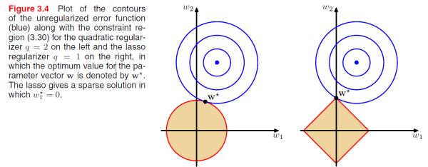
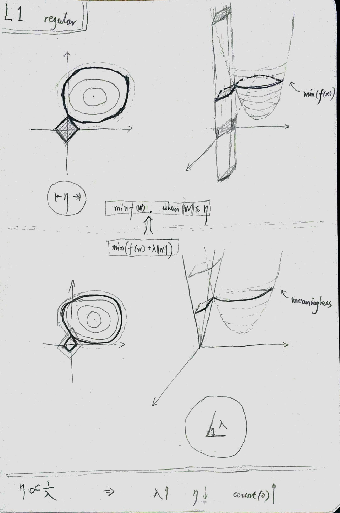

---

layout:            post  
title:             "L1 正则化"  
date:              2017-09-10 18:25:00 +0300  
tags:              ML
category:          Tech  
author:            Qiang  

---

- 问题：优化包含正则的损失，两个应该一起优化，为什么在图里把它们拆解。
- 
- 答：这个图根本不是两个函数的拆解。prml说的是，最⼩化包含正则的误差，等价于在满⾜限制的条件下，最⼩化未包含正则的误差。
- 

## 参考
- [l1 相比于 l2 为什么容易获得稀疏解？](https://www.zhihu.com/question/37096933/answer/189905987)
- [prml - 正则化最小二乘](https://mqshen.gitbooks.io/prml/content/Chapter3/basis/regularized_least_squares.html)
- [What is the difference between L1 and L2 regularization?](https://www.quora.com/What-is-the-difference-between-L1-and-L2-regularization-How-does-it-solve-the-problem-of-overfitting-Which-regularizer-to-use-and-when/answer/Kenneth-Tran?srid=CZEe)