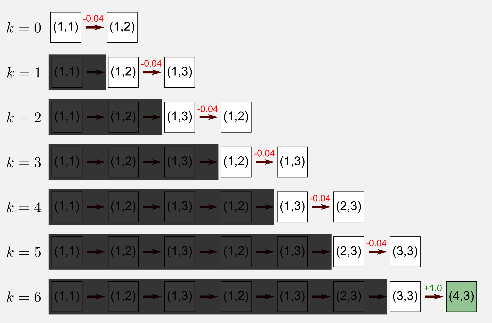
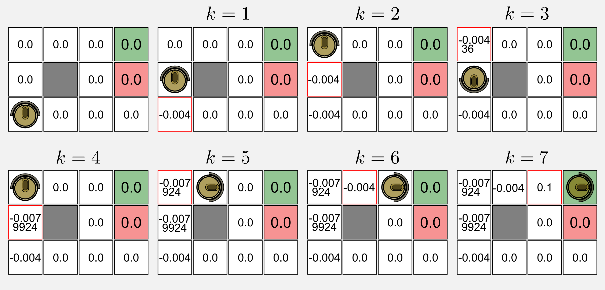
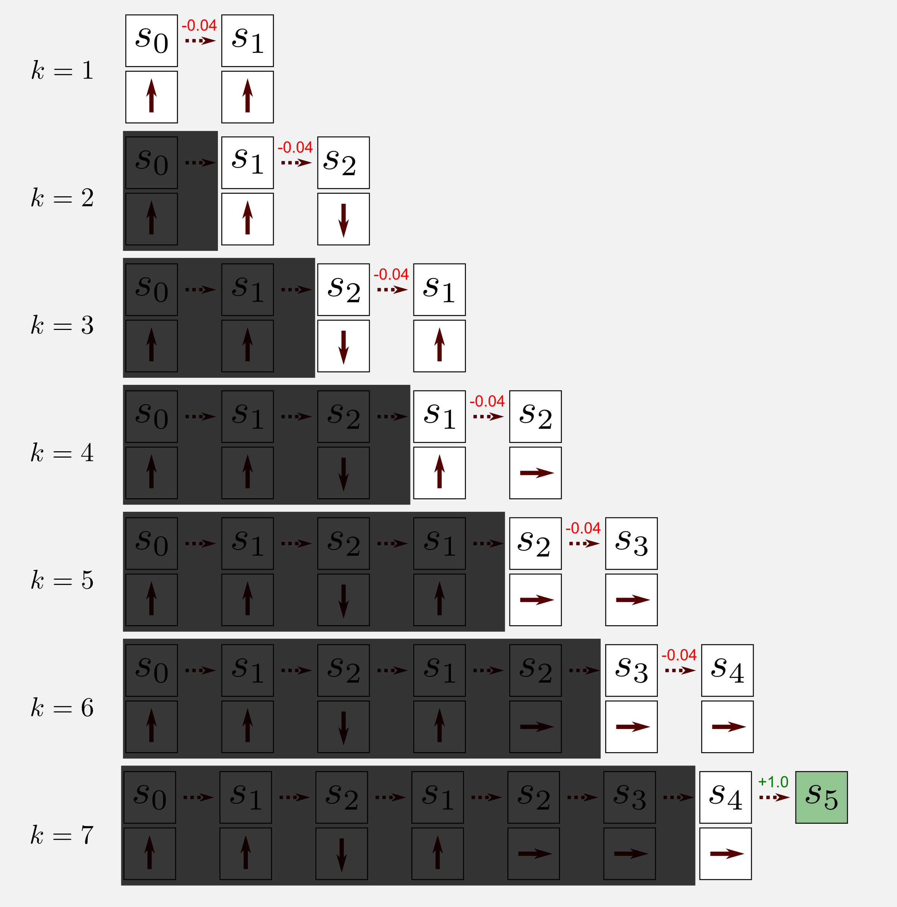
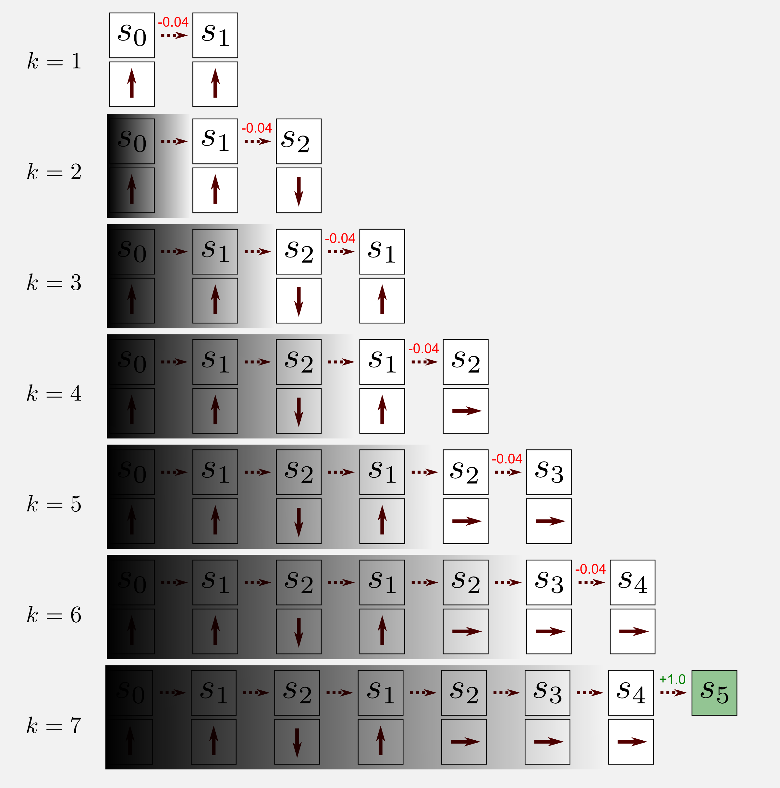
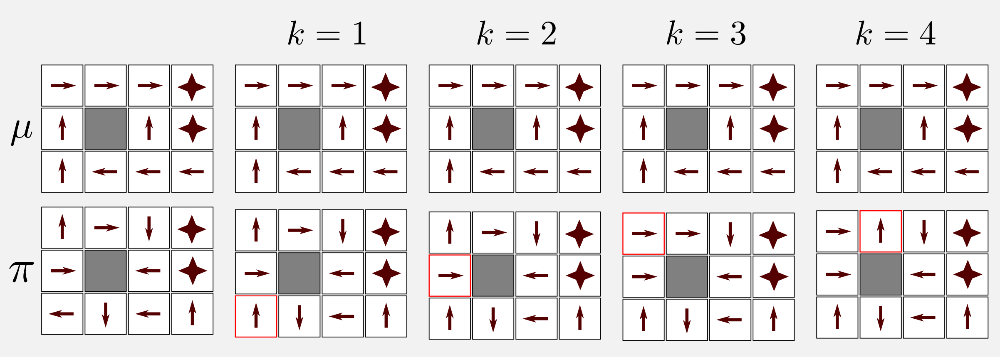
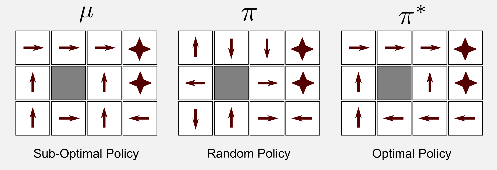

---

layout:            post  
title:             "Dissecting Reinforcement Learning-P3 Note"  
tags:              ML
category:          Tech  
author:            Qiang  

---


<!-- TOC -->

- [1. Temporal Differencing (and rabbits)](#1-temporal-differencing-and-rabbits)
- [2. TD(0) Python implementation](#2-td0-python-implementation)
- [3. TD(λ) and eligibility traces](#3-td%CE%BB-and-eligibility-traces)
- [4. SARSA: Temporal Differencing control](#4-sarsa-temporal-differencing-control)
- [5. SARSA: Python and ε-greedy policy](#5-sarsa-python-and-%CE%B5-greedy-policy)
- [6. Q-learning: off-policy control](#6-q-learning-off-policy-control)
- [7. Q-learning: Python implementation](#7-q-learning-python-implementation)
- [8. Conclustions](#8-conclustions)
- [9. 参考](#9-%E5%8F%82%E8%80%83)

<!-- /TOC -->


# 1. Temporal Differencing (and rabbits)
- 更新定为

- 其中 target 定为


- update utility


# 2. TD(0) Python implementation



使用以下 policy 计算出的 utiltiy 如下：

```
Optimal policy:			Utility Matrix:

 >   >   >   * 			0.812  0.868  0.918  1.0
 ^   #   ^   * 			0.762  0.0    0.660 -1.0
 ^   <   <   <. 		0.705  0.655  0.611  0.388
```

 代码如下：

```python
 # 使用 policy 更新 utility
 def update_utility(utility_matrix, observation, new_observation, 
                   reward, alpha, gamma):
    '''Return the updated utility matrix

    @param utility_matrix the matrix before the update
    @param observation the state observed at t
    @param new_observation the state observed at t+1
    @param reward the reward observed after the action
    @param alpha the step size (learning rate)
    @param gamma the discount factor
    @return the updated utility matrix
    '''
    # 当前 utility
    u = utility_matrix[observation[0], observation[1]]
    # 下一 utility
    u_t1 = utility_matrix[new_observation[0], new_observation[1]]
    # 更新当前 utility
    utility_matrix[observation[0], observation[1]] += \
        alpha * (reward + gamma * u_t1 - u)
    return utility_matrix
```

``` python
for epoch in range(tot_epoch):
    #Reset and return the first observation
    observation = env.reset(exploring_starts=True)
    for step in range(1000):
        #Take the action from the action matrix
        # 获取 action
        action = policy_matrix[observation[0], observation[1]]
        #Move one step in the environment and get obs and reward
        # 动一下
        new_observation, reward, done = env.step(action)
        #Update the utility matrix using the TD(0) rule
        # 更新当前 utility
        utility_matrix = update_utility(utility_matrix, 
                                        observation, new_observation, 
                                        reward, alpha, gamma)
        observation = new_observation
        if done: break #return
```

```
Utility matrix after 1 iterations:
[[-0.004  -0.0076  0.1     0.    ]
 [ 0.      0.      0.      0.    ]
 [ 0.      0.      0.      0.    ]]

Utility matrix after 2 iterations:
[[-0.00835924 -0.00085     0.186391    0.        ]
 [-0.0043996   0.          0.          0.        ]
 [-0.004       0.          0.          0.        ]]

Utility matrix after 3 iterations:
[[-0.01520748  0.01385546  0.2677519   0.        ]
 [-0.00879473  0.          0.          0.        ]
 [-0.01163916 -0.0043996  -0.004      -0.004     ]]

...

Utility matrix after 100000 iterations:
[[ 0.83573452  0.93700432  0.94746457  0.        ]
 [ 0.77458346  0.          0.55444341  0.        ]
 [ 0.73526333  0.6791969   0.62499965  0.49556852]]

...

Utility matrix after 300000 iterations:
[[ 0.85999294  0.92663558  0.99565229  0.        ]
 [ 0.79879005  0.          0.69799246  0.        ]
 [ 0.75248148  0.69574141  0.65182993  0.34041743]]
```

# 3. TD(λ) and eligibility traces


- 把 e 看作是短期记忆，作用范围一个 episode
- 其中 gamma 是如前一样的折扣率（步数越远作用越小），lambda 则是衰退率（之前状态的更新保留率）
- 0 < lambda < 1，如果 lambda = 0 退化为 td(0)，如果 lambda = 1 退化为类 mc 
- 如下曲线表示按此策略，s1 的 e 曲线  

- 估计误差 delta 如下：  

$$\delta_{t} = r_{t+1} + \gamma U(s_{t+1}) - U(s_{t})$$

- 更新 utility 如下：  

$$U_{t}(s) = U_{t}(s) + \alpha \delta_{t} e_{t}(s) \qquad  \text{for all } s \in S$$

- 同样走一个 episode ，td(0) 和 td(lambda)，的更新幅度如下：


- td(0) 需要走 5 个 episode 才能达到此效果


- td(lambda) 更新如下：

``` python
# 更新 utility
def update_utility(utility_matrix, trace_matrix, alpha, delta):
    '''Return the updated utility matrix

    @param utility_matrix the matrix before the update
    @param alpha the step size (learning rate)
    @param delta the error (Taget-OldEstimte) 
    @return the updated utility matrix
    '''
    utility_matrix += alpha * delta * trace_matrix
    return utility_matrix

# 更新短期记忆 e
def update_eligibility(trace_matrix, gamma, lambda_):
    '''Return the updated trace_matrix

    @param trace_matrix the eligibility traces matrix
    @param gamma discount factor
    @param lambda_ the decaying value
    @return the updated trace_matrix
    '''
    trace_matrix = trace_matrix * gamma * lambda_
    return trace_matrix
```

``` python
for epoch in range(tot_epoch):
  #Reset and return the first observation
  observation = env.reset(exploring_starts=True)
  # 似乎短期记忆 trace_matrix 应该每个 episode 都要置 0
  for step in range(1000):
    #Take the action from the action matrix
    action = policy_matrix[observation[0], observation[1]]
    #Move one step in the environment and get obs and reward
    new_observation, reward, done = env.step(action)
    #Estimate the error delta (Target - OldEstimate)
    delta = reward + gamma * \
        utility_matrix[new_observation[0], new_observation[1]] - \
        utility_matrix[observation[0], observation[1]]
    #Adding +1 in the trace matrix (only the state visited)
    # 进入的状态,短期记忆值+1
    trace_matrix[observation[0], observation[1]] += 1
    #Update the utility matrix (all the states)
    utility_matrix = update_utility(utility_matrix, trace_matrix, alpha, delta)
    #Update the trace matrix (decaying) (all the states)
    trace_matrix = update_eligibility(trace_matrix, gamma, lambda_)
    observation = new_observation
    if done: break #return
```

```
Utility matrix after 1 iterations:
[[ 0.       0.04595  0.1      0.     ]
 [ 0.       0.       0.       0.     ]
 [ 0.       0.       0.       0.     ]]

...

Utility matrix after 101 iterations:
[[ 0.90680695  0.98373981  1.05569002  0.        ]
 [ 0.8483302   0.          0.6750451   0.        ]
 [ 0.77096419  0.66967837  0.50653039  0.22760573]]

...

Utility matrix after 100001 iterations:
[[ 0.86030512  0.91323552  0.96350672  0.        ]
 [ 0.80914277  0.          0.82155788  0.        ]
 [ 0.76195244  0.71064599  0.68342933  0.48991829]]

...

Utility matrix after 300000 iterations:
[[ 0.87075806  0.92693723  0.97192601  0.        ]
 [ 0.82203398  0.          0.87812674  0.        ]
 [ 0.76923169  0.71845851  0.7037472   0.52270127]]
```

# 4. SARSA: Temporal Differencing control

- SARDA: State.Action -> Reward -> State.Action
- 直接用 Q 替换 U 就获得了 control 的计算方式

$$U(s_{t}) \leftarrow U(s_{t}) + \alpha \big[ r_{t+1} + \gamma U(s_{t+1}) - U(s_{t}) \big]$$

$$Q(s_{t}, a_{t}) \leftarrow Q(s_{t}, a_{t}) + \alpha \big[ r_{t+1} + \gamma Q(s_{t+1}, a_{t+1}) - Q(s_{t}, a_{t}) \big]$$

- Q 表格 = count(State) * count(Action)  


- 流程  


- 可以使用 td(lambda) 改进 Q 的 update  


$$e_{t}(s,a) = \begin{cases} \gamma \lambda e_{t-1}(s,a)+1 & \text{if}\ s=s_{t} \text{ and } a=a_{t};  \\ \gamma \lambda e_{t-1}(s,a) & \text{otherwise}; \end{cases}$$

$$Q_{t+1}(s, a) = Q_{t}(s, a) + \alpha \delta_{t} e_{t}(s, a) \qquad  \text{for all } s \in S$$

# 5. SARSA: Python and ε-greedy policy

``` python
# 更新 q-table 中，当前位置的值
def update_state_action(state_action_matrix, observation, new_observation, 
                   action, new_action, reward, alpha, gamma):
    '''Return the updated utility matrix

    @param state_action_matrix 即 q-table
    @param observation the state observed at t
    @param new_observation the state observed at t+1
    @param action the action at t
    @param new_action the action at t+1
    @param reward the reward observed after the action
    @param alpha the step size (learning rate)
    @param gamma the discount factor
    @return the updated state action matrix
    '''
    #Getting the values of Q at t and at t+1
    col = observation[1] + (observation[0]*4)
    q = state_action_matrix[action ,col]
    col_t1 = new_observation[1] + (new_observation[0]*4)
    q_t1 = state_action_matrix[new_action ,col_t1]
    #Applying the update rule
    state_action_matrix[action ,col] += \
        alpha * (reward + gamma * q_t1 - q)
    return state_action_matrix
```

``` python
# 更新 policy 中，当前位置的最佳 action
def update_policy(policy_matrix, state_action_matrix, observation):
    '''Return the updated policy matrix

    @param policy_matrix the matrix before the update
    @param state_action_matrix the state-action matrix
    @param observation the state obsrved at t
    @return the updated state action matrix
    '''
    col = observation[1] + (observation[0]*4)
    #Getting the index of the action with the highest utility
    best_action = np.argmax(state_action_matrix[:, col])
    #Updating the policy
    policy_matrix[observation[0], observation[1]] = best_action
    return policy_matrix
```

``` python
for epoch in range(tot_epoch):
  #Reset and return the first observation
  observation = env.reset(exploring_starts=True)
  for step in range(1000):
    #Take the action from the action matrix
    action = policy_matrix[observation[0], observation[1]]
    #Move one step in the environment and get obs,reward and new action
    new_observation, reward, done = env.step(action)
    new_action = policy_matrix[new_observation[0], new_observation[1]]
    #Updating the state-action matrix
    # 更新 q-table
    state_action_matrix = update_state_action(state_action_matrix, 
                                              observation, new_observation, 
                                              action, new_action, 
                                              reward, alpha, gamma)
    #Updating the policy
    # 更新 policy
    policy_matrix = update_policy(policy_matrix, 
                                  state_action_matrix, 
                                  observation)
    observation = new_observation
    if done: break
```

```
Policy matrix after 1 iterations:
 <   v   >   *  
 ^   #   v   *  
 >   v   v   > 

...

Policy matrix after 90001 iterations:
 >   >   >   *  
 ^   #   ^   *  
 ^   <   ^   < 

...

Policy matrix after 180001 iterations:
 >   >   >   *  
 ^   #   ^   *  
 ^   <   <   <  
```

- 为了防止有些 state-action 没有被覆盖到，使用了 sigma 和 epsilon，产生随机运动

$$\pi(s) = \begin{cases} \underset{a}{\text{ argmax }} Q(s, a) & \text{if}\ \sigma > \epsilon; \\ a \sim A(s) & \text{if}\ \sigma \leq \epsilon; \end{cases}$$

``` python
# 带有随机性的贪婪策略
def return_epsilon_greedy_action(policy_matrix, observation, epsilon=0.1):
    tot_actions = int(np.nanmax(policy_matrix) + 1)
    #Getting the greedy action
    action = int(policy_matrix[observation[0], observation[1]])
    #Probabilities of non-greedy actions
    non_greedy_prob = epsilon / tot_actions
    #Probability of the greedy action
    greedy_prob = 1 - epsilon + non_greedy_prob
    #Array containing a weight for each action
    weight_array = np.full((tot_actions), non_greedy_prob)
    weight_array[action] = greedy_prob
    #Sampling the action based on the weights
    return np.random.choice(tot_actions, 1, p=weight_array)
```

# 6. Q-learning: off-policy control

- 使用 mu 策略运动，更新获得优化策略 pi  


- 如下更新 Q-table

$$Q(s_{t}, a_{t}) \leftarrow Q(s_{t}, a_{t}) + \alpha \big[ r_{t+1} + \gamma \underset{a}{\text{ max }} Q(s_{t+1}, a) - Q(s_{t}, a_{t}) \big]$$

$$\text{Target}[\text{SARSA}] = r_{t+1} + \gamma Q(s_{t+1}, a_{t+1})$$

$$\text{Target}[\text{Q-learning}] = r_{t+1} + \gamma \underset{a}{\text{ max }} Q(s_{t+1}, a)$$

- 与 SARSA 不同如下：

$$\text{Target} = r_{t+1} + \gamma Q(s_{t+1}, \underset{a}{\text{ argmax }} Q(s_{t+1},a))$$

$$\text{Target} = r_{t+1} + \gamma \underset{a}{\text{ max }} Q(s_{t+1}, a)$$

- 更新步骤如下：  
  
不同点在于，下一 Q 值，使用 max 获取，即考虑所有可能的 action

- 资格轨迹同样适用与 Q-Learning ，以Watkins’s Q(λ) 为例

- Watkins’s Q(λ)算法的特点  
假如我们有一个episode，第一个timestep的action是greedy的，第二个timestep的action也是greedy的，第三个timestep的action是non-greedy的，那么Watkins’s Q(λ)使用的有效序列长度，最长就到第二个timestep，从第三个timestep往后的序列都不再理会。也就是说，Watkins’s Q(λ)使用的有效序列长度最远到达第一个non-greedy action对应的timestep。  

$$e_{t}(s,a) = I_{ss_{t}} \cdot I_{aa_{t}} + \begin{cases} \gamma \lambda e_{t-1}(s,a) & \text{if}\ Q_{t-1}(s_{t},a_{t})= \underset{a}{\text{max }} Q_{t-1}(s_{t},a);  \\ 0 & \text{otherwise}; \end{cases}$$  

- 以上方程含义：  
首先，$I_{ss_{t}}$ 和 $I_{aa_{t}}$ 表示为，对于当前正在访问的 (s,a)，其资格迹单独+1；然后，所有(s,a)的资格迹要么乘以decay系数γλ（当选择的action是greedy的），要么变成0（当选择的action是non-greedy的）

- 错误估计 delta，更新如下

$$\delta_{s} = r_{t+1} + \gamma \underset{a}{\text{max }} Q_{t}(s_{t+1},a) - Q_{t}(s_{t},a_{t})$$

- 最终更新：

$$Q_{t+1}(s, a) = Q_{t}(s, a) + \alpha \delta_{t} e_{t}(s, a) \qquad  \text{for all } s \in S$$

# 7. Q-learning: Python implementation

``` python
def update_state_action(state_action_matrix, observation, new_observation, 
                        action, reward, alpha, gamma):
    '''Return the updated utility matrix

    @param state_action_matrix the matrix before the update
    @param observation the state obsrved at t
    @param new_observation the state observed at t+1
    @param action the action at t
    @param new_action the action at t+1
    @param reward the reward observed after the action
    @param alpha the ste size (learning rate)
    @param gamma the discount factor
    @return the updated state action matrix
    '''
    #Getting the values of Q at t and at t+1
    col = observation[1] + (observation[0]*4)
    q = state_action_matrix[action ,col]
    col_t1 = new_observation[1] + (new_observation[0]*4)
    q_t1 = np.max(state_action_matrix[: ,col_t1])
    #Applying the update rule
    state_action_matrix[action ,col] += alpha * (reward + gamma * q_t1 - q)
    return state_action_matrix
```




# 8. Conclustions

|   | on-policy | off-policy |
|---|---|---|
| prediction | TD(lambda) |
| control | SARSA | Q-Learning |

# 9. 参考
[Dissecting Reinforcement Learning-Part.3](https://mpatacchiola.github.io/blog/2017/01/29/dissecting-reinforcement-learning-3.html)  
[强化学习经典入门书的读书笔记系列--第七篇（下）](https://zhuanlan.zhihu.com/p/28017357)