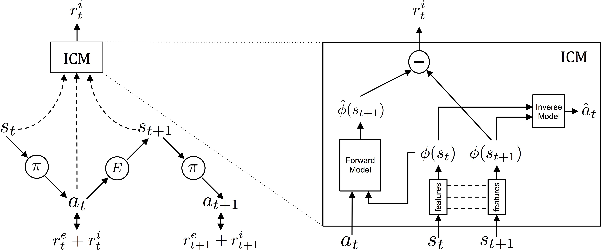

# Curiosity Driven Learning

<!--  -->

- [Curiosity-driven Exploration by Self-supervised Prediction](https://pathak22.github.io/noreward-rl/resources/icml17.pdf) - paper 2017
    - [pathak22/noreward-rl](https://github.com/pathak22/noreward-rl) - github
- [Large-Scale Study of Curiosity-Driven Learning](https://pathak22.github.io/large-scale-curiosity/resources/largeScaleCuriosity2018.pdf) - paper 2018
    - [openai/large-scale-curiosity](https://github.com/openai/large-scale-curiosity) - github