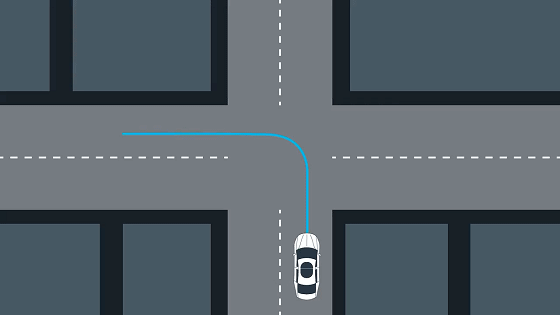
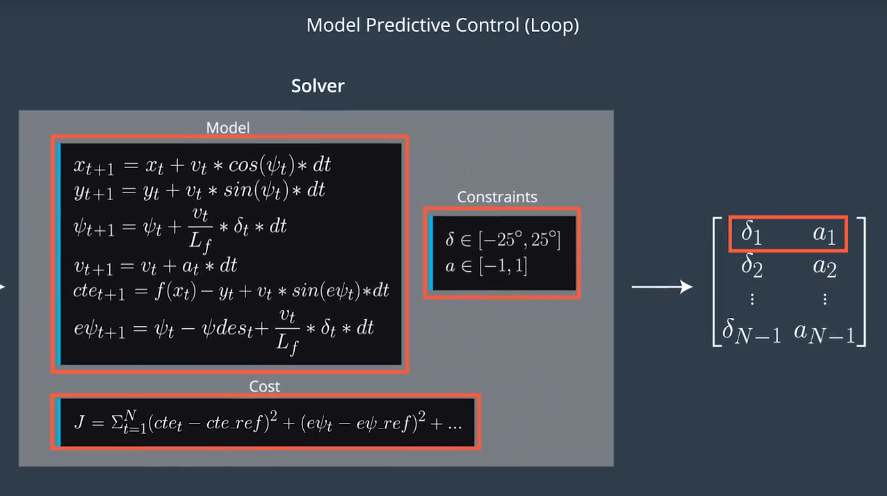
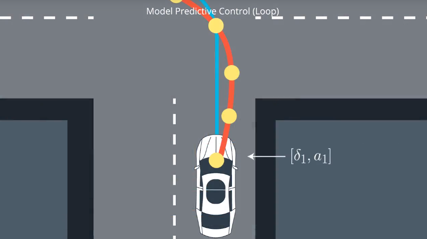

# Model Predictive Control

- [Model Predictive Control](#model-predictive-control)
    - [conception](#conception)
    - [equations](#equations)
    - [Steps:](#steps)
    - [ref](#ref)

## conception
- fit -> do -> fit
    - 

## equations
- steps
    - 
- from
    - 
- to
    - 
- do
    - 

## Steps:
- Set N and dt.
- Fit the polynomial to the waypoints.
- Calculate initial cross track error and orientation error values.
- Define the components of the cost function (state, actuators, etc). You may use the methods previously discussed or make up something, up to you!
- Define the model constraints. These are the state update equations defined in the Vehicle Models module.

## ref
- [CarND Controls Quizzes](https://github.com/udacity/CarND-MPC-Quizzes)