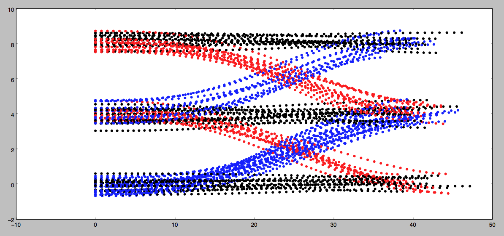
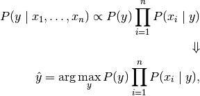

# Prediction by Gaussian Naive Bayes

## process
- training
    - cal mean & mu of each behavior based on labled datas
- prediction
    - predicting probability of each behavior by features

## ref
- [Naive Bayes classifier](https://en.wikipedia.org/wiki/Naive_Bayes_classifier#Gaussian_naive_Bayes) - Wikipedia
- [1.9. Naive Bayes](http://scikit-learn.org/stable/modules/naive_bayes.html#gaussian-naive-bayes) - sklearn