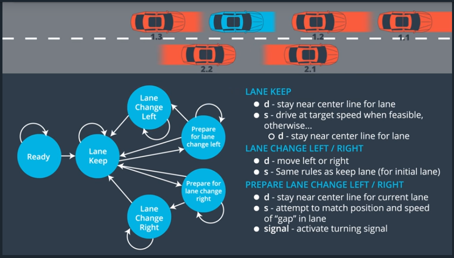

# Behavior Planning

- [Behavior Planning](#behavior-planning)
    - [Statess for Self Driving Cars](#statess-for-self-driving-cars)
    - [outline](#outline)


## Statess for Self Driving Cars
- 
- why "prepare for lane change"?
    - If there is a gap behind you on the changing lane, 
    - you can prepare for it by slowing down your speed

## outline
- concept
```
behavior_plan
    -> get successor_states
    -> calculate_cost
        -> by generate_trajectory
    -> change state
```

- pseudo code
``` py
def transition_function(predictions, current_fsm_state, current_pose, cost_functions, weights):
    # only consider states which can be reached from current FSM state.
    possible_successor_states = successor_states(current_fsm_state)

    # keep track of the total cost of each state.
    costs = []
    for state in possible_successor_states:
        # generate a rough idea of what trajectory we would
        # follow IF we chose this state.
        trajectory_for_state = generate_trajectory(state, current_pose, predictions)

        # calculate the "cost" associated with that trajectory.
        cost_for_state = 0
        for i in range(len(cost_functions)) :
            # apply each cost function to the generated trajectory
            cost_function = cost_functions[i]
            cost_for_cost_function = cost_function(trajectory_for_state, predictions)

            # multiply the cost by the associated weight
            weight = weights[i]
            cost_for_state += weight * cost_for_cost_function
         costs.append({'state' : state, 'cost' : cost_for_state})

    # Find the minimum cost state.
    best_next_state = None
    min_cost = 9999999
    for i in range(len(possible_successor_states)):
        state = possible_successor_states[i]
        cost  = costs[i]
        if cost < min_cost:
            min_cost = cost
            best_next_state = state 

    return best_next_state
```