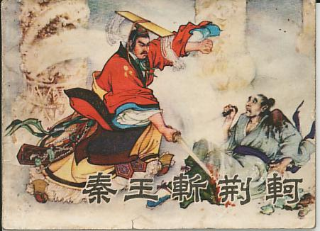

---

layout:            post  
title:             "荆轲刺秦王是如何安排的"  
date:              2016-08-18 18:25:00 +0300  
tags:              史记   
category:          History  
author:            Qiang  

---

## 一、缘起

### 1.讲座《荆轲刺秦王为什么会失败》

2016年8月19日，有幸听了李开元先生的讲座《荆轲刺秦王为什么会失败》，李先生将一个众所周知的历史事件娓娓道来，并以一种新视角进行解读。新观点及其精彩，请不想被剧透的各位读者，直接离开本文，后文将直接剧透，让你失去在讲座中慢慢体验新视角的沉浸式享受。

### 2.讲座总结

总结前，请大家把原文先读一下：[《史记 刺客列传》](http://so.gushiwen.org/guwen/bfanyi_166.aspx)。李先生的讲座总结为如下几点：  
1. 荆轲刺秦王是口述史，源自秦王御医夏无且  
2. 重点剧透：计划中刺杀执行者是同去的副使秦舞阳

### 3.刺杀计划推理

> 秦王闻之，大喜，乃朝服，设九宾，见燕使者咸阳宫。荆轲奉樊於期头函，而秦武阳奉地图匣，以次进。至陛下，秦武阳色变振恐，群臣怪之，荆轲顾笑武阳，前为谢曰：“北蛮夷之鄙人，未尝见天子，故振慑，愿大王少假借之，使毕使于前。”秦王谓轲曰：“起，取武阳所持图！”轲既取图奉之，发图，图穷而匕首见。因左手把秦王之袖，而右手持匕首揕之。  

重点在这一句：*“秦王谓轲曰：‘起，取武阳所持图！’”*那么原先地图是在秦舞阳手中，计划中的刺客应该是秦舞阳，后来被秦王打乱了，所以迫不得已，由荆轲来执行刺杀任务，而荆轲并不擅长剑术，最后导致了失败。当然，李老师还有其他一些佐证，暂时略过。

## 二、思考

### 1.个人愚见

上文最后一句。*“因左手把秦王之袖，而右手持匕首揕之。”*这个情景应该是亲眼看到事件的夏无且所述，然而奇怪的是，如果这是个意外事件，为何同在《史记 刺客列传》此段落之间，还有一句类似的记述。

### 2.《史记 刺客列传》

> 荆轲知太子不忍，乃遂私见樊於期，曰：“秦之遇将军，可谓深矣。父母宗族，皆为戮没。今闻购樊将军之首，金千斤，邑万家，将奈何？”樊将军仰天太息流涕曰：“吾每念，常痛于骨髓，顾计不知所出耳！”轲曰：“今有一言，可以解燕国之患，报将军之仇者，何如？”於期乃前曰：“为之奈何？”荆轲曰：“愿得将军之首以献秦，秦王必喜而善见臣。臣左手把其袖，而右手揕其胸，然则将军之仇报，而燕国见陵之耻除矣。将军岂有意乎？”樊於期偏袒扼腕而进曰：“此臣之日夜切齿拊心也，乃今得闻教！”遂自刎。

请看其中一句*“臣左手把其袖，而右手揕其胸”。*荆轲计划中早有如何刺杀秦王的计划，且与夏无且所见情形完全雷同，可见这是完美的实施了计划，而并非是遇到意外临时行刺。但这样又如何解释所持地图者是秦舞阳？

### 3.献图推理

这次出使荆轲为正使，秦舞阳为副使。见秦王时，荆轲持樊将军之首在前，秦舞阳持图在后。那么首先上前的必是荆轲，之后呢？我们试试看看其他材料。

#### （1）《史记 平原君虞卿列传》

第一个是，并不那么符合的材料《史记 平原君虞卿列传》中，有关毛遂威胁楚王的一段：
> 毛遂比至楚，与十九人论议，十九人皆服。平原君与楚合从，言其利害，日出而言之，日中不决。十九人谓毛遂曰：“先生上。”毛遂按剑历阶而上，谓平原君曰：“从之利害，两言而决耳。今日出而言从，日中不决，何也？”楚王谓平原君曰：“客何为者也？”平原君曰：“是胜之舍人也。”楚王叱曰：“胡不下！吾乃与而君言，汝何为者也！”毛遂按剑而前曰：“王之所以叱遂者，以楚国之众也。今十步之内，王不得恃楚国之众也，王之命县于遂手。吾君在前，叱者何也？

这句：*“楚王叱曰：‘胡不下！吾乃与而君言，汝何为者也！’”*差不多的意思是：“不是主角，别瞎逼逼，下去！”于是我猜测，主副使出使，与秦王相交谈的是否也只有主使一人。

#### (2)《仪礼 聘礼》

> 厥明，讶宾于馆。宾皮弁聘，至于朝。宾入于次，乃陈币。卿为上摈，大夫为承摈，士为绍摈。摈者出请事。公皮弁，迎宾于大门内。大夫纳宾。宾入门左，公再拜，宾辟，不答拜。公揖入，每门每曲揖。及庙门，公揖入，立于中庭；宾立接西塾。几筵既设，摈者出请命。贾人东面坐启椟，取圭垂缫，不起而授上介。上介不袭，执圭屈缫，授宾。宾袭，执圭。摈者入告，出辞玉。纳宾，宾入门左。介皆入门左，北面西上。三揖，至于阶，三让。公升二等，宾升，西楹西，东面。摈者退中庭。宾致命。公左还，北乡。摈者进。公当楣再拜。宾三退，负序。公侧袭，受玉于中堂与东楹之间。摈者退，负东塾而立。宾降，介逆出。宾出。公侧授宰玉，裼，降立。摈者出请。宾裼，奉束帛加璧享。摈者入告，出许。庭实，皮则摄之，毛在内；内摄之，入设也。宾入门左，揖让如初，升致命，张皮。公再拜受币。士受皮者自后右客；宾出，当之坐摄之。公侧授宰币，皮如入，右首而东。聘于夫人，用璋，享用琮，如初礼。若有言，则以束帛，如享礼。摈者出请事，宾告事毕。

*“贾人东面坐启椟，取圭垂缫，不起而授上介。上介不袭，执圭屈缫，授宾。宾袭，执圭。”*大概是这个意思：贾人面朝东坐下，打开木匣，取出圭玉，丝垫悬垂，把圭玉交给上介，不站起。上介不加穿袭衣，拿着圭，折起丝垫，交给主宾。主宾加穿袭衣，拿着圭。这里上介即为副使，主宾为主使。可见交付聘礼时的礼仪，主事部分由主使完成。

#### （3）回到《史记 刺客列传》

*“秦王闻之，大喜，乃朝服，设九宾，见燕使者咸阳宫。”*可见秦王按高规格礼仪来接待，推断周礼遗风可能尚存，那么秦舞阳只是持图，献图者仍为荆轲。再看这一句:*至陛下，秦武阳色变振恐，群臣怪之，荆轲顾笑武阳，前为谢曰：“北蛮夷之鄙人，未尝见天子，故振慑，愿大王少假借之，使毕使于前。”秦王谓轲曰：“起，取武阳所持图！”*荆轲说：“使毕使于前”，秦王回答：“取武阳所持图”，那么可以解读为，秦王按礼让荆轲行事。刺杀之事便按计划执行。

## 三、疑问

真心非常感谢李开元先生的讲座，如果只是自己读一遍《史记 刺客列传》，可能也就读过忘过，没什么思考了。至少现在，无论我的解读是否有丝毫的可信之处，对此事件我是有思考的。当然，想的多了之后，问题也多了。

### 1.秦舞阳结局

在荆轲刺秦王的记述中，出场有名有姓的四人是：秦王嬴政、御医夏无且、主使荆轲、副使秦舞阳。到最后的结局，我们发现有一个人却消失了“秦舞阳”。荆轲刺秦时，他在干吗？吓得屁滚尿流了吗？不知道。刺秦失败后，他的结局是什么，五马分尸？不知道。为什么司马先生没有给出描述呢？只因夏无且并未描述该配角的结局？不知道。

### 2.到底想不想劫持秦王

> 轲自知事不就，倚柱而笑，箕踞以骂曰：“事所以不成者，以欲生劫之，必得约契以报太子也。”

此时荆轲是在为失败找借口，还是真是如此呢？李开元先生认为此言是可信的，证据如下：

> 荆轲坐定，太子避席顿首曰：“……诚得劫秦王，使悉反诸侯侵地，若曹沫之与齐桓公，则大善矣；则不可，因而刺杀之。彼秦大将擅兵于外而内有乱，则君臣相疑，以其间诸侯得合从，其破秦必矣。此丹之上愿，而不知所委命，唯荆卿留意焉。”

可见太子丹的A计划确实是劫持秦王，刺杀只是B计划。然而荆轲是否是如此计划的呢？我仍有疑问。

### 3.剑术前后表述

> 荆轲尝游过榆次，与盖聂论剑，盖聂怒而目之。荆轲出，人或言复召荆卿。盖聂曰：“曩者吾与论剑有不称者，吾目之；试往，是宜去，不敢留。”使使往之主人，荆卿则已驾而去榆次矣。使者还报，盖聂曰：“固去也，吾曩者目摄之！”  
> 荆轲游于邯郸，鲁勾践与荆轲博，争道，鲁句践怒而叱之，荆轲嘿而逃去，遂不复会。
> 
> ……
> 
> 鲁勾践已闻荆轲之刺秦王，私曰：“嗟乎，惜哉其不讲于刺剑之术也！甚矣吾不知人也！曩者吾叱之，彼乃以我为非人也！”

这里让我觉得奇怪的是，荆轲刺秦前，是与盖聂论剑。盖聂认为他不行。但刺秦失败后，再次认为他剑术不行的是鲁勾践，怎么前后对应不起来啊？？？司马先生到底想要表达什么呢？

### 4.抄录问题

> 臣左手把其袖，而右手揕其胸  
> 因左手把秦王之袖，而右手持匕首揕之。

这两句这么这么雷同啊？我开始怀疑了，会不会是在书籍的誊录过程中，意外的誊录错误呢？我并不懂版本目录学，只是瞎想而已。荆轲刺秦的过程是由御医夏无且口述的，虽由公孙季功、董生转述与司马谈，但可信度仍较高。而刺杀计划是荆轲与樊於期的密谋，司马先生获得的材料我想可能来自当地采风或野史笔记，那么具体内容可信度并没有刺秦过程的可信度那么高。所以，又有一种可能，司马先生自己演绎了此段密谋。但还是奇怪，两句文笔如此雷同，是司马先生的文笔？还希望有关大家来指导。

但是下面引起的思考就有趣了：  
（1）李开元先生阐述刺秦新视角  
（2）我的疑问来自两句相同的叙述语句  
（3）我又认为第一句可能不是司马先生所写  
（4）我靠一句不可信的话，来质疑李先生的观点  
（5）这真是一个自我悖论  

## 四、版本以及后续

### 1.参考书目版本

目前还未用正式出版书籍做校对，资料都是网络收集，后续当要改进

### 2.此文版本

v0.1.1 说明这只是个测试版，同时证明我真的是个码农

### 3.码字

强忠华

