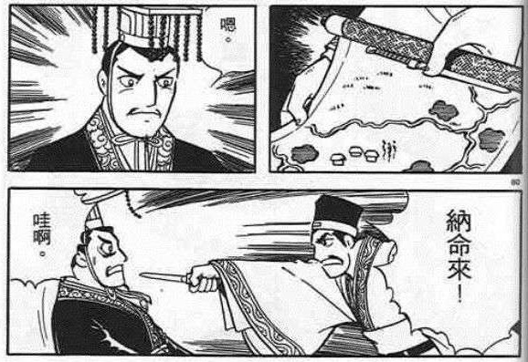

---

layout:            post  
title:             "历史侦探司马迁"  
date:              2016-09-01 18:25:00 +0300  
tags:              史记   
category:          History  
author:            Qiang  

---

## 源起

之前，听李开元先生的《荆轲刺秦王为什么失败》，有些感想，写了一文发表了些感想。后，经尹玲玲师指导，彭景涛兄建议，又思前想后的准备再表达一下自己的想法。关注的仍是《史记 刺客列传》中荆轲刺秦，在计划与实施中，为何出现两句极为类似的语句。

- 计划

> 臣左手把其袖，而右手揕其胸  

- 实施

> 因左手把秦王之袖，而右手持匕首揕之。

## 实施来源

实施场景的描述，来自夏无且是没有异议的。“太史公曰”已经明确表示，夏无且的叙述，他是转听来的。那么无疑可信度是较高的。既然当事人是夏无且，那么他的转述定是指刺杀当天的情景，即便包含了前情也是他由别处获得的信息，此种前情提要可信度大大降低。当日细节在李开元先生的讲座中有非常精彩的分析，简述如下。夏无且作为医生，观察人的角度会受其职业影响，会着重观察荆轲的受伤情况，如断其左股，共八创，此种细节更令人相信是来自一位医生的描述。

> 负剑，遂拔以击荆轲，断其左股。荆轲废，乃引其匕首以擿秦王，不中，中桐柱。秦王复击轲，轲被八创。

## 计划来源

关于计划的部分，推测来自与当地采风或野史笔记。那么具体的计划，旁人又是如何得知的呢。我想大概还是太史公的演绎吧。如李开元先生在描述韩信遣使，向刘邦请求当假齐王（代理齐王）时，萧何在桌底下踢了刘邦一脚，让他审时度势做出了正确的决定，那么桌底下踢一脚这种事，谁会看到呢，大概也是符合当时情景的演绎吧。但是在荆轲刺秦这件事上，仍有一些值得把玩的片段。历史侦探司马迁写文章可不是瞎编的，都是有理有据的哦。首先，荆轲是源自田光的推荐。

> 田光曰：“臣闻骐骥盛壮之时，一日而驰千里；至其衰老，驽马先之。今太子闻光盛壮之时，不知臣精已消亡矣。虽然，光不敢以图国事，所善荆卿可使也。”

后，田光为了保密及激励荆轲，自杀以明志。然而让人意想不到的是，一件暗地里偷偷摸摸的事，居然搞得众人皆知了。请看著名的“风萧萧兮易水寒”场景。

> 太子及宾客知其事者，皆白衣冠以送之。至易水之上，既祖，取道，高渐离击筑，荆轲和而歌，为变徵之声，士皆垂泪涕泣。又前而为歌曰：“风萧萧兮易水寒，壮士一去兮不复还！”复为羽声慷慨，士皆瞋目，发尽上指冠。於是荆轲就车而去，终已不顾。

什么情况啊，你们搞这么一堆人都知道这事，还能保什么密啊。假定此事成立，推理得出荆轲具体如何计划行刺之事，宾客可能也是了解的。那么人多势众，荆轲的刺秦计划便可能以口述史的方式流传下来。这里似乎给我们一个理由去相信，“左手抓右手刺”的计划是可信的。

## 两相对比

然而，我对此的怀疑，来自两点：

- 两个不同方向的口述流传，居然某一细节完美的吻合
- 自我模拟场景时，有悖常规对话 

### 细节完美吻合

描述来自两件事，来自两个人；一个说计划，一个说结果；一个讲秘密，一个亲眼见。表述完全一样，你说两个都是真实场景，这个概率是多少？最好有个专业统计学家来帮忙算算。总之我是不信的，信不信由你。那么两者至少有一个场景是演绎的，我的倾向必然是计划场景。

### 模拟场景

> ”荆轲曰：“原得将军之首以献秦王，秦王必喜而见臣，臣左手把其袖，右手揕其匈，然则将军之仇报而燕见陵之愧除矣。将军岂有意乎？”

这里试想一下，一般场景是这样的，荆轲说：“将军啊，我如果献上你的头颅，秦王一定会见我，我就有机会为您报仇啦。”但是，现在《史记》中的场景是这样的。荆轲说：“将军啊，我如果献上你的头颅，秦王一定会见我的，我到时左手拉他衣袖，右手刺他，一定可以为您报仇的啊。”有必要这么细吗？合逻辑吗？

## 一种猜测

姚大力先生的《司马迁和他的史记》一书中，提到了钱大昕在读《后汉书 郭泰传》时，发现有74字与上下文不符，推测并非来自原文。后得一刻本，发现果然如此，原来这74字来自注释。在《廿二史考异》中也记录了这一段。此74文字，钱大昕提出了“四疑”，其中第四点，便是重复，前面说过的话，后面又说了一遍，感觉不对啊。DUANG的一下，我脑子一炸，难道《刺客列传》也是如此。

## 另一种猜测

如果场景如此的不合理，但偏偏就是太史公写的，那又是为什么呢？前前后后，整个荆轲刺秦的故事，充满了冲突和矛盾，看似精心策划的刺杀，实则矛盾重重：

- 荆轲剑术不精通
- 太子丹用人不信
- 密谋众人皆知
- 太子催促冲忙出行

在这么多前提下，太史公还要演绎一段计划是“左手抓右手刺”，结果也是“左手抓右手刺”，但还是刺杀失败了。着实是用生命在强调，整件事从计划开始便预示着最后的失败。然，我仍更愿意相信，重复叙述来自版本问题。

## 不用写偏要写 需要写偏不写

如果刺秦计划是“不用写偏要写”，《司马迁和他的史记》一书中，写道司马光发现曹操遗言一事，便是“需要写偏不写”。简述大概如下，曹操临死前，交代这交代那，连妇人孩子，可卖些什么以做家用都罗里吧嗦了一堆。怎么最重要的，他死后对汉王朝怎么处置，一句没留？？？精彩之处就在于什么都没说，我没说那么你怎么做就都和我无关，那你想怎么做呢？我反正什么都没说，什么都没看见。司马光悟道这里时，兴奋到难以言表啊，急着等待友人第二天到来时，手舞足蹈的发表一番。那么曹操遗言之事，看出其奥妙真可谓火眼金睛。然历史侦探司马光意犹未尽，现代侦探也有一位遇此类似事件。

名侦探古田任三郎登场，记得我初看此电视剧约莫高中时期，被其吸引源自第一部第一集，其实除了这一集后来的我都没提起太大兴趣。下面又要剧透了，话说我最讨厌剧透推理剧的败类了，现在我也沦落了。该集简述如下，被害人死亡时，手中握有纸和笔，明明可以亲而易举地讲罪犯姓名记下，可缺留下一张空白纸条。WHY, WHY, WHY，看到这里是否会心一笑，被害人就是什么都没说，曹操也是什么都没说。没说正是因为有话要说，此中含义深刻，请读者自行观看此剧寻找答案。题外话，这个剧情还被某国内剧抄袭了一遍，哪部就自行寻找吧，肯定不是什么幼年包黑炭，那是抄金田一一去了，要抄干嘛不抄爷爷，就会抄孙子。

## 后序

推荐《司马迁和他的史记》一书，其中与史记无关的《外一篇 漫谈读书》尤其合我胃口。另外，姚大力先生提到的司马光一事，不知出处在哪里，有哪位知道的请告知一声。该书《把过程植入历史书写——论司马迁对中国历史 编撰学的突破》一篇中，引用到了较多日本学者的研究，这些学者的书目也值得一读（其实我一本也没读过）。

另，题首配图来自意外发现的日本漫画家横山光辉的《史记》，他最出名的应该是《三国志》，日亚搜索的时候意外发现居然还有横山光辉《长征》（我又DUANG了一下）。

最后，文章还有好多要修改的，以后继续吧

## 版本

V0.1.2

## 参考书目

- 《史记》 
- 《司马迁和他的史记》 姚大力
- 《廿二史考异》 钱大昕

