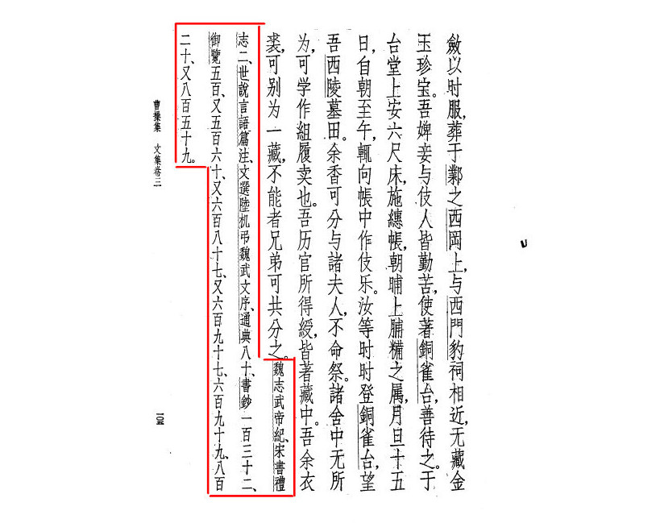
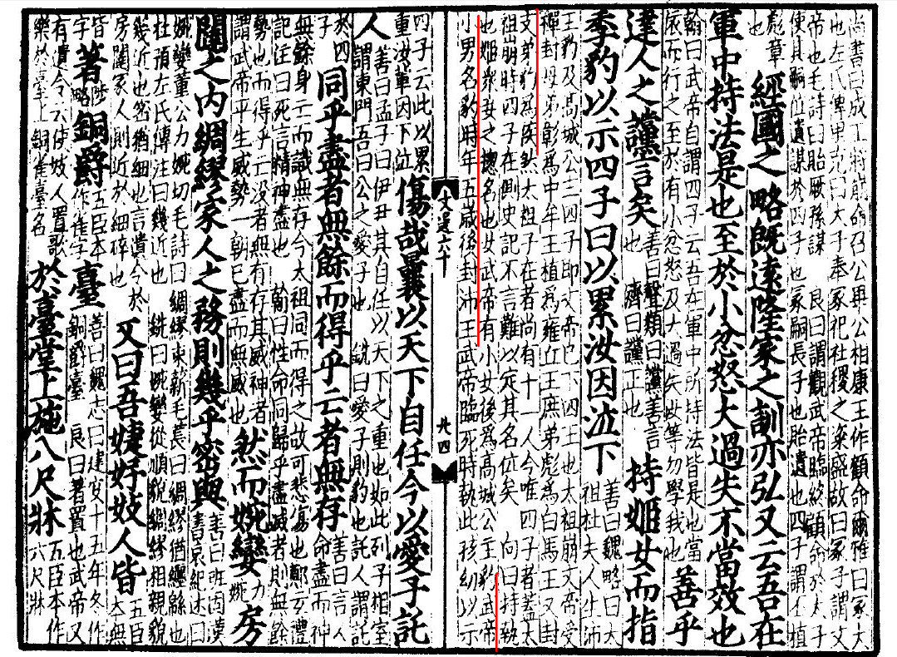
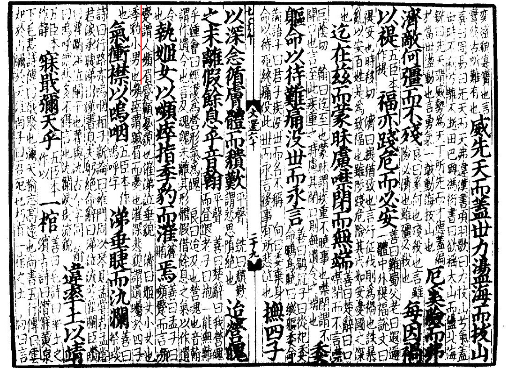
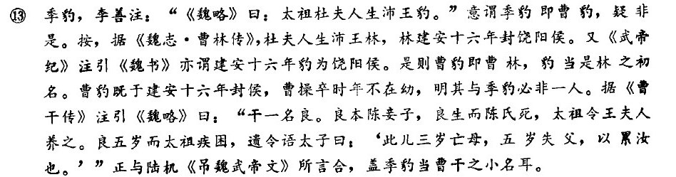

---

layout:            post  
title:             "枭雄曹操的谢幕"  
date:              2017-09-27 18:25:00 +0300  
tags:              史记   
category:          History  
author:            Qiang  

---

## 落幕

建业二十五年（公元220年）春正月，曹操由前线返回洛阳。就在前一年秋七月，曹仁被关羽围困，曹操指派徐晃前去救援。至冬十月，孙权上书，愿为曹操效力讨伐关羽，后曹操准备亲自开往前线作战，当浩浩荡荡的大军拔营起前往前线的途中，捷报已传至营中，徐晃不负众望一举击溃关羽军，曹仁之围被解。于是曹操便将军队驻扎于摩陂，第二年返回了洛阳。

当曹操回到洛阳后，又得捷报，孙权斩杀了关羽，并传关羽之首至洛阳。关羽的人生就此落幕，一代枭雄曹操也迎来了人生最后的时刻。时年，曹操已六十有六，此刻重疾难医，他心中也自知命不久矣。人之将死，其鸣也哀，在人生的最后时刻，曹操收起了历来强悍的枭雄本色，作为一个临终的老人交代了身后之事。

去世前，曹操的五个儿子和一个女儿陪他度过了最后的时刻。对四个已成人的儿子，他谆谆教导：“我在军中，执法施政总体还是得当的。至于一些小的忿恨，大的过失，你们可别效仿啊。”他又搂着在场的小女儿，抬起他羸弱的手臂，指了指在场最年幼儿子，对几个年长的孩子嘱咐到：“他们，就要辛苦你们了啊！”说到这里，一股莫名的情绪涌上心头，止不住的老泪纵横。任你指点江山，万人景仰，此时此刻只愿亲人在侧。曹操一生妻妾众多，他也不忘为她们的生计计划计划，说到：“我的婕妤妓人，在我死后，都要把她们安置在铜雀台上。并在台堂上放一张八尺的床，床上挂着细布床帐，每天早上傍晚，给我供上干肉干饭之类的食物。每月初一、十五两天，就让妓人对着床帐奏乐跳舞。你们几个也要不时地登上铜雀台，望望我的西陵墓田。”他又说：“多馀的香料，可以分给众位夫人。众妾无事可做时，可以让她们去学习编织鞋上的丝带去卖钱。我历来做官所得的绶带，可以都藏于一处。我多馀的衣裳等，可以另外藏个地方。如实在做不到的话，你们兄弟几个可以共同分掉。”后来，这些衣裳果然被分掉了。

当然以曹操的雄才大略，对军队亦早有安排：“天下还未安定，不能遵循古代的旧制。下葬以后，立即除去丧服。凡是带兵在外戍守的将领，都不准离开驻守之地。官吏们要各尽其职。入殓用当时所穿的衣服，不要放金银珠宝作陪葬。”不仅如此，在重病期间，曹操召唤了爱子黄须儿曹彰，然而从长安敢来的曹彰未能见上曹操最后一面，曹操究竟在最后关头还要交代些什么，后人亦不得而知。

曹操在洛阳去世后，谏议大夫贾逵主持丧事，这时候曹彰从长安赶到，得知先王已仙逝，此刻他最在意的是什么呢？他问贾逵先王的玉玺印绶存放在什么地方。贾逵正颜厉色地说：“太子在邺城，国家已经有了储君，先王的玺绶，不是君侯您所应当问的。”曹彰如此性急，并不是打算凭借手中的兵力，自己篡位夺军，他心中猜测先王召唤他是为了另立太子，因此又急冲冲的找到曹植：“先王之所以急召我来，是要立你为太子啊！”一脸懵逼的曹植，或许内心还带着惶恐：“要不得，要不得，没有见到袁氏兄弟的下场嘛！”

身在邺的太子曹丕也不是吃素的。

曹操征伐汉中，陈矫随行，返回后被授予尚书之职。还没到达邺城任所，曹操在洛阳去世，大臣们拘泥于常礼，认为太子即位，必须要有皇帝的诏书。陈矫说：“魏王亡故于邺城之外，天下人惶恐不安。太子曹丕应尽快节哀即位，以抚慰远近各地的官民的期望。况且魏王的爱子又在旁边，倘若兄弟之间发生事变，那国家可就危险了。”于是当即配齐应有的官员，备好典礼的用品，一天之内，全都安排妥当。第二天一早，便以王后的命令，督促太子曹丕即位，并大赦天下。

## 司马光之眼

曹操临终前婆婆妈妈说了一大堆，但对家国大事，似乎没有太多的安排，那么他到底是葫芦里卖的什么药。

我们将时间前进至赵姓那一家时期。看看当时有同样疑问的司马光看出了什么门道。司马光识破曹操遗令之事，源于[《元城語録》](https://zh.wikisource.org/wiki/%E5%85%83%E5%9F%8E%E8%AA%9E%E9%8C%B2)
，作者马永卿受教于刘世安，而刘世安又受教于司马光。

(司马光 -> 刘世安 -> 马永卿)

> 徽宗初，劉安世與蘇軾同北歸大觀中寄居永城，永卿方為主簿受學于安世，因撰集其語為此書，安世之學出于司馬光，故多有光之遺說。

原文如下：(句读我自己瞎点的，凑合看吧)

> 先生曰，老先生退居洛日，无三日不见之。一日见于读书堂，老先生曰，昨夕看三国志识破一事，因令取三国志及文选示某乃理会武帝遗令也。老先生曰，遗令之意如何，某曰，曹公平生奸至此尽矣，故临死谆谆作此令也。老先生曰，不然此乃操之微意也，遗令者世所谓遗嘱也必择紧要言语付嘱子孙，至若纎细不紧要之事则或不暇矣，且操身后之事有大于禅代者乎，今操之遗令谆谆百言，下至分香卖履之事，家人婢妾无不处置详尽，无一语语及禅代之事，其意若曰，禅代之事自是子孙所为吾未尝教为之，是实以天下遗子孙而身享汉臣之名，此遗令之意历千百年无人识得，昨夕偶窥破之。老先生似有喜色，且戒某曰，非有识之士不足以语之。仆曰，非温公识高不能至此。先生曰，此无他也乃一诚字尔。老先生读书必具衣冠正坐庄色，不敢懈怠惟以诚意读之，且诚之至者，可以开金石，况此虚伪之事一看即解散也。某因此，历观曹操平生之事无不如此，夜卧枕圆枕，啖野葛至尺许，饮鸩酒至一盏，皆此意也。操之负人多矣，恐人报已，故先扬此声以诳时人，使人无害已意也，然则遗令之意亦扬此声，以诳后世耳。【解曰，元城述温公识破曹孟徳遗令之事信乎，只是一诚更无别法。故曰，一诚足以破万伪也，呜呼此中庸所以惓惓至诚与。】

看吧，老先生的意思是，一切尽在不言中。曹操是以无招胜有招，让事态自然发展吧，也为自己留个好名声。

## 遗令

那么曹操这篇最后留世的“遗令”到底是如何的？中华书局出版了《曹操集》其中收入了“遗令”，该书以《汉魏六朝名家集》为底本整理。但最后我们发现，其中的《遗令》是由多种史料辑录整理而成，并非自然而成。

辑录完成的文章看起来是一篇完整的口述遗令，由曹操口述，相关人员记载。然而当我们反过去看，最主要的文字来源《吊魏武帝文》时，会发现事情并非如此简单。

## 《吊魏武帝文》

该文作者为陆机，被收入于《文选》。陆机（261年－303年），字士衡，(好像还是陆逊的孙子吧)，吴郡吴县（今江苏省苏州市）人，西晋文学家，与其弟陆云合称“二陆”，后死于“八王之乱”，被夷三族。曾历任平原内史、祭酒、著作郎等职。世称“陆平原”。

[原文以下](https://zh.wikisource.org/zh-hans/%E5%BC%94%E9%AD%8F%E6%AD%A6%E5%B8%9D%E6%96%87)

序

> 元康八年，机始以台郎出补著作，游乎秘阁，而见魏武帝遗令，忾然叹息，伤怀者久之。
> 
> 客曰：夫始终者，万物之大归；死生者，性命之区域。是以临丧殡而后悲，睹陈根而绝哭。今乃伤心百年之际，兴哀无情之地，意者无乃知哀之可有，而未识情之可无乎？
>
> 机答之曰：夫日食由乎交分，山崩起于朽壤，亦云数而已矣。然百姓怪焉者，岂不以资高明之质，而不免卑浊之累；居常安之势；而终婴倾离之患故乎？夫以回天倒日之力，而不能振形骸之内；济世夷难之智，而受困魏阙之下。已而格乎上下者，藏于区区之木；光于四表者，翳乎蕞尔之土。雄心摧于弱情，壮图终于哀志。长算屈于短日，远迹顿于促路。呜呼！岂特瞽史之异阙景，黔黎之怪颓岸乎？观其所以顾命冢嗣，贻谋四子，经国之略既远，隆家之训亦弘。又云：吾在军中，持法是也。至小忿怒，大过失，不当效也。”善乎达人之谠言矣！持姬女而指季豹以示四子曰：“以累汝！”因泣下。伤哉！曩以天下自任，今以爱子托人。同乎尽者无馀，而得乎亡者无存。然而婉娈房闼之内，绸缪家人之务，则几乎密与！又曰：“吾婕妤妓人，皆著铜爵台。于台堂上施八尺床，穗帐，朝晡上脯糒之属。月朝十五，辄向帐作妓。汝等时时登铜爵台，望吾西陵墓田。”又云：“馀香可分与诸夫人。诸舍中无所为，学作履组卖也。吾历官所得绶，皆著藏中。吾馀衣裘，可别为一藏。不能者兄弟可共分之。”既而竟分焉。亡者可以勿求，存者可以勿违，求与违不其两伤乎？悲夫！爱有大而必失，恶有甚而必得；智惠不能去其恶，威力不能全其爱。故前识所不用心，而圣人罕言焉。若乃系情累于外物，留曲念于闺房，亦贤俊之所宜废乎？于是遂愤懑而献吊云尔。

正文

> 接皇汉之末绪，值王途之多违。伫重渊以育鳞，抚庆云而遐飞。  
> 运神道以载德，乘灵风而扇威。摧群雄而电击，举勍敌其如遗。  
> 指八极以远略，必翦焉而后绥。釐三才之阙典，启天地之禁闱。  
> 举脩网之绝纪，纽大音之解徽。扫云物以贞观，要万途而来归。  
> 丕大德以宏覆，援日月而齐晖。济元功于九有，固举世之所推。  
>
> 彼人事之大造，夫何往而不臻。将覆篑于浚谷，挤为山乎九天。  
> 苟理穷而性尽，岂长算之所研。悟临川之有悲，固梁木其必颠。  
> 当建安之三八，实大命之所艰。虽光昭于曩载，将税驾于此年。  
>
> 惟降神之绵邈，眇千载而远期。信斯武之未丧，膺灵符而在兹。  
> 虽龙飞于文昌，非王心之所怡。愤西夏以鞠旅，溯秦川而举旗。  
> 逾镐京而不豫，临渭滨而有疑。冀翌日之云瘳，弥四旬而成灾。  
> 咏归途以反旆，登崤渑而朅来。次洛汭而大渐，指六军曰念哉。  
>
> 伊君王之赫奕，寔终古之所难。威先天而盖世，力荡海而拔山。  
> 厄奚险而弗济，敌何强而不残。每因祸以禔福，亦践危而必安。  
> 迄在兹而蒙昧，虑噤闭而无端。委躯命以待难，痛没世而永言。  
> 抚四子以深念，循肤体而颓叹。迨营魄之未离，假馀息乎音翰。  
> 执姬女以嚬瘁，指季豹而漼焉。气冲襟以鸣咽，涕垂睫而汍澜。  
>
> 违率土以靖寐，戢弥天乎一棺。咨宏度之峻邈，壮大业之允昌。  
> 思居终而恤始，命临没而肇扬。援贞咎以惎悔，虽在我而不臧。  
> 惜内顾之缠绵，恨末命之微详。纡广念于履组，尘清虑于馀香。  
> 结遗情之婉娈，何命促而意长！陈法服于帷座，陪窈窕于玉房。  
> 宣备物于虚器，发哀音于旧倡。矫戚容以赴节，掩零泪而荐觞。  
> 物无微而不存，体无惠而不亡。庶圣灵之响像，想幽神之复光。  
> 茍形声之翳没，虽音景其必藏。徽清弦而独奏，进脯糒而谁尝？  
> 悼穗帐之冥漠，怨西陵之茫茫。登爵台而群悲，眝美目其何望？  
> 既晞古以遗累，信简礼而薄葬。彼裘绂于何有，贻尘谤于后王。  
> 嗟大恋之所存，故虽哲而不忘。览遗籍以慷慨，献兹文而凄伤。  

中华书局出版了[《文选》的“六臣注”版本](https://book.douban.com/subject/10738630/)。

《文选》是南朝梁昭明太子(萧统)编纂的一部诗文总集。“六臣注”是指唐高宗时的李善注和唐玄宗时吕延济等五人的《文选注》。凡六十卷，分三十七类，引书广泛，是众多《文选》版本中最有代表性且流传最久的注本。

现存文献中，并没有一处记录了此“令”的完整内容。而根据陆机的序文，他所见的此“令”，并不像大多数的“遗令”，只有当事人对生后事的口头描述。而是一种场景式叙述。有人物、有场景、有动作、有言语，此中记录更像是有史官记录的人事文档，更像是起居注之类的记述。我尚不知汉末是否有类似的史官记录王侯的生活，有待深入学习。

## 鲁迅之文

所以在 [《魏晋风度及文章与药及酒之关系》](https://zh.wikisource.org/wiki/%E9%AD%8F%E6%99%8B%E9%A3%8E%E5%BA%A6%E5%8F%8A%E6%96%87%E7%AB%A0%E4%B8%8E%E8%8D%AF%E5%8F%8A%E9%85%92%E4%B9%8B%E5%85%B3%E7%B3%BB)之中，也有这样的描述：

> 还有一样，比方人死时，常常写点遗令，这是名人的一件极时髦的事。当时的遗令本有一定的格式，且多言身后当葬于何处何处，或葬于某某名人的墓旁；操独不然，他的遗令不但没有依着格式，内容竟讲到遗下的衣服和伎女怎样处置等问题。

此时再反过来思考，似乎确实不该有此格式。这并非是一个严肃成文的令，当然会不同。

## 《吊魏武帝文》中“季豹”一词的解读

序

> 持姬女而指季豹以示四子曰：“以累汝！”因泣下。

正文

> 执姬女以嚬瘁，指季豹而漼焉。

对于季豹一词尤其好奇，按照李善注指的是曹豹。但通读全文，发现有一个问题。首先序当中使用了一词“季豹”，接着再正文中也使用了一词“季豹”，但是吕延济在正文此处注曰：季豹，小男也。明显这里是对小男孩的一个总称，而并非是特指某人名。
同样可以再思考，

- 与文中“姬女”相对应，没有具体指出是何名。

- 按文意来理解，“执姬女以嚬瘁，指季豹而漼焉”。给人的第一感就是抱幼女，指小男而哭泣。如果用人名来替换，意境亦不如。

- 再者，正文与序何者先完成。按照正常逻辑，作者先是完成了正文，为了帮助读者理解，再写作一篇序做引导。那么序中的“季豹”一词，及可能按正文来复述。而正文中的文字不会如序中，较多的引用作者所见“令”中的文字。如果这个词并不是来自“令”，那么更由可能是作者使用了一个指代小男孩的词汇。如此“季豹”更有可能解读为小男孩。

## 《曹植生平若干事迹考辨》俞绍初

此文也从年龄方面考虑到，季豹不可能是曹豹，比许多只会附和的文章好太多了。但是对于季豹仍解读为人名，我并不赞同。

## 《山堂肆考》

《山堂肆考》是明朝的一部类书，凡二百四十卷，分八十册，彭大翼著。万历二十三年（1595年）《山堂肆考》完稿，全书分宫、商、角、征、羽五集，中分四十五门，《宫集》又分为天文、时令等；《商集》有臣职、仕进等……门又各分子目。万历四十七年（1619年），该书散佚，彭大翼之孙婿张幼学“寻绎旧闻，踵事增订，遂成完帙”，改为六十册装订。

[《山堂肆考》季豹一条](http://ctext.org/wiki.pl?if=gb&chapter=736071#季豹)

> 季豹：小男也

但此书成书较晚，所以如果有更早的材料那就更棒了。

## 论文
- [《汉魏六朝起居注考略》 陈一梅](http://wuxizazhi.cnki.net/Sub/lszt/a/ZGSJ604.012.html)
- [《曹植生平若干事迹考辨》俞绍初](http://www.cqvip.com/read/read.aspx?id=1002772424)
- [《秦汉至唐宋时期遗嘱制度的演化》乜小红](http://economy.guoxue.com/?p=8311)