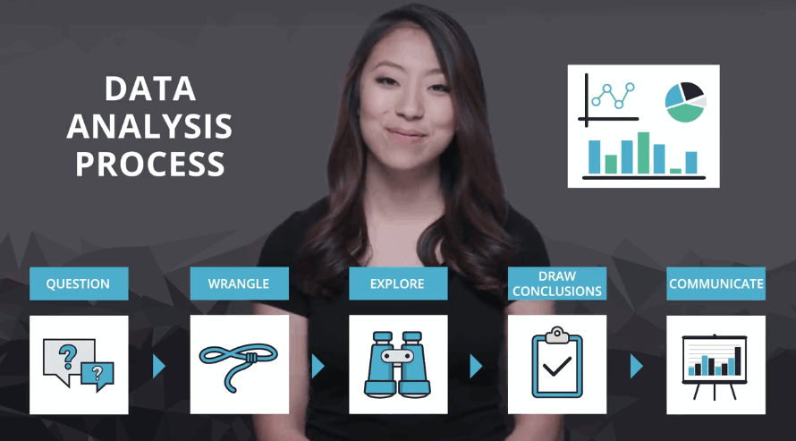

# 数据分析流程

我们将数据分析过程组织为五个步骤：  
- 第 1 步：提问  
你要么获取一批数据，然后根据它提问，要么先提问，然后根据问题收集数据。在这两种情况下，好的问题可以帮助你将精力集中在数据的相关部分，并帮助你得出有洞察力的分析。

- 第 2 步：整理数据  
你通过三步来获得所需的数据：收集，评估，清理。你收集所需的数据来回答你的问题，评估你的数据来识别数据质量或结构中的任何问题，并通过修改、替换或删除数据来清理数据，以确保你的数据集具有最高质量和尽可能结构化。

- 第 3 步：执行 EDA（探索性数据分析）  
你可以探索并扩充数据，以最大限度地发挥你的数据分析、可视化和模型构建的潜力。探索数据涉及在数据中查找模式，可视化数据中的关系，并对你正在使用的数据建立直觉。经过探索后，你可以删除异常值，并从数据中创建更好的特征，这称为特征工程。

- 第 4 步：得出结论（或甚至是做出预测）  
这一步通常使用机器学习或推理性统计来完成，不在本课程范围内，本课的重点是使用描述性统计得出结论。

- 第 5 步：传达结果  
你通常需要证明你发现的见解及传达意义。或者，如果你的最终目标是构建系统，则通常需要分享构建的结果，解释你得出设计结论的方式，并报告该系统的性能。传达结果的方法有多种：报告、幻灯片、博客帖子、电子邮件、演示文稿，甚至对话。数据可视化总会给你呈现很大的价值。
