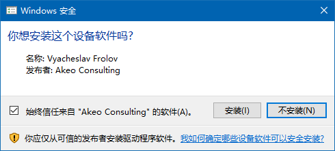

# com0com on AppVeyor


- [com0com project](https://sourceforge.net/projects/com0com/)
- [we need signed drivers](https://pete.akeo.ie/2011/07/com0com-signed-drivers.html)
- how to confirm a gui prompt installer
    - 
    - [appveyor discussions]( https://help.appveyor.com/discussions/questions/26046-how-to-confirm-a-gui-prompt-in-appveyor)
    - [solved by AutoIt](http://unattended.sourceforge.net/installers.php)
- final script
``` yml
before_build:
- ps: choco install autoit.commandline --no-progress
- ps: choco install 7zip.install --no-progress
- ps: mkdir ./com_tmp_dir;       cd ./com_tmp_dir
- ps: Invoke-WebRequest "http://files.akeo.ie/blog/com0com.7z" -OutFile "./com0com.7z"  
- ps: 7z x ./com0com.7z -y;      cd ./x64
- ps: AutoIt3 "C:\projects\qcomm\setupc_by_autoit.au3"
```