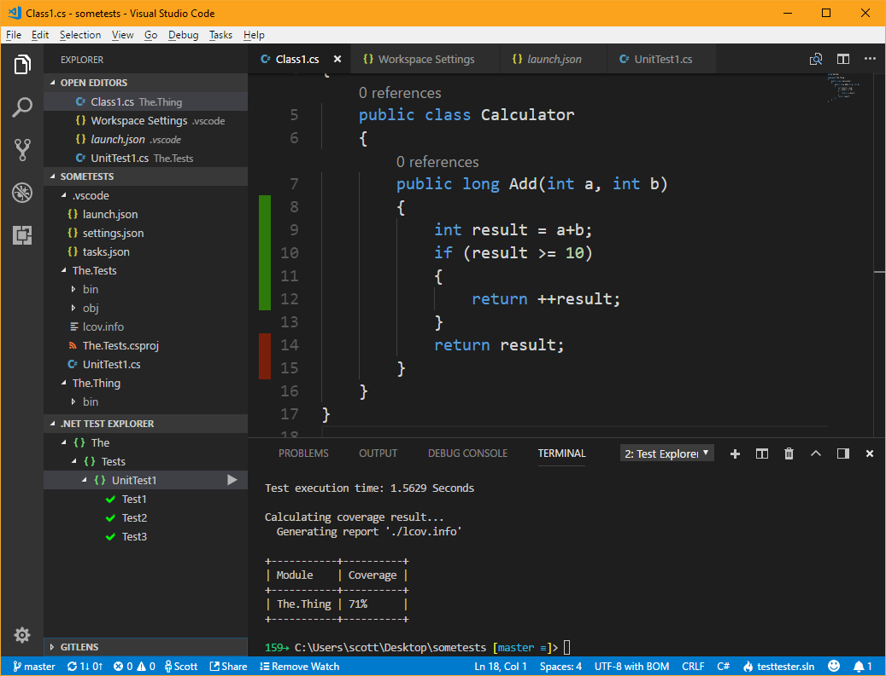

# Code Coverage in VS Code

- 
- [Automatic Unit Testing in .NET Core plus Code Coverage in Visual Studio Code](https://www.hanselman.com/blog/AutomaticUnitTestingInNETCorePlusCodeCoverageInVisualStudioCode.aspx) - Scott Hanselman
    - [Coverage Gutters](https://marketplace.visualstudio.com/items?itemName=ryanluker.vscode-coverage-gutters) - Reads in the lcov.info file (name matters) and highlights lines with color
        - set path to "**/lcov.info"
    - [.NET Core Test Explorer](https://marketplace.visualstudio.com/items?itemName=ryanluker.vscode-coverage-gutters) - Discovers tests and gives you a nice explorer.
    - [Coverlet](https://github.com/tonerdo/coverlet/) - The start of .NET Core Code Coverage
- [Example on Github](https://github.com/shanselman/dotnetcoreunittestingwithcoverageinvscode)

``` json
{
    "label": "test with coverage",
    "command": "dotnet",
    "type": "process",
    "args": [
        "test",
        "/p:CollectCoverage=true",
        "/p:CoverletOutputFormat=lcov",
        "/p:CoverletOutput=./lcov.info",
        "${workspaceFolder}/The.Tests/The.Tests.csproj"
    ],
    "problemMatcher": "$msCompile",
    "group": {
        "kind": "test",
        "isDefault": true
    }
},
```