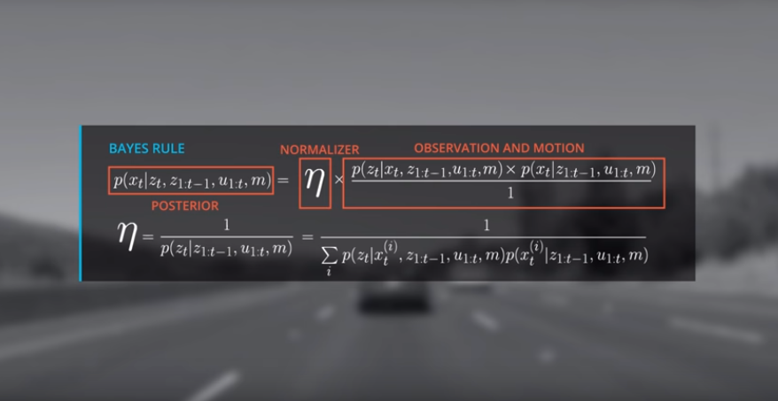
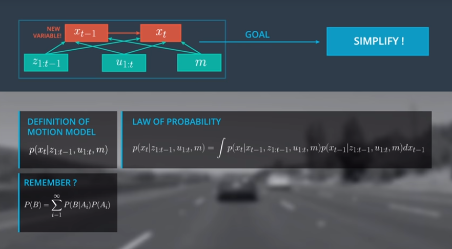
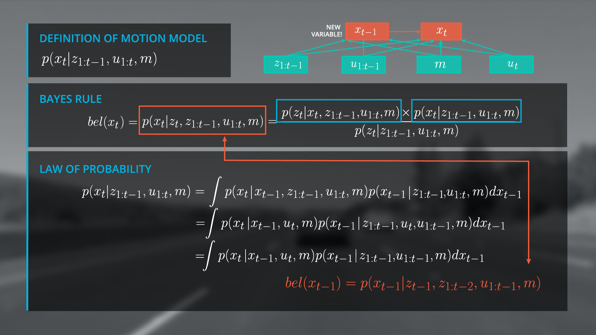
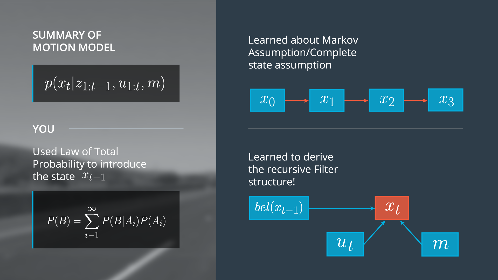

# Markov Localization

- [Markov Localization](#markov-localization)
    - [Localization Posterior](#localization-posterior)
        - [Tools](#tools)
        - [Bayes Rule](#bayes-rule)
        - [Variables](#variables)
        - [Apply Bayes Rule On Localization Posterior](#apply-bayes-rule-on-localization-posterior)
    - [To Simplify Motion Model](#to-simplify-motion-model)
        - [Total Probability for Motion Model](#total-probability-for-motion-model)
        - [Markov Assumption for Motion Model](#markov-assumption-for-motion-model)
        - [Recursive Structure of Motion Model](#recursive-structure-of-motion-model)
        - [Summary of Motion Model](#summary-of-motion-model)

## Localization Posterior
### Tools
- Bayes Rule 
- the Law of Total Probability
- the Markov Assumption

### Bayes Rule
- 
- 

### Variables
- 
- 

### Apply Bayes Rule On Localization Posterior
- 定义后验方程
- Defination of Localization Posterior
    - 
- Observation model & Motion model
    - 
- Normalizer
    - 

## To Simplify Motion Model
### Total Probability for Motion Model
- 使得当前状态与上一状态相关
- 

### Markov Assumption for Motion Model
- 减少当前状态、上一状态的依赖项
- 目标
    - 
- 原理
    - 
- 结果
    - 

### Recursive Structure of Motion Model
- 使得当前状态几乎只于上一状态相关
- Simply bel(x(t-1))
    - 
- Recursive Structure
    - 
- Discrete Case
    - 

### Summary of Motion Model
-  

