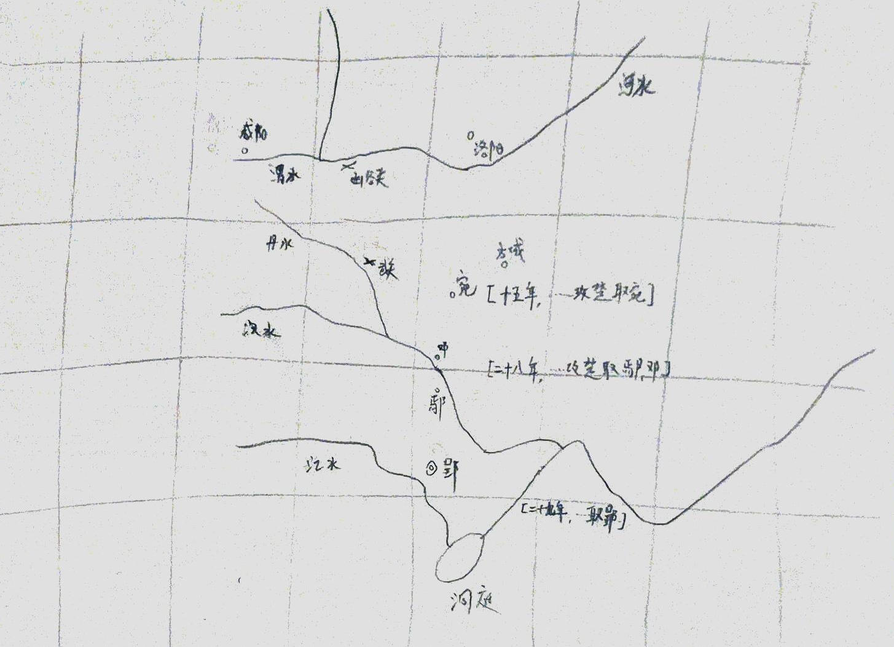

# 白起攻楚取鄢邓

- [白起攻楚取鄢邓](#白起攻楚取鄢邓)
    - [缘起](#缘起)
    - [三军的三路军](#三军的三路军)
    - [攻郢路线的时间差](#攻郢路线的时间差)
    - [其他问题](#其他问题)
    - [dwww](#dwww)
    - [ref](#ref)

## 缘起
辛神的[《論秦漢以前江漢平原的北出通道》](https://mp.weixin.qq.com/s/_b0slBFtqMMPXKcID-e92g)，说秦取郢不出武关：

    當時列國交爭，張儀、蘇秦等策士遊走其間，翻云覆雨，合縱連橫。張儀在爲秦人向楚王遊說時，爲破縱成橫，曾大着嗓门嚇唬楚王說：“秦舉甲出之武關，南面而攻，則北地絕。秦兵之攻楚也，危難在三月之内。”（《戰國策·楚策一》）另外，秦人爲威嚇楚王，尚“正告”之曰，秦国若是以“漢中之甲，乘舟出於巴，乘夏水而下漢，四日而至五渚”（《戰國策·燕策二》）。聽了這些話，不知楚王嚇尿了沒有，卻給我們一種感覺——似乎秦兵出武關東南行，下抵江漢之間的楚國，是輕而易舉的事情。這條通道，不管是水路，還是陸路，都一路暢行，便捷得很。可是秦人滅楚，並沒有選取這條道路，而是從北面的南陽郡宛城向南跨過漢水，經由漢水岸邊的鄧、鄢等地，逐次南下，最終攻取楚都郢城，建立南郡（《史記》卷五《秦本紀》，又相關史事尚別見於睡虎地秦墓竹簡之《編年記》），故司馬遷稱道此舉乃“越宛有郢，置南郡”（《史記》卷六《秦始皇本紀》）。

其中

    可是秦人滅楚，並沒有選取這條道路（出武關東南行，下抵江漢之間的楚國），而是從北面的南陽郡宛城向南跨過漢水，經由漢水岸邊的鄧、鄢等地，逐次南下，最終攻取楚都郢城，建立南郡。

## 三军的三路军

然而，打开所谓三军出版社的《中国历代战争史》看看，这个图上却说，老子就是出的武关。

然后再，看看对战争的文字描述：

好吧，问题来了，哪来的三路军，哪来的出武关？接着想看看这都引用的是什么文献，做出这样的判断的？啥出处都没有…………呵呵

估计三路是这么来的：
- 《史记·卷五·秦本纪》：（秦昭襄王）二十七年，错攻楚。
    - 《史记·卷四十·楚世家》：（楚顷襄王）十九年，秦伐楚，楚军败，割上庸、汉北地予秦。
- 接上秦本纪：……又使司马错发陇西，因蜀攻楚黔中，拔之。
- 《史记·卷五·秦本纪》：（秦昭襄王）二十八年，大良造白起攻楚，取鄢、邓，赦罪人迁之。二十九年，大良造白起攻楚，取郢为南郡，楚王走。

那么：
- 勉强算三路好了
    - 只说“割上庸、汉北地予秦”，哪来的这一路具体战事
- 全程没的提到过武关
- 也没白起用余部之说
- 都试着看看不那么一手的《资治通鉴》了，也没发现在这些乱七八糟的描述啊。

## 攻郢路线的时间差

- 《史记·卷五·秦本纪》：（秦昭襄王）十五年，大良造白起攻魏，取垣，复予之。攻楚，取宛。
- 《史记·卷五·秦本纪》：（秦昭襄王）二十八年，大良造白起攻楚，取鄢、邓，赦罪人迁之。二十九年，大良造白起攻楚，取郢为南郡，楚王走。

这两者之间差了 13 年，确定是从宛攻鄢吗？时间对不大上啊。辛神又回答了：

- 《史记·卷六·秦始皇本纪》：当是之时，秦地已并巴、蜀、汉中，越宛有郢，置南郡矣。

其中， [《越宛有郢》](https://weibo.com/5274752310/CFkmO05cT) 是否是这个意思呢？

## 其他问题
- 丹水与武关的关系？
- 丹水是否适合行军？
- 秦水军状况如何？
- 是否可由丹水出军平定郢？
- 李开元先生的韩信以水路还定三秦如何解释？

## dwww
辛神在公众号中提到的神秘的 [dwww](https://www.thepaper.cn/newsDetail_forward_1258465) 在找这个文章时，居然出现了……

## ref
- [《論秦漢以前江漢平原的北出通道》](https://mp.weixin.qq.com/s/_b0slBFtqMMPXKcID-e92g)
- [《越宛有郢》](https://weibo.com/5274752310/CFkmO05cT)
- [《睡虎地秦簡》](https://ctext.org/wiki.pl?if=gb&chapter=528529)