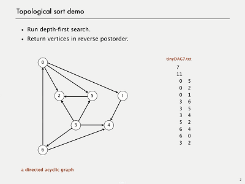

---

layout:            post  
title:             "拓扑排序的两种实现"  
date:              2017-08-22 18:25:00 +0300  
tags:              ML  
category:          Tech  
author:            Qiang  

---

## 两种实现（效率均为 O(V顶点+E边)）
- kahn 算法
- DFS 算法

### kahn 算法
1. 从 DAG 图中选择一个 没有前驱（即入度为0）的顶点并输出。
2. 从图中删除该顶点和所有以它为起点的有向边。
3. 重复 1 和 2 直到当前的 DAG 图为空或当前图中不存在无前驱的顶点为止。后一种情况说明有向图中必然存在环。

### DFS 算法
- 命题：一幅有向无环图的拓扑顺序，即为所有顶点的逆后顺排列。
- 证明：考虑任意的边v->w，当调用dfs(v)的时候，有如下三种情况：
  - dfs(w)还没有被调用，即w还没有被mark，此时会调用dfs(w)，然后当dfs(w)返回之后，dfs(v)才会返回
  - dfs(w)已经被调用并返回了，即w已经被mark
  - ~~dfs(w)已经被调用但是在此时调用dfs(v)的时候还未返回~~
 - 注意,情况三不可能发生的，因为这导致图中存在环路.
- 考虑前两种情况，w都会先于v被添加到结果列表中。

## 参考文档
- https://songlee24.github.io/2015/05/07/topological-sorting/
- http://algs4.cs.princeton.edu/42digraph/