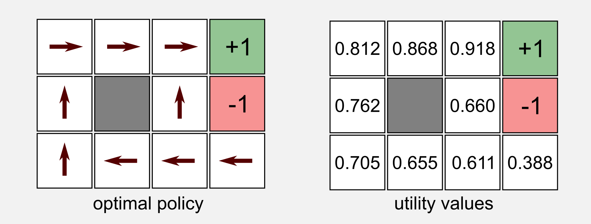
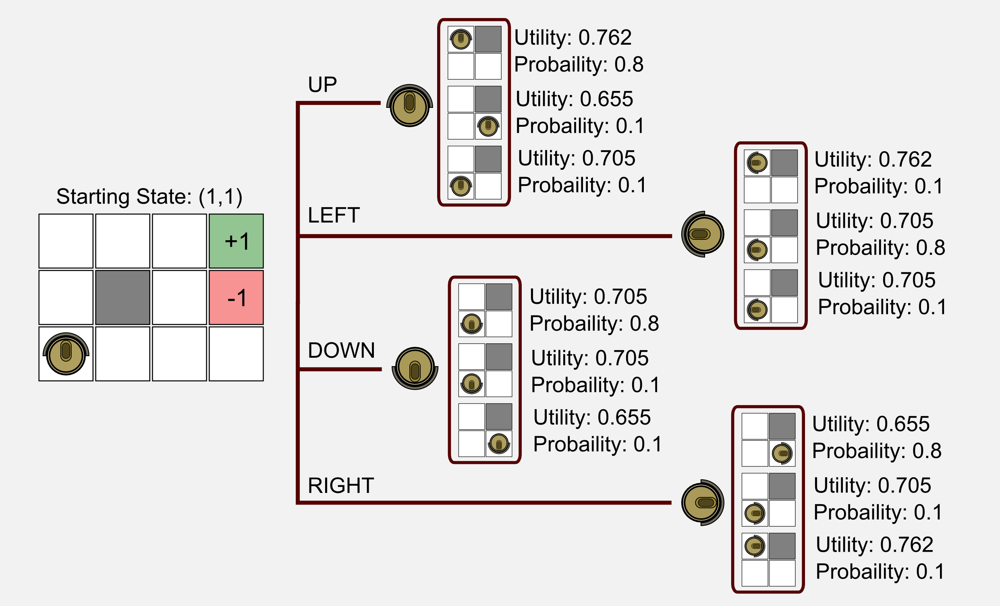
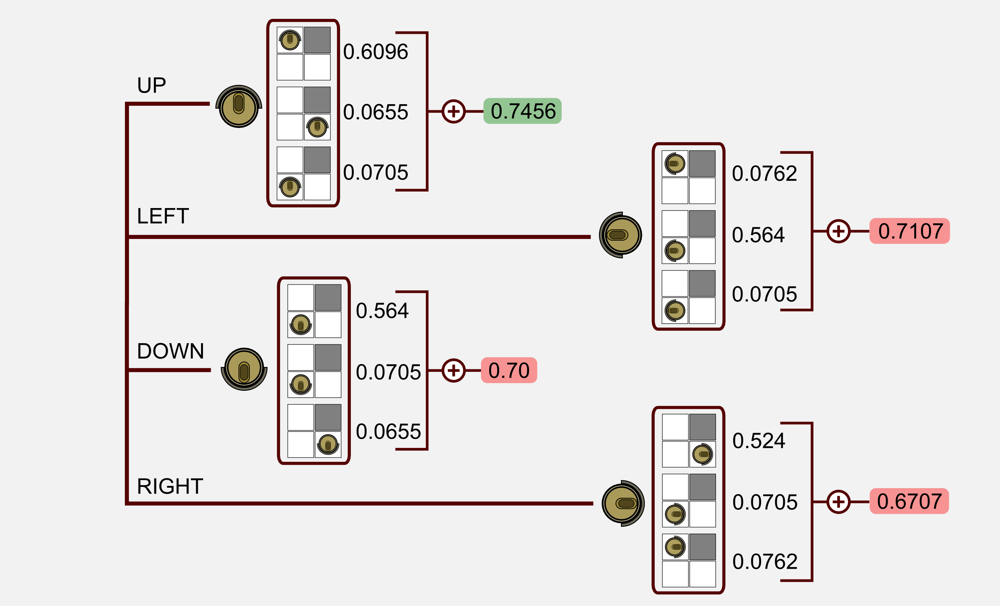

---

layout:            post  
title:             "Dissecting Reinforcement Learning-P1 Note"  
date:              2017-10-19 18:25:00 +0300  
tags:              ML
category:          Tech  
author:            Qiang  

---


<!-- TOC -->

- [1. 正文](#1-正文)
    - [1.1. In the beginning was Andrey Markov(马尔科夫)](#11-in-the-beginning-was-andrey-markov马尔科夫)
    - [1.2. Markov Decision Process(马尔科夫决策)](#12-markov-decision-process马尔科夫决策)
    - [1.3. The Bellman equation(贝尔曼方程)](#13-the-bellman-equation贝尔曼方程)
    - [1.4. The value iteration algorithm(价值迭代算法)](#14-the-value-iteration-algorithm价值迭代算法)
    - [1.5. The policy iteration algorithm(策略迭代算法)](#15-the-policy-iteration-algorithm策略迭代算法)
    - [1.6. Policy evaluation using linear algebra(线性计算策略)](#16-policy-evaluation-using-linear-algebra线性计算策略)
- [2. 参考](#2-参考)

<!-- /TOC -->


# 1. 正文

- s, states, 状态
- a, action, 动作
- r, reward, 奖励
- u, utility, 价值（r的总和）
- p, policy, 方案（依s选a）

## 1.1. In the beginning was Andrey Markov(马尔科夫)

- 依据马尔科夫链可以计算n步后，在某位置的概率
- 
- 

```
import numpy as np

# 设置转换矩阵
T = np.array([[0.90, 0.10],
              [0.50, 0.50]])
### 强加
# 1->1, 1->2
# 2->1, 2->2

# n 次累计转化
T_3 = np.linalg.matrix_power(T, 3)
T_50 = np.linalg.matrix_power(T, 50)
T_100 = np.linalg.matrix_power(T, 100)

print("T: " + str(T))
print("T_3: " + str(T_3))
print("T_50: " + str(T_50))
print("T_100: " + str(T_100))
print("####################)


# 设置初始位置
v = np.array([[1.0, 0.0]])

# n 次后每位置的概率
print("v: " + str(v))
print("v_1: " + str(np.dot(v,T)))
print("v_3: " + str(np.dot(v,T_3)))
print("v_50: " + str(np.dot(v,T_50)))
print("v_100: " + str(np.dot(v,T_100)))
```

```
T: [[ 0.9  0.1]
    [ 0.5  0.5]]
T_3: [[ 0.844  0.156]
      [ 0.78   0.22 ]]
T_50: [[ 0.83333333  0.16666667]
       [ 0.83333333  0.16666667]]
T_100: [[ 0.83333333  0.16666667]
        [ 0.83333333  0.16666667]]

##########################

v: [[ 1.  0.]]
v_1: [[ 0.9  0.1]]
v_3: [[ 0.844  0.156]]
v_50: [[ 0.83333333  0.16666667]]
v_100: [[ 0.83333333  0.16666667]]

```

## 1.2. Markov Decision Process(马尔科夫决策)

- 

## 1.3. The Bellman equation(贝尔曼方程)

- 
- 
- 

```
import numpy as np

def return_state_utility(v, T, u, reward, gamma):
    """Return the state utility.

    @param v the state vector
    @param T transition matrix
    @param u utility vector
    @param reward for that state
    @param gamma discount factor
    @return the utility of the state
    """
    action_array = np.zeros(4)
    for action in range(0, 4):
        action_array[action] = np.sum(np.multiply(u, np.dot(v, T[:,:,action])))
    return reward + gamma * np.max(action_array)


# 强注 #############################################
# T.Shape
## 12, 12, 4
## self -> others, others -> self, action

# np.dot(v, T[:,:,action])  
## probaility (1_12 x 12_12 = 1_12) 
## 下一动作，每位置的可能性

# np.multiply(u, p)
## utility * probaility (1_12 * 1_12 = 1_12) 
## 每个位置贡献的 Utility

# np.sum(up)  
## 贡献的 Utility 总和

# reward + gamma * np.max(action_array)
## 本位置的 Utility = 移动到此的 Reward + 后续最大可能的 Utility
###################################################


def main():
    #The agent starts from (1, 1)
    v = np.array([[0.0, 0.0, 0.0, 0.0, 
                   0.0, 0.0, 0.0, 0.0, 
                   1.0, 0.0, 0.0, 0.0]])

    T = np.load("T.npy")

    u = np.array([[0.812, 0.868, 0.918,   1.0,
                   0.762,   0.0, 0.660,  -1.0,
                   0.705, 0.655, 0.611, 0.388]])

    reward = -0.04
    gamma = 1.0

    utility_11 = return_state_utility(v, T, u, reward, gamma)
    print("Utility of state (1,1): " + str(utility_11))

if __name__ == "__main__":
    main()
```

```
Utility of state (1,1): 0.7056
```


## 1.4. The value iteration algorithm(价值迭代算法)
- 刚开始时，只有reward，此时 Utiltiy 为 0。然后每次用当前reward，接续的 utility，更新当前 Utility，直到 Utility 几乎不再更新。


```

def main():
    tot_states = 12
    gamma = 0.999 #Discount factor
    iteration = 0 #Iteration counter
    epsilon = 0.01 #Stopping criteria small value

    T = np.load("T.npy")

    r = np.array([-0.04, -0.04, -0.04,  +1.0,
                  -0.04,   0.0, -0.04,  -1.0,
                  -0.04, -0.04, -0.04, -0.04])    

    u = np.array([0.0, 0.0, 0.0,  0.0,
                   0.0, 0.0, 0.0,  0.0,
                   0.0, 0.0, 0.0,  0.0])
    u1 = np.array([0.0, 0.0, 0.0,  0.0,
                    0.0, 0.0, 0.0,  0.0,
                    0.0, 0.0, 0.0,  0.0])

    while True:
        delta = 0
        u = u1.copy()                     # 保存当前 utility
        iteration += 1
        for s in range(tot_states):       # 计算每个位置的运动
            reward = r[s]
            v = np.zeros((1,tot_states))
            v[0,s] = 1.0                  # 设置要运动位置
            u1[s] = return_state_utility(v, T, u, reward, gamma)   
                                          # 更新当前位置的 Utility

        # 停止更新 utiltiy 的条件
        if delta < epsilon * (1 - gamma) / gamma:
                print("=========== FINAL RESULT ==========")
                print("Iterations: " + str(iteration))
                print("Delta: " + str(delta))
                print("Gamma: " + str(gamma))
                print("Epsilon: " + str(epsilon))
                print("===================================")
                print(u[0:4])
                print(u[4:8])
                print(u[8:12])
                print("===================================")
                break

if __name__ == "__main__":
    main()
```

```
=================== FINAL RESULT ==================
Iterations: 9
Delta: 0.000304045
Gamma: 0.5
Epsilon: 0.001
===================================================
[[ 0.00854086  0.12551955  0.38243452  1.        ]]
[[-0.04081336  0.          0.06628399 -1.        ]]
[[-0.06241921 -0.05337728 -0.01991461 -0.07463402]]
===================================================
```

```
=================== FINAL RESULT ==================
Iterations: 16
Delta: 0.000104779638547
Gamma: 0.9
Epsilon: 0.001
===================================================
[[ 0.50939438  0.64958568  0.79536209  1.        ]]
[[ 0.39844322  0.          0.48644002 -1.        ]]
[[ 0.29628832  0.253867    0.34475423  0.12987275]]
===================================================
```

```
=================== FINAL RESULT ==================
Iterations: 29
Delta: 9.97973302774e-07
Gamma: 0.999
Epsilon: 0.001
===================================================
[[ 0.80796344  0.86539911  0.91653199  1.        ]]
[[ 0.75696623  0.          0.65836281 -1.        ]]
[[ 0.69968285  0.64882069  0.6047189   0.38150244]]
===================================================
```

## 1.5. The policy iteration algorithm(策略迭代算法)


```
import numpy as np


## Generate the first policy randomly
## NaN=Nothing, -1=Terminal, 0=Up, 1=Left, 2=Down, 3=Right
# p = np.random.randint(0, 4, size=(12)).astype(np.float32)
# p[5] = np.NaN
# p[3] = p[7] = -1


# 依据该位置的 policy 计算其 utility
def return_policy_evaluation(p, u, r, T, gamma):
  """Return the policy utility.

  @param p policy vector
  @param u utility vector
  @param r reward vector
  @param T transition matrix
  @param gamma discount factor
  @return the utility vector u
  """
  for s in range(12):
    if not np.isnan(p[s]):
      v = np.zeros((1,12))
      v[0,s] = 1.0
      action = int(p[s])
      u[s] = r[s] + gamma * np.sum(np.multiply(u, np.dot(v, T[:,:,action])))
  return u

# 返回最优 action 索引
def return_expected_action(u, T, v):
    """Return the expected action.

    It returns an action based on the
    expected utility of doing a in state s, 
    according to T and u. This action is
    the one that maximize the expected
    utility.
    @param u utility vector
    @param T transition matrix
    @param v starting vector
    @return expected action (int)
    """
    actions_array = np.zeros(4)
    for action in range(4):
       #Expected utility of doing a in state s, according to T and u.
       actions_array[action] = np.sum(np.multiply(u, np.dot(v, T[:,:,action])))
    return np.argmax(actions_array)

# 打印每个位置的最优 policy
def print_policy(p, shape):
    """Printing utility.

    Print the policy actions using symbols:
    ^, v, <, > up, down, left, right
    * terminal states
    # obstacles
    """
    counter = 0
    policy_string = ""
    for row in range(shape[0]):
        for col in range(shape[1]):
            if(p[counter] == -1): policy_string += " *  "
            elif(p[counter] == 0): policy_string += " ^  "
            elif(p[counter] == 1): policy_string += " <  "
            elif(p[counter] == 2): policy_string += " v  "
            elif(p[counter] == 3): policy_string += " >  "
            elif(np.isnan(p[counter])): policy_string += " #  "
            counter += 1
        policy_string += '\n'
    print(policy_string)

```

```
def main():
    gamma = 0.999
    epsilon = 0.0001
    iteration = 0
    T = np.load("T.npy")
    #Generate the first policy randomly
    # NaN=Nothing, -1=Terminal, 0=Up, 1=Left, 2=Down, 3=Right
    p = np.random.randint(0, 4, size=(12)).astype(np.float32)
    p[5] = np.NaN
    p[3] = p[7] = -1
    #Utility vectors
    u = np.array([0.0, 0.0, 0.0,  0.0,
                  0.0, 0.0, 0.0,  0.0,
                  0.0, 0.0, 0.0,  0.0])
    #Reward vector
    r = np.array([-0.04, -0.04, -0.04,  +1.0,
                  -0.04,   0.0, -0.04,  -1.0,
                  -0.04, -0.04, -0.04, -0.04])

    while True:
        iteration += 1
        u_0 = u.copy()
        u = return_policy_evaluation(p, u, r, T, gamma)  # 后续最优 u
        delta = np.absolute(u - u_0).max()
        if delta < epsilon * (1 - gamma) / gamma: break
        for s in range(12):
            if not np.isnan(p[s]) and not p[s]==-1:
                v = np.zeros((1,12))
                v[0,s] = 1.0
                a = return_expected_action(u, T, v)      # 最优 a
                if a != p[s]: p[s] = a                   # 更新 p
        print_policy(p, shape=(3,4))

    print("=================== FINAL RESULT ==================")
    print("Iterations: " + str(iteration))
    print("Delta: " + str(delta))
    print("Gamma: " + str(gamma))
    print("Epsilon: " + str(epsilon))
    print("===================================================")
    print(u[0:4])
    print(u[4:8])
    print(u[8:12])
    print("===================================================")
    print_policy(p, shape=(3,4))
    print("===================================================")

if __name__ == "__main__":
    main()
```

## 1.6. Policy evaluation using linear algebra(线性计算策略)

- `u[s] = np.linalg.solve(np.identity(12) - gamma*T[:,:,p[s]], r)[s]`

# 2. 参考
- [Dissecting Reinforcement Learning-Part.1](https://mpatacchiola.github.io/blog/2016/12/09/dissecting-reinforcement-learning.html)
- others
    - [什么是强化学习？](http://geniferology.blogspot.com/2015/04/what-is-reinforcement-learning.html)
    - [REINFORCEMENT LEARNING PART 1: Q-LEARNING AND EXPLORATION](https://studywolf.wordpress.com/2012/11/25/reinforcement-learning-q-learning-and-exploration/)
