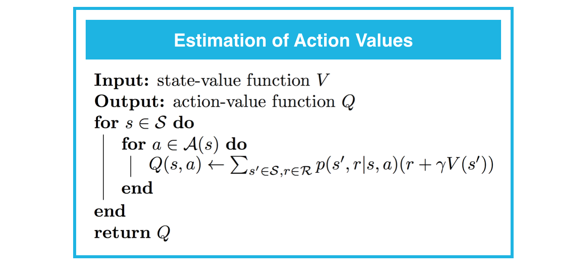
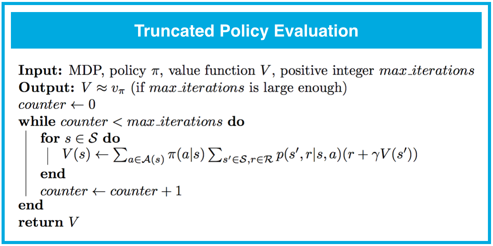

# 强化学习 Dynamic Programming

- [强化学习 Dynamic Programming](#%E5%BC%BA%E5%8C%96%E5%AD%A6%E4%B9%A0-dynamic-programming)
    - [支持方法](#%E6%94%AF%E6%8C%81%E6%96%B9%E6%B3%95)
        - [Iterative Policy Evaluation](#iterative-policy-evaluation)
        - [Estimation of Action Values](#estimation-of-action-values)
        - [Policy Improvement](#policy-improvement)
    - [完整计算](#%E5%AE%8C%E6%95%B4%E8%AE%A1%E7%AE%97)
        - [Policy Iteration](#policy-iteration)
        - [Truncated Policy Iteration](#truncated-policy-iteration)
        - [Value Iteration](#value-iteration)
    - [reference](#reference)

## 支持方法

### Iterative Policy Evaluation
- 迭代策略评估：policy_now -> state-value

### Estimation of Action Values
- 动作值估算： state-value -> action-value

### Policy Improvement
- 策略改进：(state-value, action-value) -> policy_new

## 完整计算

### Policy Iteration
- 策略迭代：（policy_evalution, policy_improvement) -> policy

### Truncated Policy Iteration
- 截断策略迭代：（truncated_policy_evalution, policy_improvement) -> policy
- 相比 policy iteration 仅多次循环，无需完全收敛即可更新 policy

### Value Iteration
- 价值迭代：policy_improvement -> policy 
- state-value 和 action-value 计算方程合而为一，几乎只需更新 state-value 即可获取 policy
- 相比 truncated policy iteration 每扫一次 state 即可更新 state-value

## reference
- [Dynamic Programming - Explore FrozenLakeEnv](./ref/Dynamic_Programming_Solution.html)
- [dynamic_programming_summary](./ref/dynamic_programming_summary.png)