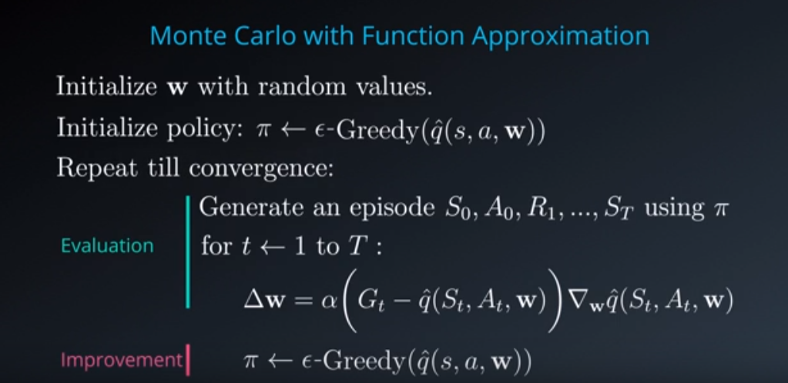
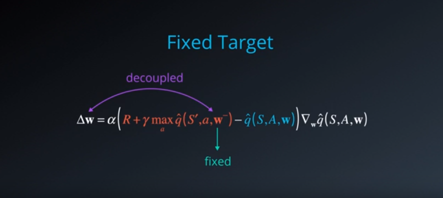

# 强化学习 Deep Q-Learning

- [强化学习 Deep Q-Learning](#deep-q-learning)
    - [Algorithm for Deep Q-Learning](#algorithm-for-deep-q-learning)
        - [monte carlo implementation](#monte-carlo-implementation)
        - [sarsa implementation](#sarsa-implementation)
        - [q-learing implementation](#q-learing-implementation)
        - [tricks](#tricks)
    - [ref](#ref)

## Algorithm for Deep Q-Learning

### monte carlo implementation

### sarsa implementation

### q-learing implementation

### tricks

## ref
- [Deep Q-Learning with Keras and Gym](https://keon.io/deep-q-learning/)
- [Q-Learning Cart](./ref/Q-learning-cart.html)