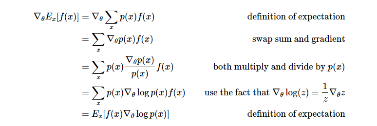

# 强化学习 Deep Deterministic Policy Gradient

- [强化学习 Deep Deterministic Policy Gradient](#deep-deterministic-policy-gradient)
    - [Policy Gradient](#policy-gradient)
        - [Policy Gradient](#policy-gradient)
        - [Deterministic Policy Gradient](#deterministic-policy-gradient)
        - [Deep Deterministic Policy Gradient](#deep-deterministic-policy-gradient)
    - [A-C](#a-c)
    - [DDPG Algorithm](#ddpg-algorithm)
    - [ref](#ref)

## Policy Gradient
### Policy Gradient
- get policy directly

### Deterministic Policy Gradient
- get a deterministic action by policy

### Deep Deterministic Policy Gradient
- solving large states problem
- used a-c method

## A-C

|   | vanilla | deep |
|---| --- | --- |
| value update | approximate Qt = Qt + alpha(Gt-Qt) | min Loss = (Gt-Qt)^2 by gradiant descent|
| policy update | approximate p = p + beta(Gt-Qt) | max Expectation = E(f(p)) by gradiant descent |

## DDPG Algorithm

## ref
- [Deep Reinforcement Learning: Pong from Pixels](http://karpathy.github.io/2016/05/31/rl/) - cal E(f(x))
- [Deterministic Policy Gradient Algorithms](http://proceedings.mlr.press/v32/silver14.pdf) - dpg algorithm
- [CONTINUOUS CONTROL WITH DEEP REINFORCEMENT LEARNING](https://arxiv.org/pdf/1509.02971.pdf) - ddpg algorithm 
- [Dissecting Reinforcement Learning-Part.4](https://mpatacchiola.github.io/blog/2017/02/11/dissecting-reinforcement-learning-4.html)
- [Deep Deterministic Policy Gradients in TensorFlow](http://pemami4911.github.io/blog/2016/08/21/ddpg-rl.html) - deep policy update equation
- [Deep Q-Learning with Keras and Gym](https://keon.io/deep-q-learning/) - deep value update equation 