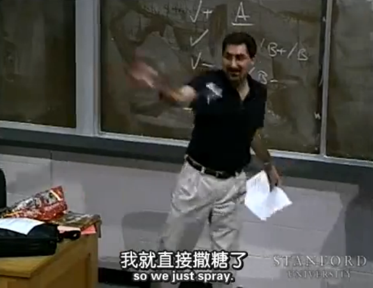
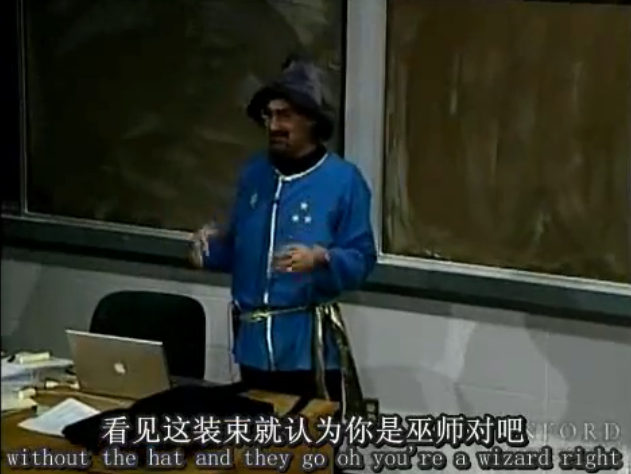
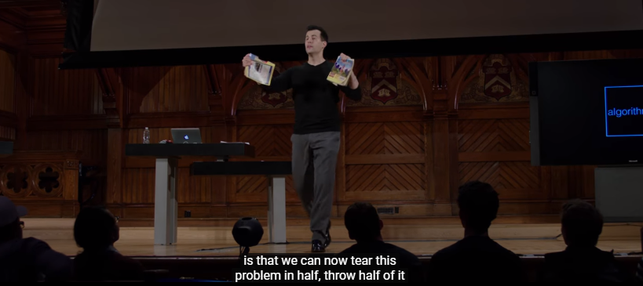
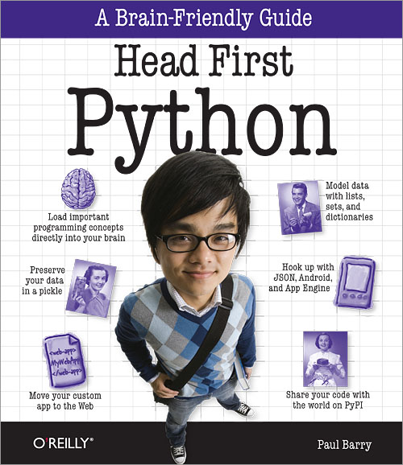
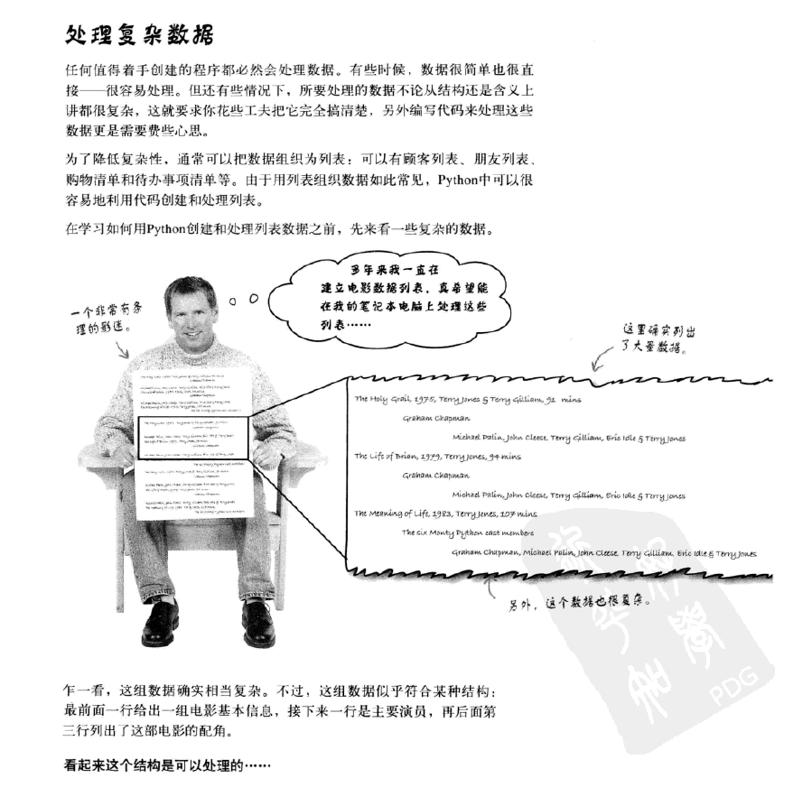
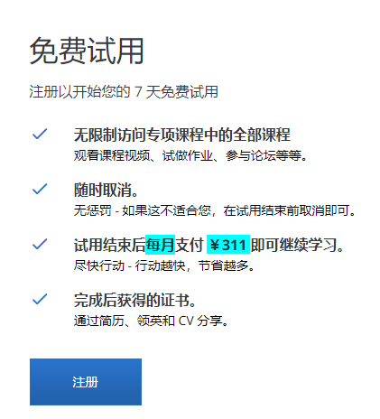
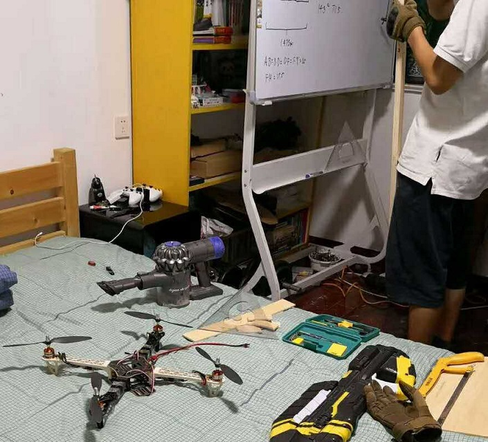

# 码农入门记

- [码农入门记](#码农入门记)
    - [缘起](#缘起)
    - [我踩过的坑](#我踩过的坑)
        - [计算机科学导论](#计算机科学导论)
        - [MIT Python](#mit-python)
        - [CS106A](#cs106a)
        - [CS50](#cs50)
        - [Head First Python](#head-first-python)
    - [我远眺的风景](#我远眺的风景)
        - [零基础 Python 入门专项课程](#零基础-python-入门专项课程)
        - [Python 编程入门](#python-编程入门)
    - [术与道](#术与道)

## 缘起
这天，前同事小T给我发了个微信，说开始自学 python 了，所以给她推荐一些教程。同时总结一下自己上过的和没上过的一些入门课程。

如今软件行业无处不在，除了小T开始自学，身边其他还有许多其他实例：
- 前后两位硬件同事转软件
- 没学过编程的老婆要在公司里要写 SQL
- 高中都有了 AI 教程
- 等等等等......

## 我踩过的坑

我是属于半路出家，开始学习时已年过半半百。对于许多成功的程序来说，这个年龄应该是，从一线转向管理岗位的。自己的学习经历，主要从两个方面，一个是书籍，第二个是视频。当前的大多视频教学已上升为在线教程，结合了学与做，所以会比书籍更有优势。另外一个方向就是付钱和不付钱，网上有很多免费的课程，也有很多收费的。按自己的经验，收费的比较能坚持下去，毕竟花了钱不学会心痛。目前最推荐的三个在线学习网站依然是 Udacity, Coursera, Edx 。

说起小T想要学的 python ，我最早是从这里开始的：

### [计算机科学导论](https://cn.udacity.com/course/intro-to-computer-science--cs101)

- 课程 1 - 编写一个计算机程序
    - Sergey Brin 的编程学习建议
    - 从一个 Python 项目开始
    - 如何创建和使用 Python 中的变量
- 课程 2 - 编写程序处理重复工作
    - 算法介绍Introducing procedures.
    - 求和算法并返回描述
    - 等式比较……
- 课程 3 - 如何管理数据How to Manage Data
    - 嵌套列表Nested lists.
    - 字符串列表
    - 别名……
- 课程 4 - 响应查询
    - 数据结构
    - 查找
    - 建立网络索引……

- 课程 5 - 程序如何运行
    - 测量速度
    - Spin 循环
    - 索引大小与时间……
- 课程 6 - 如何具有无限能力
    - 无限能力
    - 计数器
    - 递归……
- 课程 7 - 计算的过去、现在和将来
    - 过去的计算
    - Slac 和大数据
    - 开源……

2012年初识 Udacity 那时上面只有两门课，此入门课便是其中之一。整个课程的内容实际上非常丰富，从 if else 到 初级数据结构都有涉及。另，这门课也是我第一次在网上做可提交可测试的编程题目，赞。如果是 5、6 年前，这个课程应该是首推，但现在其他新课程有更好的练习方式，付费课程有更好的社区支持，所以并非首选。

另一教育巨头 Edx 的风格更有传统大学的教学风范，如下的课程：

### [MIT Python](https://www.edx.org/course/introduction-computer-science-mitx-6-00-1x-11)

- What you'll learn
    - A Notion of computation
    - The Python programming language
    - Some simple algorithms
    - Testing and debugging
    - An informal introduction to algorithmic complexity
    - Data structures

总体而言，该课程更趋向于传统教授的教学方式，一板一眼但内容扎实可靠。但我是一个哗众取宠的人，所以更喜欢一些不守妇道的课程。

我们撇开 python ，看看以 java 为基础的编程入门课程：

### [CS106A](http://open.163.com/special/sp/programming.html)

- [第1集] 课程简介  	
- [第2集] 欢迎来到Karel的世界  	
- [第3集] Karel与Java  	
- [第4集] 计算科学发展史  	
- [第5集] 变量  	
- [第6集] 操作符  	
- [第7集] 循环与“一半”问题  	
- [第8集] 信息隐藏  	
- [第9集] 字符串  	
- [第10集] 私有变量的重要性  	
- [第11集] Gimage类  	
- [第12集] 枚举  	
- [第13集] 对字符串的处理  	
- [第14集] 内存  	
- [第15集] 指针要点回顾  	
- [第16集] 数组  	
- [第17集] 多维数组  	
- [第18集] 多维数组收尾  	
- [第19集] 接口  	
- [第20集] 图形用户界面  	
- [第21集] Interactor与Listener回顾  	
- [第22集] NameSurfer概述  	
- [第23集] 搜索，排序与算法效率分析  	
- [第24集] 管理大型数据中的良好软件工程原理  	
- [第25集] 设计实用社交网络  	
- [第26集] 介绍Java标准库  	
- [第27集] CS106A后续课程介绍  	
- [第28集] 宣布图形比赛结果  	

想要上课老师发糖吃吗？想要看叫兽 cosplay 吗？请来 CS106A 。叫兽 Mehran Sahami 绝对是不可多得的教学奇才。一门入门课从头玩到尾，欢笑不断，教给你的却是扎实的编程方法。唯一遗憾的是，我只在网易公开课上见过此课程，也没有练习。但课程太棒了。后来还在 youtube 或什么网上听了一次 Mehran Sahami 的毕业演讲，说的是时间的重要性，又是一次精彩的体验。

看完斯坦福，还有国内最认可的哈佛：

### [CS50](https://www.edx.org/course/cs50s-introduction-computer-science-harvardx-cs50x)

- What you'll learn
    - A broad and robust understanding of computer science and programming
    - How to think algorithmically and solve programming problems efficiently
    - Concepts like abstraction, algorithms, data structures, encapsulation, resource management, security, software engineering, and web development
    - Familiarity in a number of languages, including C, Python, SQL, and JavaScript plus CSS and HTML
    - How to engage with a vibrant community of like-minded learners from all levels of experience
    - How to develop and present a final programming project to your peers

提问，找黄页中的某个号码，要搜索几次？ 解决方案：和高考结束后干的第一件事一样，撕书。David J. Malan 就是这么开始教二分查找的。看看上课有多少人，你就知道这课在哈佛有多受欢迎了。如今 CS50 已发展成了全家桶：https://www.edx.org/cs50 ，有兴趣请自行查看哦。

视频差不过了，说说书吧：

### [Head First Python](https://book.douban.com/subject/10561367/)

- 引子
- 1 初识Python:人人都爱列表
- 2 共享你的代码：函数模块
- 3 文件与异常：处理错误
- 4 持久存储：数据保存到文件
- 5 推导数据：处理数据！
- 6 定制数据对象：打包代码与数据
- 7 Web开发：集成在一起
- 8 移动应用开发：小设备
- 9 管理你的数据：处理输入
- 10 扩展你的Web应用：来真格的
- 11 处理复杂性：数据加工
- I 其他：（我们没有谈到的）十大问题
- 索引

Head First 系列，无论哪一本都是入门书中的翘楚。不正经的故事，正经的理念。

我入门所学的，所踩的坑大致是这些了。但如同这一行一样，旧事物不断地被淘汰，这些内容放在今天也许已过时。所以指向那些我不曾上过，但有所耳闻的课程。

## 我远眺的风景

当前的课程，质量不断上升，同时收费也开始上涨，但只要有所收获，价格在可承受范围内，还是推荐在此类课程：

### [零基础 Python 入门专项课程]( https://www.coursera.org/specializations/python)

- 第 1 门课程 - Programming for Everybody (Getting Started with Python)
- 第 2 门课程 - Python Data Structures
- 第 3 门课程 - Using Python to Access Web Data
- 第 4 门课程 - Using Databases with Python
- 第 5 门课程 - Capstone: Retrieving, Processing, and Visualizing Data with Python

作者还有配套图书及内容的网站哦，https://www.py4e.com/

### [Python 编程入门](https://cn.udacity.com/course/intro-to-python-nanodegree--nd302-cn-basic)

- 第一部分 - 学习准备
    - 了解课程讲师、课程大纲，
    - 以及注意事项。
- 第二部分 - 数据类型和运算符
    - 你将了解 Python 的数字和字符串数据类型，
    - 学会使用变量存储数据。
- 第三部分 - 控制流
    - 学习循环和条件
    - 实现更复杂的逻辑。
- 第四部分 函数
    - 你将学习如何定义函数。
    - 还将学习如何将程序拆分为多个部分，
    - 使得代码的结构更加合理。
- 第五部分 - 脚本编写
    - 在自己的电脑上安装 Python，
    - 然后学习使用 Python 标准库和第三方库中的模块，
    - 读取磁盘上的文件中的数据，
    - 使用在线资源解决问题。
- 第六部分 - 维基百科爬虫案例研究
    - 你将运用在这门课程中学到的技能，
    - 练习编写一个爬虫，自动爬取维基百科的文章链接。

- 实战项目 1 - 分析电话和短信记录
    - 在这个项目中，你将会使用 Python 挑战一个电话号码分析的任务。使用课程学习到的数据结构、字符串处理、循环等技巧，根据限定的条件，从杂乱的电话和短信记录中筛选并匹配数据，最后从中找出推销和骚扰电话。
- 实战项目 2 - 爬虫训练：爬取豆瓣高分电影
    - 你将有机会建立一个自己的数据集——豆瓣电影信息。在这个项目中，你会使用访问文件和网络的技巧，收集豆瓣网评分超过 9 分的电影，并筛选和匹配出每个类别的高分电影分别来自哪些国家和地区。

Udacity 的本地化非常棒，工作人员和社区的支持都是三大中最好的，当然收费也最可喜。

## 术与道

我很low，看知乎 https://www.zhihu.com/question/19805899

我只想说，无论是理念还是语言的具体使用，都有其重要性。不用纠结，想学就学。兴趣是最好的老师。所以我很欣赏尹师家的 Tony ，看:

