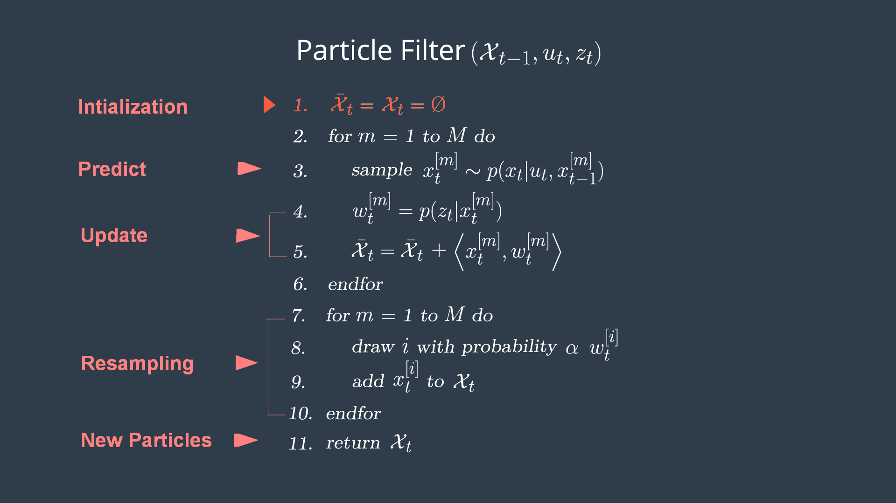
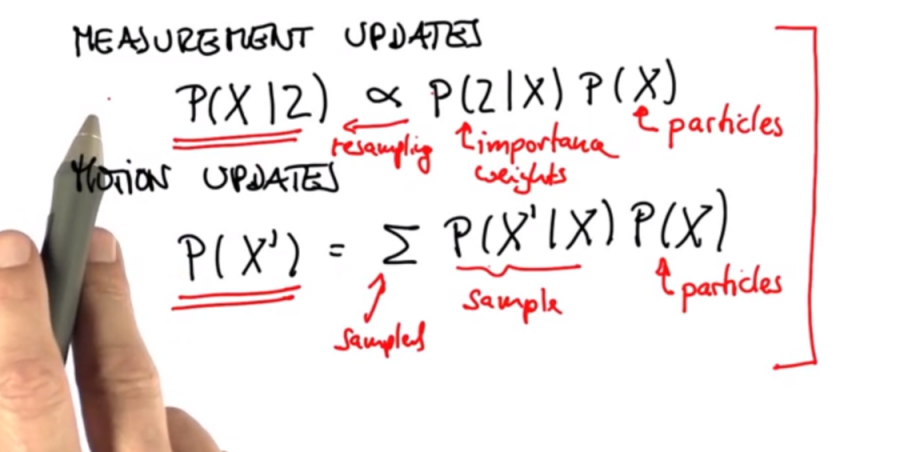
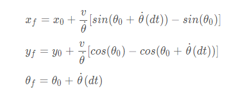
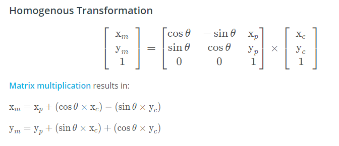
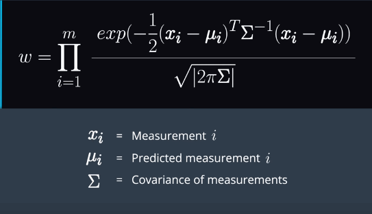
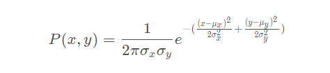
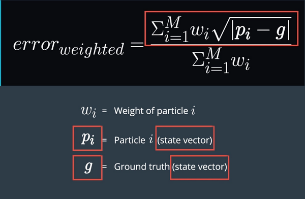
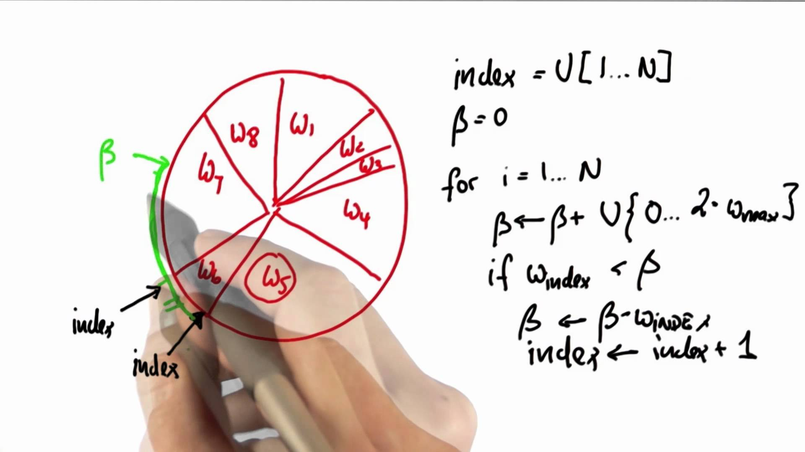

# Particle Filter

- [Particle Filter](#particle-filter)
    - [Process](#process)
        - [Initializtion](#initializtion)
        - [Predict](#predict)
        - [Update](#update)
        - [Resampling](#resampling)
        - [New Particles](#new-particles)

## Process

### Initializtion
- At the initialization step we estimate our position from GPS input. The subsequent steps in the process will refine this estimate to localize our vehicle.

### Predict
- During the prediction step we add the control input (yaw rate & velocity) for all particles
- predict equations when yaw rate is not zero
    - 
  
### Update
- During the update step, we update our particle weights using map landmark positions and feature measurements.
- to map coordinate
    - 
- cal new weight for observations of each particle
    - 
    - for each observations
        - 
- cal error of weight
    - 

### Resampling
- During resampling we will resample M times (M is range of 0 to length_of_particleArray) drawing a particle i (i is the particle index) proportional to its weight. 
    - resampling wheel
        - 

### New Particles
- The new set of particles represents the Bayes filter posterior probability. We now have a refined estimate of the vehicles position based on input evidence.