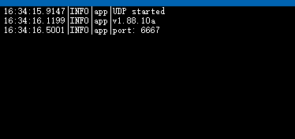

# Tcp Udp Server App in C#

- tcp
	- block in listening
	- multi clients
	- aysnc in every client's rev
- udp
	- no listening
	- only one client
	- block in rev
- both
	- async in dealrev (repo.add)

