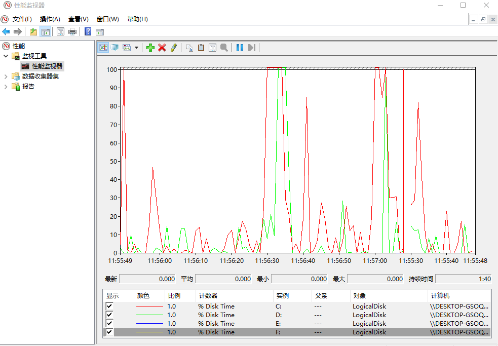

Perfmon in Windows

## ref
- [WINDOWS性能监控器的监视以及邮件预警配置](https://www.skyarch.cn/blog/windows/monitor-perfmon-tool/) - 创建“警告任务”
- [https://www.raymond.cc/blog/sending-email-using-command-line-useful-for-downtime-alert-notification/](https://www.raymond.cc/blog/sending-email-using-command-line-useful-for-downtime-alert-notification/) - 使用“mailsend”发送邮件

## remaining problems
- how to save logs and check them after alerting e-mail